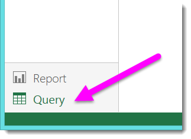
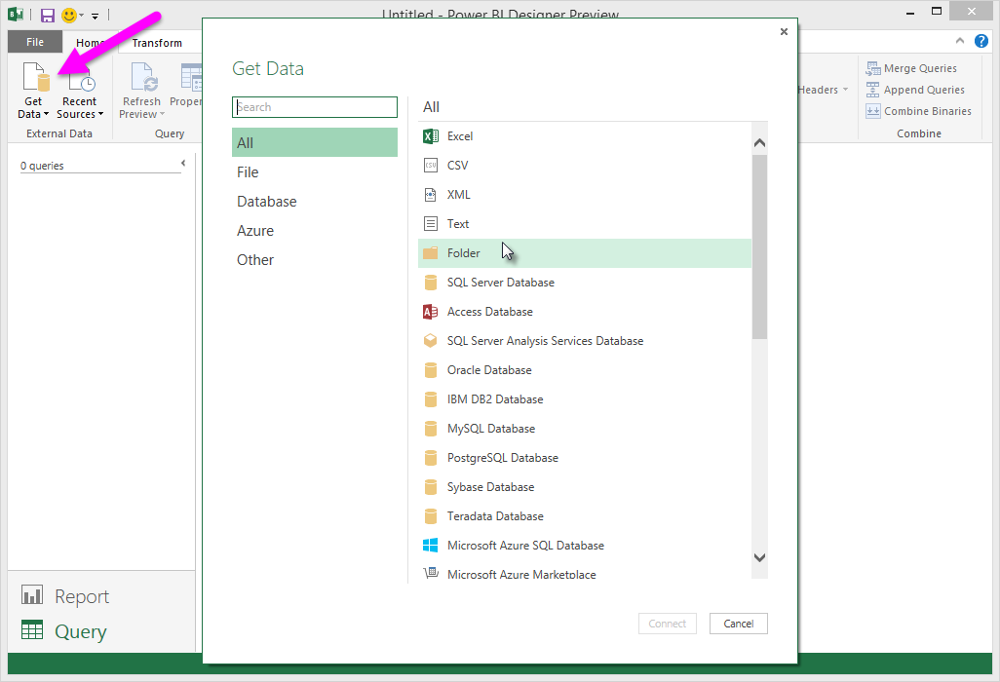
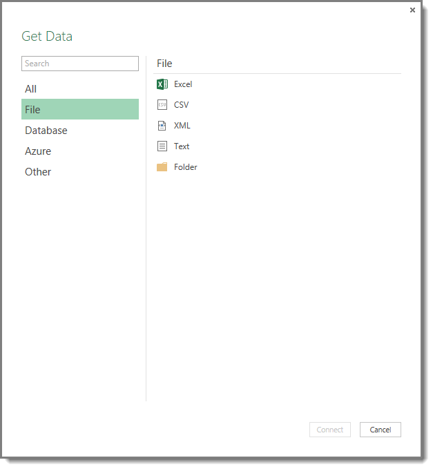
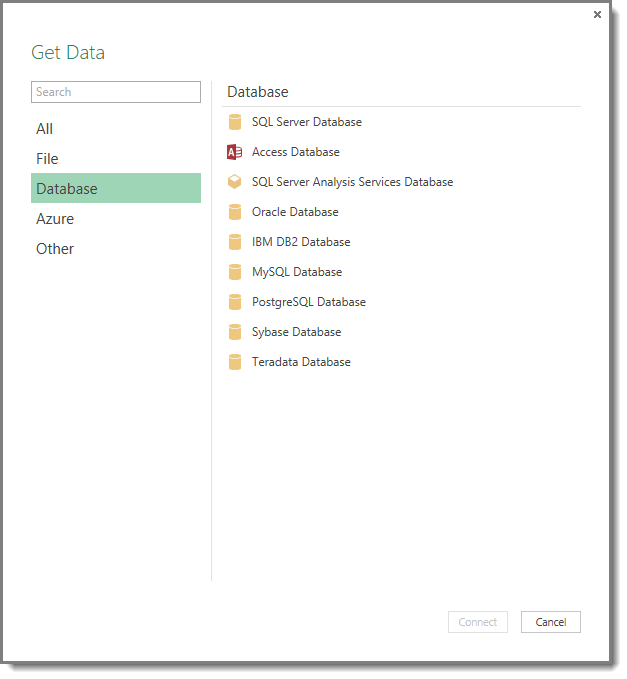
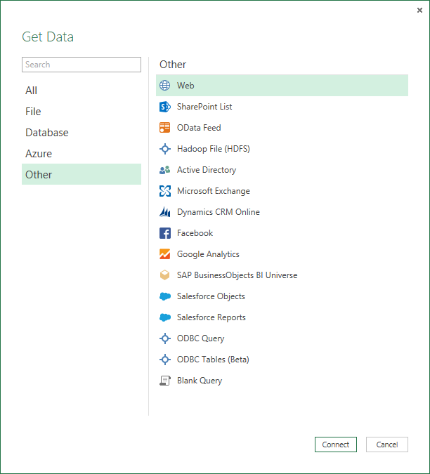

<properties 
   pageTitle="Orígenes de datos en el Diseñador de Power BI" 
   description="Orígenes de datos en el Diseñador de Power BI" 
   services="powerbi" 
   documentationCenter="" 
   authors="v-anpasi" 
   manager="mblythe" 
   editor=""
   tags=""/>
 
<tags
   ms.service="powerbi"
   ms.devlang="NA"
   ms.topic="article"
   ms.tgt_pltfrm="NA"
   ms.workload="powerbi"
   ms.date="06/19/2015"
   ms.author="v-anpasi"/>

#Orígenes de datos en el Diseñador de Power BI
[Diseñador ← Power BI](https://support.powerbi.com/media/knowledgebase/topics/68530-power-bi-designer)

El Diseñador de BI de energía le permite conectarse a datos de muchos orígenes diferentes. Es una lista completa de los orígenes de datos disponibles en la parte inferior de esta página.

Para conectarse a datos, debe tener la **consulta** muestra el lienzo. Seleccione **consulta** desde la esquina inferior izquierda del lienzo.

Desde el **consulta** lienzo, en la **Inicio** seleccione la cinta de opciones **obtener datos**.

Seleccione la flecha hacia abajo, o la **obtener datos** muestra texto en el botón, el **más comunes** menú de tipos de datos se muestra en la siguiente imagen.

Seleccionar **más...** desde el **más comunes** menú muestra el **obtener datos** ventana. También puede poner en funcionamiento el **obtener datos** ventana \(y omitir el **más comunes** menú\) seleccionando el **obtener datos** **botón de icono** directamente.

##Orígenes de datos

Tipos de datos se organizan en las categorías siguientes:

-   Todo
-   Archivo
-   Database
-   Las tablas de Azure
-   Otros

El **todos** categoría incluye todos los tipos de conexión de datos de todas las categorías.

El **archivo** categoría proporciona las siguientes conexiones de datos:

-   Excel
-   CSV
-   XML
-   Texto
-   Carpeta

La siguiente imagen muestra el **obtener datos** ventana **archivo**.

El **base de datos** categoría proporciona las siguientes conexiones de datos:

-   Base de datos SQL Server
-   Base de datos de Access
-   Base de datos SQL Server Analysis Services
-   Base de datos de Oracle
-   Base de datos IBM DB2
-   Base de datos MySQL
-   Base de datos PostgreSQL
-   Base de datos de Sybase
-   Base de datos de Teradata

La siguiente imagen muestra el **obtener datos** ventana **base de datos**.

El **Azure** categoría proporciona las siguientes conexiones de datos:

-   Base de datos SQL Azure de Microsoft
-   Microsoft Azure Marketplace
-   Microsoft Azure HDInsight
-   Almacenamiento de blob de Microsoft Azure
-   Almacenamiento de tablas de Microsoft Azure

La siguiente imagen muestra el **obtener datos** ventana **Azure**.

El **otros** categoría proporciona las siguientes conexiones de datos:

-   Web
-   Lista de SharePoint
-   Fuente de OData
-   Archivo Hadoop \(HDFS\)
-   Active Directory
-   Microsoft Exchange
-   Dynamics CRM Online
-   Facebook
-   Google Analytics
-   Universo de BI de SAP BusinessObjects
-   Objetos de Salesforce
-   Informes de Salesforce
-   Consulta ODBC
-   Tablas ODBC \(Beta\)
-   Consulta en blanco

La siguiente imagen muestra el **obtener datos** ventana **otros**.

##Conectarse a un origen de datos

Para conectarse a un origen de datos, seleccione el origen de datos de la **obtener datos** ventana y seleccione **Conectar**. En la siguiente imagen, **Web** está seleccionado en el **otros** categoría de conexión de datos.

Una ventana de conexión se muestra, específicos del tipo de conexión de datos. Si las credenciales son necesarias, se le pedirá a fin de proporcionarles. La siguiente imagen muestra una dirección URL que se escribió para conectarse a un origen de datos Web.

Cuando se escribe la información de conexión de dirección URL o un recurso, seleccione **Aceptar**. El Diseñador de BI de energía realiza la conexión al origen de datos y presenta los orígenes de datos disponibles en la **Navigator**.

O bien, puede cargar los datos seleccionando la **cargar** situado en la parte inferior de la **Navigator** panel o editar la consulta antes de cargar datos mediante la selección la **Editar consulta** botón.

Eso es todo para conectarse a orígenes de datos en el Diseñador de BI de energía.

Más información
================

Hay todo tipo de cosas que puede hacer con el Diseñador de BI de energía. Para obtener más información sobre sus capacidades, consulte los siguientes recursos:

-   [Introducción a Diseñador de Power BI](https://powerbi.uservoice.com/media/knowledgebase/articles/471664)
-   [Información general de la consulta con el Diseñador de Power BI](https://powerbi.uservoice.com/media/knowledgebase/articles/471646)
-   [Orígenes de datos en el Diseñador de Power BI](https://powerbi.uservoice.com/media/knowledgebase/articles/471643)
-   [La forma y combinar datos con el Diseñador de Power BI](https://powerbi.uservoice.com/media/knowledgebase/articles/471644)
-   [Tareas comunes de consulta en el Diseñador de BI de energía](https://powerbi.uservoice.com/media/knowledgebase/articles/471648)    

¿Desea enviar comentarios? Muy bien: usar el elemento de menú Enviar comentarios en el Diseñador de BI de energía. Esperamos tener noticias suyas de usted!

