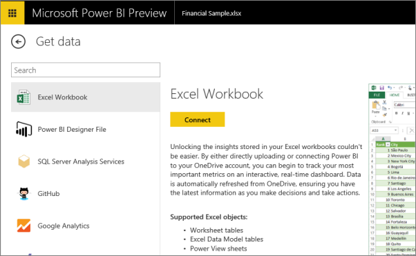
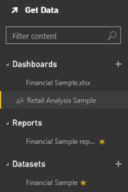

<properties 
   pageTitle="Datos de Excel en Power BI" 
   description="Datos de Excel en Power BI" 
   services="powerbi" 
   documentationCenter="" 
   authors="v-anpasi" 
   manager="mblythe" 
   editor=""
   tags=""/>
 
<tags
   ms.service="powerbi"
   ms.devlang="NA"
   ms.topic="article"
   ms.tgt_pltfrm="NA"
   ms.workload="powerbi"
   ms.date="06/19/2015"
   ms.author="v-anpasi"/>

# Datos de Excel en Power BI

[Archivos ← en Power BI](https://support.powerbi.com/knowledgebase/topics/88767-files-in-power-bi)

Puede utilizar cualquier libro de Excel XLSX - 2007 de Excel 2010 y 2013 - como un conjunto de datos para los informes y paneles de Power BI. Para obtener resultados óptimos, los datos del libro de Excel:

-  está en formato de tabla. \( [Instrucciones para aplicar formato a los datos de Excel como una tabla](https://support.office.com/en-us/article/Create-an-Excel-table-in-a-worksheet-e81aa349-b006-4f8a-9806-5af9df0ac664?ui=en-US&rs=en-US&ad=US)\)
-  se preparan como un modelo de datos de Excel \(normalmente creado mediante Power Pivot\). No se preocupe si no sabe cómo hacer esto, no es necesario.
-  tiene las columnas marcadas por tipo de datos \(por ejemplo, fecha, número\). Para obtener más información:
	-   [tipos de datos en modelos de datos de Excel](https://support.office.com/en-US/Article/Data-Types-Supported-in-Data-Models-e2388f62-6122-4e2b-bcad-053e3da9ba90)
	-   [aplicar formato a tipos de datos numéricos en Excel](https://support.office.com/en-us/article/Format-numbers-f27f865b-2dc5-4970-b289-5286be8b994a)

 **Importante:** \*\*\* solo la persona que carga el conjunto de datos \(el propietario\) puede tener acceso a los datos subyacentes. Si comparte su escritorio con otras personas, podrán ver e interactuar con los informes de [la vista de lectura](http://support.powerbi.com/knowledgebase/articles/439920-open-a-report-in-reading-view), pero no podrá explorar o tener acceso a los datos subyacentes.

## Instrucciones

1.  Inicio desde el panel al que desea agregar los datos del libro y seleccione **obtener datos**.  **Nota:** panel de ejemplo el análisis comercial está protegido contra escritura, por lo que si se inicia a partir de ahí, Power BI crea un panel en blanco y le agrega el nuevo conjunto de datos. El nuevo panel tendrá el mismo nombre que el conjunto de datos. Puede descargar su propia copia de: panel de ejemplo el análisis comercial: después de Seleccionar obtener datos, seleccionar ejemplo de análisis de venta. O bien: los [análisis comercial](https://support.powerbi.com/knowledgebase/articles/474807) libro de ejemplo.
    
2.  Seleccione **libro de Excel** \> **Conectar.**
    
	**Sugerencia**: si necesita un libro para probar, seleccione **descargar este** y guarde el archivo en el escritorio o en OneDrive.

3.  Busque el libro, seleccione **abiertos**, a continuación, **Conectar**.

    **Libros en el equipo**: carga Power BI para Power BI.

    **Libros en OneDrive**: Power BI crea una conexión con ellos y los cambios realizados en los libros en OneDrive aparecen automáticamente en Power BI. Power BI no altera los libros en OneDrive. Leer más sobre [actualizar los datos en libros de Excel en OneDrive](https://support.powerbi.com/knowledgebase/articles/471009).

    
    
    
4.  El nuevo conjunto de datos se agrega a Power BI. Si el libro tiene hojas de Power View, Power BI combinarlos para crear un informe. El informe tiene el mismo nombre que el conjunto de datos y aparece en el **informes** heading.\* \* \*\* puede cambiar los nombres de informe y el conjunto de datos.
    
    
5.  Haga clic en el nombre del conjunto de datos para [Explorar el conjunto de datos en Power BI](http://support.powerbi.com/knowledgebase/articles/475159-explore-a-dataset).  
6.  O simplemente escribir una [pregunta en el cuadro pregunta](http://support.powerbi.com/knowledgebase/articles/474566-q-a-in-power-bi) en el panel.
7.  [Anclar algunas visualizaciones al escritorio](http://support.powerbi.com/knowledgebase/articles/430323-pin-a-tile-to-a-dashboard-from-a-report). 

##¿Qué es importado?

Power BI aporta a los datos en el libro desde las tablas de la hoja de cálculo o desde el modelo de datos de Excel. El contenido del modelo de datos tiene prioridad sobre el contenido de la hoja de cálculo.

Power BI trae hojas de Power View, pero todavía no reconoce las tablas dinámicas o gráficos dinámicos o los campos personalizados.

### Tipos de datos

Power BI reconoce los valores y es compatible con estos tipos de datos: número entero, número Decimal, moneda, fecha, True/False, texto\). Marcar los datos como datos específicos tipos en Excel mejorará la experiencia de Power BI.

## Actualizar los datos de Excel
-   Al cargar un libro de Excel desde su equipo, no puede actualizar los datos. 
-   Cuando se conecta a un [libro de Excel en OneDrive](http://support.powerbi.com/knowledgebase/articles/471009-excel-data-stored-in-onedrive), puede [actualizar los datos](http://support.powerbi.com/knowledgebase/articles/474669-refresh-data-in-power-bi).

## Solución de problemas
Actualmente en la vista previa, al conectarse a Excel, Power BI sólo importa datos que forma parte de una tabla con nombre o un modelo de datos. Como resultado:

-   Al importar un libro, si no hay ninguna tabla con nombre, hojas de Power View o modelos de datos de Excel en el libro, verá este error. El artículo "[no se pudieron encontrar los datos en un libro de Excel](https://support.powerbi.com/knowledgebase/articles/501937--we-couldn-t-find-any-data-in-your-excel-workbook)" se explica cómo corregir el libro y vuelva a importarlo.

### Consulte también

[Obtener datos](http://support.powerbi.com/knowledgebase/articles/434354-get-data) [empezar a trabajar con Power BI](http://support.powerbi.com/knowledgebase/articles/430814-get-started-with-power-bi) [conceptos básicos de Power BI -](http://support.powerbi.com/knowledgebase/articles/487029-power-bi-preview-basic-concepts)