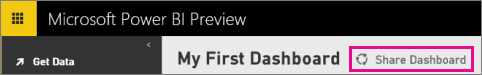
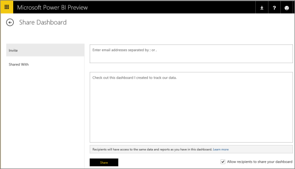
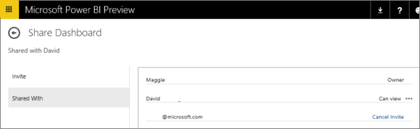
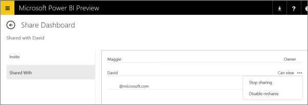
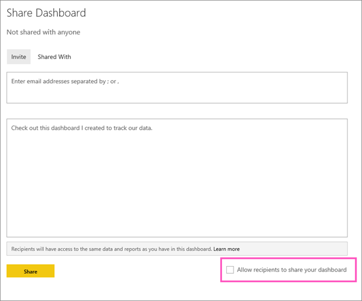

<properties 
   pageTitle="Compartir un panel de Power BI (y dejar de compartir)" 
   description="Compartir un panel de Power BI (y dejar de compartir)" 
   services="powerbi" 
   documentationCenter="" 
   authors="v-anpasi" 
   manager="mblythe" 
   editor=""
   tags=""/>
 
<tags
   ms.service="powerbi"
   ms.devlang="NA"
   ms.topic="article"
   ms.tgt_pltfrm="NA"
   ms.workload="powerbi"
   ms.date="06/19/2015"
   ms.author="v-anpasi"/>

#Compartir un panel de Power BI \(y dejar de compartir\)
[← Todo acerca de los paneles](https://support.powerbi.com/knowledgebase/topics/65158-all-about-dashboards)

Puede compartir sus escritorios con personas de su organización. Si no ha suscrito a [Power BI](http://powerbi.com/), deberá hacerlo para ver el escritorio.

1.   Abrir el panel recurso compartido y haga clic en **panel compartir**.  

    
    
2.  Para compartir con compañeros de trabajo, haga clic en **en vite** y escriba las direcciones de correo electrónico de los compañeros en el cuadro superior y, opcionalmente, modifique el mensaje.
    
3.  Para permitir que sus compañeros de trabajo que vuelva a compartir el escritorio con otras personas, compruebe **Permitir a los destinatarios a compartir el escritorio** \(la casilla de verificación está en la esquina inferior derecha\).

    
    
4.  Haga clic en **Share.**
5.  Para ver que el panel se comparte con, haga clic en **compartido con**.  

    

##Notas acerca del uso compartido

Cuando se comparte con sus colegas:-pueden ver el escritorio e interactuar con los informes en [vista lectura](http://support.powerbi.com/knowledgebase/articles/439920-open-a-report-in-reading-view). Que no pueden crear nuevos informes o guardar los cambios en los informes existentes. -Incluso pueden ver los cambios que realice \(después de guardar los cambios\). No pueden ver o descargar el conjunto de datos o usar cualquiera de las operaciones de actualización de datos. -Verán este icono  junto a Mi panel compartido, que indica el panel se comparte con ellos.

Puede compartir con los usuarios que tienen el mismo dominio de correo electrónico que usted y usuarios cuyo dominio está registrado con el inquilino pero diferentes. Por ejemplo, digamos, los dominios contoso.com y contoso2.com se registran en el inquilino. Si su dirección de correo electrónico es konrads@contoso.com, puede compartir con ravali@contoso.com, y también con gustav@contoso2.com.

**Sugerencia:** si sus colegas ya tienen acceso a un panel específico, puede enviar un vínculo directo a ese escritorio copiando la dirección URL cuando se encuentra en el panel. Por ejemplo:

-   https://powerbi.com/dashboards/g12466b5-a452-4e55-8634-xxxxxxxxxxxx

###Resharing  
Resharing permite que sus compañeros de trabajo reenviar la invitación de correo electrónico a otras personas de su organización \(la invitación expira transcurrido un mes\). También pueden compartir compañeros de trabajo a través del web y aplicaciones móviles. Como propietario del panel, puede desactivar resharing y también se puede revocar resharing de forma individual \(ver abajo\).

##Dejar de compartir un panel de información

1.  Abra el panel para compartir y haga clic en Compartir escritorio.  

    
    
2.  Haga clic en **compartidos con** para ver la lista completa de las personas.

    
3.  Haga clic en el botón de puntos suspensivos \(\*\*... \*\*\) junto a **puede ver** y seleccione: **dejar de compartir** con dicha persona o **Deshabilitar reshares** para impedir que esa persona compartir con otra persona. O si la persona todavía no ha aceptado su invitación de recurso compartido **Cancelar invitar a**.

##Desactivar resharing

Sólo el propietario de panel puede activar resharing activar y desactivar.

-   Si no ha enviado todavía la invitación para compartir, desactive **Permitir a los destinatarios a compartir el escritorio** en la esquina inferior derecha de la invitación.

    
    
-   Si algunos compañeros de trabajo no han aceptado la invitación para compartir, puede cancelar la invitación e invitó nuevamente sin seleccionar **Permitir a los destinatarios a compartir el escritorio**.
-   Si ha aceptado la invitación para compartir, haga clic en compartir con, haga clic en los puntos suspensivos \(...\) junto a ver y haga clic en **dejar de compartir**.

    
    

Consulte también:
---------

[Paneles en Power BI](http://support.powerbi.com/knowledgebase/articles/424868-dashboards-in-power-bi) [comenzar con Power BI](http://support.powerbi.com/knowledgebase/articles/430814-get-started-with-power-bi) [BI - conceptos básicos de energía](http://support.powerbi.com/knowledgebase/articles/487029-power-bi-preview-basic-concepts)