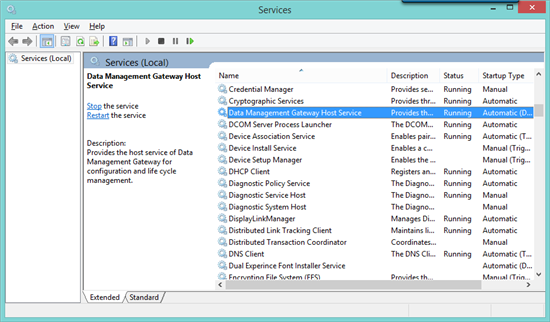

<properties 
   pageTitle="Power BI Analysis Services Connector in-depth"
   description="Power BI Analysis Services Connector in-depth"
   services="powerbi" 
   documentationCenter="" 
   authors="guyinacube" 
   manager="mblythe" 
   editor=""
   tags=""/>
 
<tags
   ms.service="powerbi"
   ms.devlang="NA"
   ms.topic="article"
   ms.tgt_pltfrm="NA"
   ms.workload="powerbi"
   ms.date="09/28/2015"
   ms.author="asaxton"/>
# Power BI Analysis Services Connector in-depth

With Power BI, users in your organization can now see your on-premises SQL Server Analysis Services data and metrics in a whole new way. But before users can connect to your Analysis Services models as a data source, an Analysis Services Connector needs to be installed and configured. The connector helps make the behind-the-scenes communication from a user in Power BI to your on-premises Analysis Services server and back to Power BI quick and secure.

Installing and configuring a connector is usually done by an administrator. It requires special knowledge of your Analysis Services servers and it requires Server Administrator permissions.

This article doesn’t provide step-by-step guidance on how to install and configure an Analysis Services Connector. For that, be sure to see [Configure a Power BI Analysis Services Connector](powerbi-analysis-services-connector.md). This article is meant to provide you with an in-depth understanding of how the connector works. We’ll also go into some detail about usernames and security in both Power BI and Analysis Services, and how Power BI uses the e-mail address a user signs into Power BI with, the connector, and Active Directory to securely connect to and query your on-premises Analysis Services data. If you want to dig deeper, links to more detailed articles are provided.

## Making the connection

Let’s first look at what happens when a user in Power BI interacts with a report connected to an Analysis Services datasource.

1.  When a user interacts with a report in Power BI, such as click on a chart, select a filter, or add a new field, a Data Analysis Expressions (DAX) query is created by Power BI and sent along with an effective username to the Analysis Services Connector.

2.  The Analysis Services Connector acts as a bridge. It sends the DAX query and effective username along to the Analysis Services server.

3.  Because the Analysis Services server is domain joined, it sends the effective username to an Active Directory server in that same domain.

4.  The Active Directory server returns a qualified Windows username (domain\\username) to the Analysis Services server.

5.  The Analysis Services server checks to see if the username belongs to a Role with at least Read permissions for the Tabular model. If they do, the DAX query is run.

6.  The result from the DAX query is returned from Analysis Services, to the Analysis Services Connector, and then onto Power BI where it’s rendered in the user’s report.

Now, let’s go over what needs to be in-place for this to happen.

## Usernames in Power BI

When a user signs up for a Power BI account, they use an e-mail address. In most cases, this is a work e-mail address, like nancy@contoso.com.

However, in some cases, it could be an e-mail address like nancyt@contoso.onmicrosoft.com. This is most common when a user signs up for Office365 and doesn’t use their work e-mail address. This is an important distinction and we’ll come back to it later when we talk about when you might need to synchronize your Active Directory with Azure Active Directory by using DirSync.

The e-mail address users sign into Power BI with is known as an effective username. In-fact, when connecting to Analysis Services, it’s a value in an EffectiveUserName connection string property. Each time a user interacts with a report connected to Analysis Services, the effective username is passed to the Analysis Services Connector and then onto your on-premises Analysis Services server. It must then be converted by an Active Directory server in the same domain to a Windows domain\\username account specified for the roles that Analysis Services use to secure your data.

## Usernames in Analysis Services

Before we talk about how an effective username and the connector is used to connect to Analysis Services, let’s take a quick look at how Analysis Services secures data. In tabular models, there are two levels of security:

### Role-based security

Tabular models provide security based on user roles. Roles are defined for a particular tabular model project during authoring in SQL Server Data Tools – Business Intelligence (SSDT-BI), or after a model is deployed, by using SQL Server Management Studio (SSMS). Roles contain members by Windows username or by Windows group. Roles define permissions a user has to query or perform actions on the tabular model. Most users will belong to a role with Read permissions. Other roles are meant for administrators with permissions to process tables, manage database functions, and manage other roles.

### Row-level security

Tabular models also provide dynamic, row-level security. Unlike having at least one role in which users belong to, dynamic security is not required for any tabular model. At a high-level, dynamic security defines a users read access to data right down to a particular row in a particular table. Similar to roles, dynamic row-level security relies on a user’s Windows username.

In Power BI, a users ability to query and view tabular model data are determined first by the roles their Windows user account are a member of and second, by dynamic row-level security, if configured.

Implementing role and dynamic row-level security in tabular models is beyond the scope of this article.  You can learn more at [Roles (SSAS Tabular)](https://msdn.microsoft.com/library/hh213165.aspx) on MSDN. And, for the most in-depth understanding of tabular model security, download and read the [Securing the Tabular BI Semantic Model](https://msdn.microsoft.com/library/jj127437.aspx) whitepaper.

## What is Active Directory’s role?

In order for Analysis Services Server to determine if a user connecting to it belongs to a role with permissions to read data, the server needs to convert the effective username passed from Power BI to the connector and then onto the Analysis Services server. The Analysis Services server passes the effective username to a Windows Active Directory server joined to the same domain. The Active Directory server then validates the effective username and returns that user’s Windows username back to the Analysis Services server.

## What about Azure Active Directory?

Because Power BI is a cloud service, it uses [Azure Active Directory](http://azure.microsoft.com/documentation/articles/active-directory-whatis/) to take care of authenticating users.

When users connect to an on-premises Analysis Services server from Power BI, their username must also be resolved in your domain’s Active Directory. If users in your organization login with their work e-mail address, like nancy@contoso.com, username resolution typically isn’t a problem. In some cases, if a user logs into Power BI with an .onmicrosoft.com address, your domains Active Directory server might need to be synchronized with Azure Active Directory. Fortunately, there’s a tool just for this.

## Synchronize an on-premises Active Directory with Azure Active Directory

Synchronizing your Active Directory to Azure Active Directory with the Directory Synchronization (DirSync) tool is not a requirement if users sign into sign into Power BI with their work e-mail address. But if users sign into Power BI with a .onmicrosoft.com email address, you will need to sync your Active Directory server with Azure Active Directory.

Let's assume your Analysis Services server and Active Directory server are joined to the same domain, Contoso.com, and an Analysis Services Connector is installed, configured and running. What happens when a user, Nancy, signs into Power BI with...

**A work email address like nancy@contoso.com**

*You do not need to sync your Active Directory with Azure Active Directory.*

When Nancy interacts with a report connected to an Analysis Services datasource, the value of the effective username passed with the DAX query is 'nancy@contoso.com'. Active Directory is able to resolve Nancy’s username and the DAX query is run in Analysis Services. Nancy is able to interact with her reports connected to Analysis Services without any problems. No Active Directory to Azure Active Directory sync is needed. However, keep the following in-mind:

Your on-premises Analysis Services server must be joined to a domain, and your Active Directory server must also be joined to that same domain.

If your Analysis Services server is part of a workgroup, Active Directory doesn’t come into the picture at all. The effective username cannot be resolved and users will be unable to connect to the server.

**A .onmicrosoft.com email address, like nancyt@contoso.onmicrosoft.com**

*You will need to sync your on-premises Active Directory with Azure Active Directory.*

Nancy’s work e-mail is nancy@contoso.com, but when she signs into Power BI, she uses a different e-mail address, nancyt@contoso.onmicrosoft.com. When Nancy interacts with a report connected to an on-premises Analysis Services tabular model, the effective username passed with the DAX query is nancyt@contoso.onmicrosoft.com. The on-premises Active Directory won’t be able to resolve this username to Nancy’s on-premises username. Analysis Services cannot identify Nancy’s membership in a role and the query will not be run.

In this case, you can use DirSync to synchronize Active Directory to Azure Active Directory. Once synchronized, Nancy can sign into Power BI using her work e-mail address, nancy@contoso.com. Nancy will be able to interact with her reports just like in our scenario above.

To learn more about using DirSync, see [Directory Integration](https://technet.microsoft.com/library/jj573653.aspx) on TechNet.

## Now, this is where the Analysis Services Connector comes in

The connector acts as a bridge between the Power BI cloud service running in a user’s browser and your on-premises Analysis Services server. Data transfer between Power BI and the Analysis Services Connector is secured through [Azure Service Bus](http://azure.microsoft.com/documentation/services/service-bus/). The Service Bus creates a secure channel between  Power BI and your on-premises Analysis Services server through an outbound connection.  An inbound connection is not required to be opened in your on-premises firewall.

You’ll need to install the connector on a computer joined to the same domain as your Analysis Services server and Active Directory. This can be the same computer as Analysis Services. In-fact, it’s even better because the communications between the connector and your Analysis Services server doesn’t have to make an extra hop over the network.

## Before you install and configure a connector, be sure you have the following:

-   The name of the Analysis Server you want to connect to. You will specify it right away when you step through the Connector’s configuration wizard. If your server uses a default instance name, you’ll only need to enter that name. If you’re connecting to an instance, you’ll enter ServerName\\Instance.

-   A Windows username and password with Server Administrator permissions for the instance you’re connecting to. Be sure this account has a password that doesn’t expire. If it does, users will get a connection error.

-   Users will need to belong to a Analysis Services Role with at least Read permissions configured for the models they are connecting to

-   If there is already a Data Management Gateway installed on the computer you want to install the connector to, uninstall it before installing the connector. An Analysis Service Connector and a Data Management Gateway cannot exist on the same computer.

-   If you have multiple Analysis Services instances, you will have to install and configure a connector for each of instance. Because you cannot have more than one connector installed on a single computer, each connector will have to be installed on a different computer, and each one of those computers must remain running. This usually isn’t a problem if you install the connector on the same computer as Analysis Services with only one instance.

-   Remember, a single Analysis Services instance can have many tabular models. A connector is configured for a single instance, so if you have multiple tabular models, but they’re all on the same instance, you will only have to install and configure one connector.

-   The computer you install the connector on must remain on all the time, and the Analysis Services Connector needs to remain running. This usually isn’t a problem if you install the connector on the same computer as Analysis Services.

-   .NET Framework 4.5.1 or later must be installed on the same computer as the connector.

## Uploading Excel workbooks with Analysis Services connections

Users in Power BI can upload Excel 2013 workbooks that already connect to Analysis Services tabular models. This can be useful when a user has already created a workbook with Power View reports based on Analysis Services tabular model data, and they want those reports for dashboards in Power BI.

The Analysis Services connection string configured in the Excel workbook needs to match an Analysis Services Connector already installed and configured for the same Analysis Services instance. Power BI will automatically match the workbook’s connection with the connection defined in the Analysis Services Connector.

## Where things can go wrong

Sometimes installing the connector fails. Or, maybe the connector seems to install ok, but Power BI is still unable to connect to an Analysis Services server. In many cases, it’s something simple, like the password for the Server Administrator account the connector uses to sign into Analysis Services expires.

In other cases, there might be issues with type of e-mail address users sign in with, or Analysis Services’ inability to resolve an effective username. If you have multiple domains with trusts between them, and your Active Directory server is in one and Analysis Services in another, this sometimes can cause some problems.

Rather than go into troubleshooting connector issues here, we’ve put a series of troubleshooting steps into another article; [Troubleshooting the Power BI Analysis Service Connector](powerbi-admin-troubleshoot-analysis-service-connector.md). Hopefully you won’t have any problems. But if you do, understanding how all of this works and the troubleshooting article should help.

## Ports

Power BI Analysis Services Connector communicates on outbound ports: TCP 443 (default), 5671, 5672, 9350 thru 9354. The Connector does not require inbound ports.

## FAQ

**Question:** Can I use msdmpump.dll to create custom effective username mappings?

**Answer:** No. This is not supported at this time.

**Question:** Can I use the Analysis Services Connector to connect to a Multidimensional (OLAP) instance.

**Answer:** No. This is not supported at this time.

**Question:** How often are tiles in a report in Power BI connected to Analysis Services updated?

**Answer:** About ten minutes. Analysis Services connections are live. This doesn’t mean that a tile will show new data every ten minutes. In-fact, most tabular models are processed once a day, usually in the evening. This is different from interacting with a report, where tiles and visualizations will be updated immediately as users slice and dice the data.

**Question:** Can I upload Excel workbooks with Power Pivot data models that connect to Analysis Services tabular models? Do I need an Analysis Services Connector for this scenario?

**Answer:** Yes, you can upload the workbook. And, no, you don’t need an Analysis Services Connector. But, because the data will reside in the Excel data model, reports in Power BI based on the Excel workbook will not be live, like with a Power BI report that connects to an Analysis Services tabular model by using an Analysis Services Connector. In order to refresh reports in Power BI, you’d have to re-upload an updated workbook each time. Connecting to an Excel workbook with a Power Pivot data model residing in OneDrive is a better solution here.

**Question:** What if I install the Power BI Analysis Services Connector on a computer in a different domain from my Analysis Services server?

**Answer:** No guarantees here. It all depends on the trust relationship between the two domains. If the two different domains are in a trusted domain model, then the Connector might be able to connect to the Analysis Services server and the effective user name can be resolved. If not, either the connection or effective username resolution can fail.

**Question:** If users share dashboards connected to Analysis Services, will those other users be able to see the data even though they might not have the same the permissions.

**Answer:** Yes. In Power BI, sharing means sharing your own data. This is the current behavior, but could change at any time.

**Question:** How can I find out what effective username is being passed to my on-premises Analysis Services server?

**Answer:** You can use SQL Profiler. You’ll see something like this:

\<RestrictionList xmlns="urn:schemas-microsoft-com:xml-analysis"\>

          \<CATALOG\_NAME\>AdventureWorks\_prod\</CATALOG\_NAME\>

          \<VERSION\>2.0\</VERSION\>

        \</RestrictionList\>

\<PropertyList xmlns="urn:schemas-microsoft-com:xml-analysis"\>

          \<Catalog\>AdventureWorks\_prod\</Catalog\>

          \<Cube\>InternetSales\</Cube\>

          \<EffectiveUserName\>nancy@contoso.com\</EffectiveUserName\>

          \<SspropInitAppName\>PowerBI\</SspropInitAppName\>

          \<LocaleIdentifier\>1033\</LocaleIdentifier\>

          \<ClientProcessID\>3408\</ClientProcessID\>

          \<Content\>SchemaData\</Content\>

          \<Format\>Tabular\</Format\>

          \<DbpropMsmdActivityID\>381f4fdf-48cf-eb13-a5bd-f585cd05dc5d\</DbpropMsmdActivityID\>

          \<DbpropMsmdRequestID\>ed28257d-b516-427e-a299-be5d60f14427\</DbpropMsmdRequestID\>

        \</PropertyList\>

**Question:** How do I find the Analysis Connector service in Services?

**Answer:** The Analysis Services Connector is called **Data Management Gateway Host Service** in Services

## Additional resources

For information in how to install and configure a Power BI Analysis Services Connector, see [Configure a Power BI Analysis Services Connector](powerbi-analysis-services-connector.md).

For information on synchronizing Azure Active Directory with an on-premises Active Directory by using DirSync, see [Directory Integration](https://technet.microsoft.com/library/jj573653.aspx) on TechNet.

For troubleshooting, see [Troubleshooting Power BI Analysis Service Connector](powerbi-admin-troubleshoot-analysis-service-connector.md).

Once a Power BI Analysis Services Connector is installed, configured, and running, users can connect to tabular models on that Analysis Services instance. To learn how to connect from Get Data in Power BI,  see [SQL Server Analysis Services Tabular data in Power BI](powerbi-sql-server-analysis-services-tabular-data.md).

