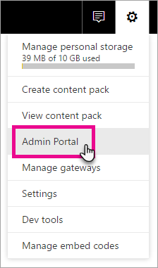
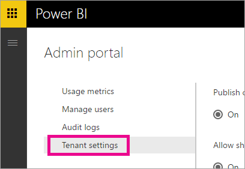
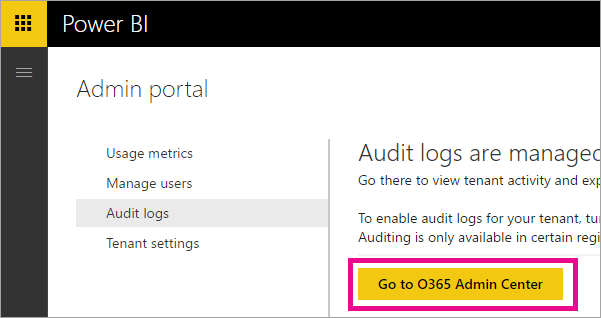
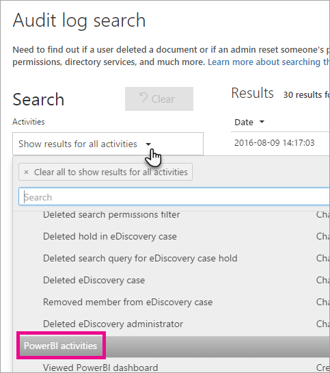
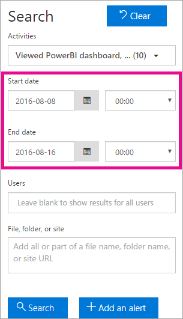

<properties
   pageTitle="Auditing Power BI in your organization"
   description="Auditing Power BI enables you to achieve increased transparency by monitoring and investigating actions taken on all the Power BI artifacts in your organization. Knowing who is taking what action on which item in your Power BI tenant can be critical in helping your organization fulfill its requirements, such as meeting regulatory compliance and records management."
   services="powerbi"
   documentationCenter=""
   authors="guyinacube"
   manager="mblythe"
   backup=""
   editor=""
   tags=""
   qualityFocus="no"
   qualityDate=""/>

<tags
   ms.service="powerbi"
   ms.devlang="NA"
   ms.topic="article"
   ms.tgt_pltfrm="NA"
   ms.workload="powerbi"
   ms.date="08/15/2016"
   ms.author="asaxton"/>
# Auditing Power BI in your organization

Auditing Power BI enables you to achieve increased transparency by monitoring and investigating actions taken on all the Power BI artifacts in your organization. Knowing who is taking what action on which item in your Power BI tenant can be critical in helping your organization fulfill its requirements, such as meeting regulatory compliance and records management.

You can filter the audit data by date range, user, dashboard, report, dataset and activity type. You can also download the activities in a csv (comma separated value) file to analyze offline.

> **Note**: The auditing feature in Power BI is in preview and is only available in the United States currently.

## Enabling auditing functionality in the Power BI admin portal

You will need to enable auditing for your organization in order to work with the reports. You can do this within the tenant settings of the admin portal.

1.	Select the **gear icon** in the upper right.

2.	Select **Admin Portal**.

    

3.	Select **Tenant Settings**.

    

4.	Switch on **Create audit logs for internal activity auditing and compliance purposes**.

5.	Select **Apply**.

Power BI will start logging various activities that your users perform in Power BI. The logs take up to 48 hours to show up in the O365 Security & Compliance Center. For more information about what activities are logged, see [List of activities audited by Power BI](#list-of-activities-audited-by-power-bi).

## Licensing requirements

Auditing is a Power BI Pro feature and auditing events are only available for Power BI Pro users.  Users with Power BI free licenses will not appear in auditing logs. 

For more information on how you can acquire and assign Power BI Pro licenses to users in your organization, see [Purchasing Power BI Pro](powerbi-admin-purchasing-powerb-bi-pro.md).

For more information on how to restrict free users from signing up, see [Enable, or disable, individual user sign up in Azure Active Directory](powerbi-admin-powerbi-free-in-your-organization.md#enable-or-disable-individual-user-sign-up-in-azure-active-directory).

> **Note**: To enable licensing for Power BI in your tenant, you need at least one exchange mailbox license in your tenant.

## Accessing your audit logs

To audit your Power BI logs, you must visit the O365 Security & Compliance Center.

1.	Select the **gear icon** in the upper right.

2.	Select **Admin Portal**.

    

3.	Select **Audit Logs**.

4.	Select **Go to O365 Admin Center**.

    

Alternatively, you can browse to [Office 365 | Security & Compliance](https://protection.office.com/#/unifiedauditlog).

## Search only Power BI activities

You can restrict results to only Power BI activities by doing the following.

1.	On the **Audit log search** page, select the drop down for **Activities** under **Search**.

2.	Select **PowerBI activities**.

    

3.	Select anywhere outside of the selection box to close it.

Your searches will now be filtered to only Power BI activities.

## Search the audit logs by date

You can search the logs by date range using the “Start date” and “End date” field. The last seven days are selected by default. The date and time are presented in Coordinated Universal Time (UTC) format. The maximum date range that you can specify is 90 days. An error is displayed if the selected date range is greater than 90 days.

> **Note**: If you're using the maximum date range of 90 days, select the current time for the Start date. Otherwise, you'll receive an error saying that the start date is earlier than the end date. If you've turned on auditing within the last 90 days, the maximum date range can't start before the date that auditing was turned on.

## Search the audit logs by users

You can search for audit log entries for activities performed by specific users. To do this, enter one or more user names in the “Users” field.  This would be the username that they sign into Power BI with. It looks like an email address.
Leave this box blank to return entries for all users (and service accounts) in your organization.

## Viewing search results

Once you hit the search button, the search results are loaded and after a few moments they are displayed under Results. When the search is finished, the number of results found is displayed. 

> **Note**: A maximum of 1000 events will be displayed; if more than 1000 events meet the search criteria, the newest 1000 events are displayed.

The results contain the following information about each event returned by the search.

|**Column**|**Definition**|
|---|---|
|Date|The date and time (in UTC format) when the event occurred.|
|IP address|The IP address of the device that was used when the activity was logged. The IP address is displayed in either an IPv4 or IPv6 address format.|
|User|The user (or service account) who performed the action that triggered the event.|
|Activity|The activity performed by the user. This value corresponds to the activities that you selected in the Activitiesdrop down list. For an event from the Exchange admin audit log, the value in this column is an Exchange cmdlet.|
|Item|The object that was created or modified as a result of the corresponding activity. For example, the file that was viewed or modified or the user account that was updated. Not all activities have a value in this column.|
|Detail|Additional detail about an activity. Again, not all activities will have a value.|

> **Note**: Select a column header under Results to sort the results. You can sort the results from A to Z or Z to A. Click the Date header to sort the results from oldest to newest or newest to oldest.

## View the details for an event

You can view more details about an event by selecting the event record in the list of search results. A details page is displayed that contains the detailed properties from the event record. The properties that are displayed depend on the Office 365 service in which the event occurs. To display additional details, select **More information**.

Here are some possible details that are displayed.

|**Parameter**|**Description**|
|---|---|
|Id|Unique identifier of an audit record.|
|RecordType|The type of operation indicated by the record. See the AuditLogRecordType table for details on the types of audit log records.|
|CreationTime|The date and time in Coordinated Universal Time (UTC) when the user performed the activity.|
|Operation|The name of the user or admin activity.|
|OrganizationId|The GUID for your organization's Office 365 service where the event occurred.|
|UserType|The type of user that performed the operation. See the User Type table for details on the types of users.|
|UserKey|The Passport Unique ID of the user who performed the activity.|
|ResultStatus|Indicates whether the action (specified in the Operation property) was successful or not. Possible values are Succeeded, PartiallySucceded, or Failed.|
|ObjectId|For SharePoint and OneDrive for Business activity, the full path name of the file or folder accessed by the user.|
|UserId|The UPN (User Principal Name) of the user who performed the action (specified in the Operation property) that resulted in the record being logged; for example, my_name@my_domain_name. Note that records for activity performed by system accounts (such as SHAREPOINT\system or NT AUTHORITY\SYSTEM) are also included.|
|ClientIp|The IP address of the device that was used when the activity was logged. The IP address is displayed in either an IPv4 or IPv6 address format.|

## List of activities audited by Power BI

### CreateGroup
This activity is fired every time a group is created. 

|**Parameter**|**Definition**|
|---|---|
|ItemName|Name of the group that was created.|

### AddGroupMembers

This activity is logged every time a member is added to a Power BI group workspace.

|**Parameter**|**Definition**|
|---|---|
|ItemName|Name of the group to which members were added.|
|AddedMembers|Email addresses of the members who were added.|

### CreateDashboard

This activity is logged every time a new dashboard is created.

|**Parameter**|**Definition**|
|---|---|
|ItemName|Name of the dashboard that was created.|

### EditDashboard

This activity is logged every time a dashboard is renamed.

|**Parameter**|**Definition**|
|---|---|
|ItemName|Name of the dashboard which was renamed.|

### DeleteDashboard

This activity is logged every time a dashboard is deleted.

|**Parameter**|**Definition**|
|---|---|
|ItemName|Name of the dashboard that was deleted.|

### ShareDashboard

This activity is logged every time a dashboard is shared.

|**Parameter**|**Definition**|
|---|---|
|ItemName|Name of the dashboard that was shared.|
|RecipientEmail|Email addresses of the recipients of the dashboard.  **Note**: This would also contain email addresses of any external recipients that the dashboard was shared with.|
|DatasetName|Names of the datasets associated with this shared dashboard.|
|ResharePermission|Denotes whether the dashboard was shared with re-share permissions.|
|UserAgent|UserAgent of the device from which the dashboard was shared.|

### DeleteReport

This activity is logged every time a report is deleted.

|**Parameter**|**Definition**|
|---|---|
|ItemName|Name of the dataset that was deleted.|

### CreateOrgApp

This activity is logged every time an organizational content pack is created.

|**Parameter**|**Definition**|
|---|---|
|ItemName|Name of the organizational content pack that was created.|
|DashboardName|Names of the dashboards that were included in the organizational content pack.|
|ReportName|Names of the reports that were included in the organizational content pack.|
|DatasetName|Names of the datasets that were included in the organizational content pack.|

## Export the Power BI audit log

You can export the Power BI audit log to a csv file.

1.	Select **Export results**.

2.	Select either **Save loaded results** or **Download all results**.

    

## See also

[Power BI Admin Portal](powerbi-admin-portal.md)

[Purchasing Power BI Pro](powerbi-admin-purchasing-powerb-bi-pro.md)