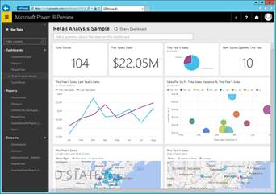
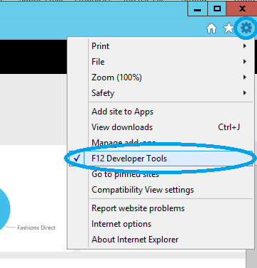
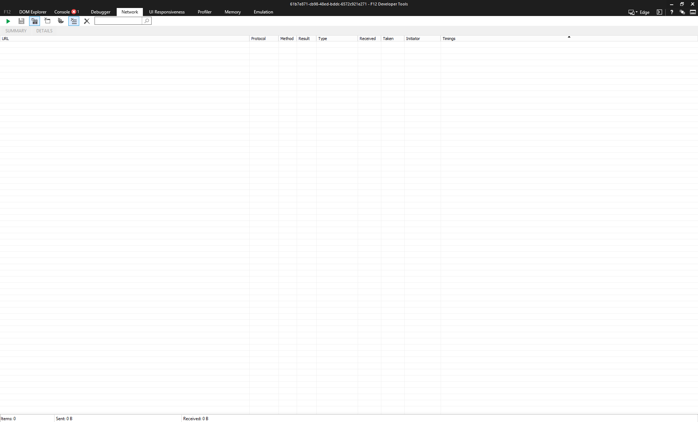
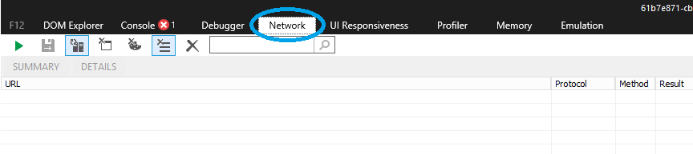
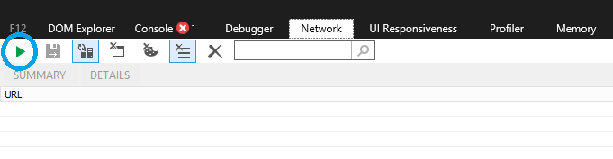
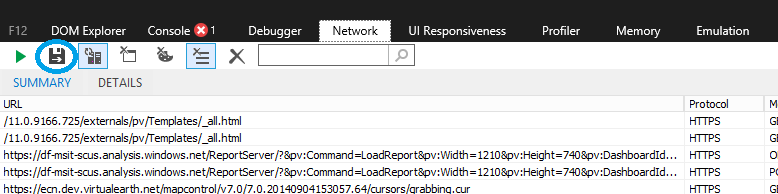
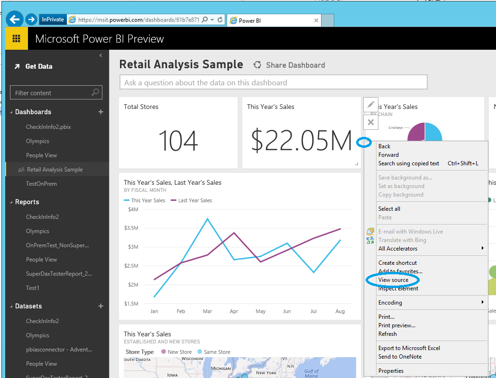
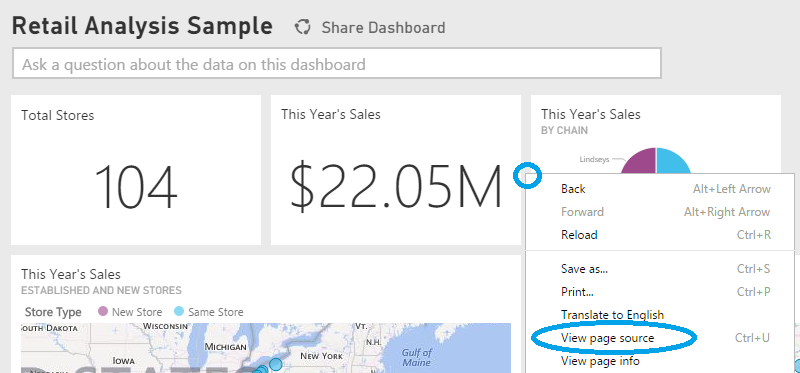

<properties 
   pageTitle="Capturing additional diagnostic information for Power BI"
   description="Capturing additional diagnostic information for Power BI"
   services="powerbi" 
   documentationCenter="" 
   authors="guyinacube" 
   manager="mblythe" 
   editor=""
   tags=""/>
 
<tags
   ms.service="powerbi"
   ms.devlang="NA"
   ms.topic="article"
   ms.tgt_pltfrm="NA"
   ms.workload="powerbi"
   ms.date="12/08/2015"
   ms.author="asaxton"/>

# Capturing additional diagnostic information for Power BI  

## Capturing Additional Diagnostic Information for Power BI  
These instructions provide two potential options for manually collecting additional diagnostic information from the Power BI web client.  Only one of these options needs to be followed.

-   Network Capture - Internet Explorer 11 (Preferred Option)  

-   By Inspecting Page Source - Internet Explorer  

-   By Inspecting Page Source - Chrome

## Network Capture - Internet Explorer 11  
1.  Open your Power BI dashboard in IE

     

2.  Open the IE F12 Developer Tools.

3.  Click on the Tools item in the top right corner of the screen then click on the “F12 Developer Tools” menu item

     

4.  That will bring up the IE F12 Developer Tools window: 

5.  Switch to the Network tab

    

6.  Click on the green triangle to “Enable Network Traffic Capturing”

    

7.  Switch back to the IE window and reproduce the problem in Power BI.

8.  Switch to the IE F12 Developer Tools window and click on the red square to stop capturing network traffic: 

9.  Click on the diskette icon to “Export Captured Traffic”

    

10. Save the NetworkData.xml file.

    The NetworkData.xml file will contain all the information about network requests between the browser window and Power BI.  This will include the activity IDs for each request, the precise timestamp for each request, and any error information returned to the client.  This trace will also contain the data used to populate the visuals shown on the screen.

11. Send us the NetworkData.xml file.

## By Inspecting the Page Source - Internet Explorer  
1.  Open Power BI using a web browser.

2.  Note the date and time.

3.  Perform the action(s) to reproduce the problem.

4.  Return to the Power BI Dashboard.

5.  View the page source in your browser.

6.  Right click in the middle area of the page

7.  Select “View Source” from the context menu  

	

## By Inspecting the Page Source - Chrome  
1.  Open Power BI using a web browser.

2.  Note the date and time.

3.  Perform the action(s) to reproduce the problem.

4.  Return to the Power BI Dashboard.

5.  View the page source in your browser.

6.  Right click in the middle area of the page

7.  Select “View Source” from the context menu

      