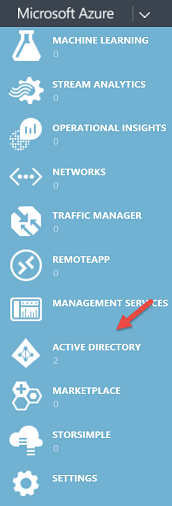
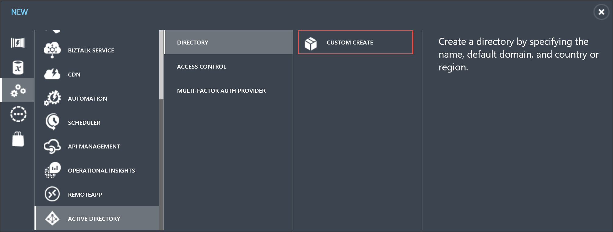
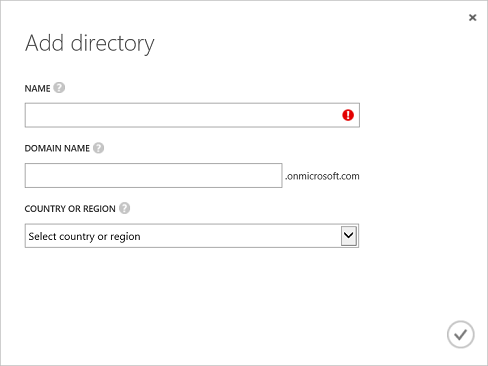
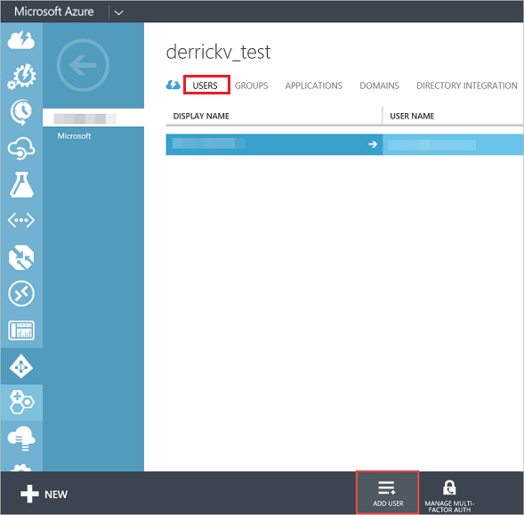
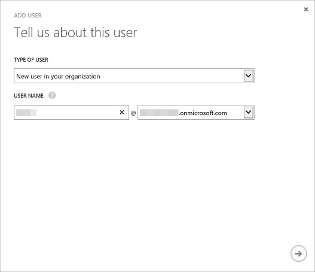
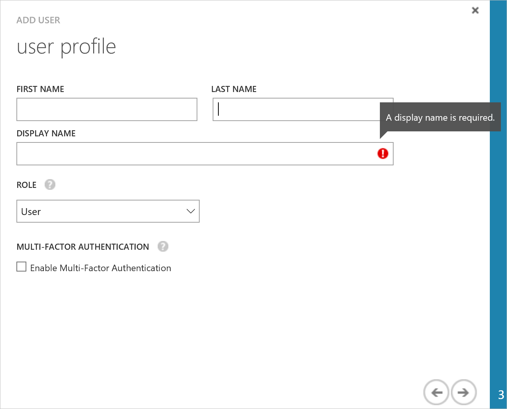

<properties
pageTitle="Sign up with a custom Azure directory"
description="You may be a developer and looking to test your Power BI application that uses the REST API. Creating a custom directory in your Azure subscription can allow you to try an isolated environment. There are a few things you need to do to get Power BI to work with that custom directory."
services="powerbi"
documentationCenter=""
authors="guyinacube"
manager="mblythe"
backup=""
editor=""
tags=""
qualityFocus="monitoring"
qualityDate="8/15/2016"/>

<tags
ms.service="powerbi"
ms.devlang="NA"
ms.topic="article"
ms.tgt_pltfrm="na"
ms.workload="powerbi"
ms.date="08/15/2016"
ms.author="asaxton"/>
# Sign up for Power BI (free) with a custom Azure Active Directory tenant

If you are a developer, using Microsoft Azure, and are looking to create a Power BI application using the REST API’s, you will probably want to use Power BI with a custom Azure Active Directory (AAD) tenant for testing purposes.  There are a few things you will need to do to get up and running. This is all about creating an Azure Active Directory tenant for use with testing Power BI. 

There is an extra step you need to perform to actually do the Power BI sign up due to the fact that you won’t have access to an email server for your custom domain with your AAD tenant.

<iframe width="560" height="315" src="https://www.youtube.com/embed/97IfXEWZMfU" frameborder="0" allowfullscreen></iframe>

## Creating the custom directory and new users

To test with a new tenant, you will need to create an Azure Active Directory Tenant. You can do that through the Azure portal by creating a new directory. After that is done, you will want to create a new user that we can sign up for Power BI with.

### Create an Azure Active Directory tenant
Here's how to setup **Azure Active Directory**:

 1. Navigate to https://manage.windowsazure.com and log in with the account that has an Azure subscription.
 2. Click **ACTIVE DIRECTORY** management icon in the left pane.

    

 3. Click **NEW** button at the bottom of the page.
 4. Choose **APP SERVICES** > **ACTIVE DIRECTORY** > **DIRECTORY** > **CUSTOM CREATE**

    

 5. In the **Add directory** page, enter a name and domain name. For country or region choose United States or the country were Power BI is available.

    

 6. Choose OK icon. An Azure Active Directory is created.

### Add a user to your Azure Active Directory tenant
Now that we have a new tenant, we can create a user within our test organization.

1. Navigate to https://manage.windowsazure.com and log in with the account that has an Azure subscription.
2. Click **ACTIVE DIRECTORY** management icon in the left pane.
3. In your **Azure Active Directory**, click **USERS**.

    
4. At the bottom of the page, click **ADD USER**. A user account is used to register a Power BI app.
5. In the **Tell us about this user page**:

	1. For **TYPE OF USER**, choose **New user in your organization**.
	2. Enter your **USER NAME**.
	3. Click **Next**.

        

6. In the **user profile** page, enter your **DISPLAY NAME**. Display name is a required field.

	

7. Click **Next**. For **ROLE**, you can use **User**.
8. Click **Create** to create a temporary password. The new user is assigned a temporary password that must be changed on first sign in.
9. In the **Get temporary password** page, copy the temporary password, and click **Complete** icon. You use the temporary password when you first login to your AAD.
10. After you click the **Complete** icon, a new Azure AD user is created.

 You can learn more about this step at [Create an Azure Active Directory tenant](powerbi-developer-create-an-azure-active-directory-tenant.md).

## Getting free licenses via add subscription within Office 365

If you try to sign up for Power BI (free) with the new user you created in your custom directory, it will give you a message indicating to check your email for the verification step. However, you do not have an email server for this custom directory’s domain. 

To work around this, we will need to add Power BI (free) licenses from the Office 365 admin center.

> **Note**: Make sure you have at least one user marked as a **Global Admin** in your custom directory. This is so you can access the Office 365 admin center.

1.	Navigate to the [Office 365 admin center](https://portal.office.com/admin/default.aspx), and sign in with your Global Admin user for your custom directory.
2.	On the left navigation pane, select **Billing** > **Subscriptions**.
3.	Select **Add subscriptions +** on the right side.
4.	Under Other Plans, hover over the **ellipse (…)** for Power BI (free) and select **Buy now**.

    

5.	Enter the number of licenses you would like to add and select **Check out now** or **Add to cart**.

    > **Note**: You can add more at a later date if needed.

6.	Enter the needed information in the check out flow.

There is no purchase when using this approach, although you will need to either enter your credit card information for billing, or choose to be invoiced.

If you decide later that you want to add more licenses, you can go back to **Add subscriptions**, and select **Change license quantity** for Power BI (free).

 
You can now assign those licenses to your users. During the check out, it may have assigned the Power BI (free) licenses to all users that didn't have any licenses assigned. [Learn more](https://support.office.com/article/Assign-or-unassign-licenses-for-Office-365-for-business-997596b5-4173-4627-b915-36abac6786dc)

You can verify if the user has a license assigned to the account by going to **Users** > **Active Users** and selecting the user. On the right, you will see **Assigned License**.

## Sign into Power BI

You should now be able to sign into [Power BI](https://app.powerbi.com) with the user you created in your custom directory.

## See also

[Create an Azure Active Directory tenant](powerbi-developer-create-an-azure-active-directory-tenant.md)

[Power BI (free) in your organization](powerbi-admin-powerbi-free-in-your-organization.md)

[What is an Azure AD directory?](https://msdn.microsoft.com/library/azure/jj573650.aspx)

[How to get an Azure Active Directory tenant](https://azure.microsoft.com/documentation/articles/active-directory-howto-tenant/)

