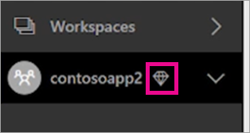
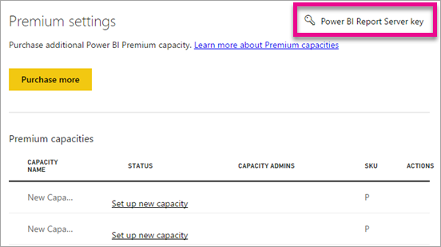
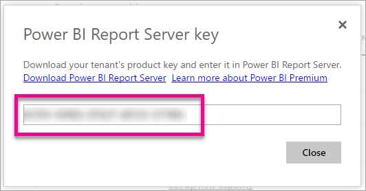

<properties 
   pageTitle="Manage Power BI Premium"
   description="Learn how you can manage Power BI Premium and enable access to content for your entire organization."
   services="powerbi"
   documentationCenter=""
   authors="guyinacube"
   manager="erikre"
   backup=""
   editor=""
   tags=""
   qualityFocus="no"
   qualityDate=""/>
<tags
   ms.service="powerbi"
   ms.devlang="NA"
   ms.topic="article"
   ms.tgt_pltfrm="NA"
   ms.workload="powerbi"
   ms.date="06/01/2017"
   ms.author="asaxton"/>

# Manage Power BI Premium

Learn how you can manage Power BI Premium and enable access to content for your entire organization.

> [AZURE.NOTE] Power BI Premium is not available yet, but coming soon. These documents are being made available ahead of the release of the offering.

The Power BI Premium offering introduces the concept of premium capacity, and it is the heart of the offering.

## What is Power BI Premium capacity?

Power BI Premium enables premium capacity, a set of resources reserved for the exclusive use by you. Having your own premium capacity allows you to publish BI content to users throughout your organization without having to purchase licenses for them. It also guarantees dependable, consistent performance for the contents hosted in capacity.

This is all transparent to your report users. Report users will continue to use Power BI as usual. They don't have to ever be aware that some (or all) of the BI content is hosted in your dedicated capacity. For your users, everything works exactly as before.

For more information, see [What is Power BI Premium?](powerbi-premium.md).

## Purchase Power BI Premium

To take advantage of Power BI Premium and dedicated capacity, you will need to purchase a subscription for Power BI Premium within the Office 365 admin center. For more information, see [How to purchase Power BI Premium](powerbi-admin-premium-purchase.md).

## Capacity admins

When a you are assigned as a capacity admin to a premium capacity, you have full control over the capacity and its administrative features. 

Power BI Premium capacity admins can access the capacity admin portal. From there, you can add more capacity admins or give users capacity assignment permissions. You can bulk assign workspaces to a capacity and view usage metrics on a capacity.

For each capacity, you can define capacity admins. Each capacity has its own admins. Defining a capacity admin to one capacity does not give them access to all capacities within your organization.

Capacity admins can manage the capacity through the admin portal. As a capacity admin, you will only be able to see the capacity items of the admin portal for the capacities that you are an admin of. You will not have access to other areas such as usage metrics, audit logs or tenant settings.

> [AZURE.NOTE] All Office 365 Global Admins and Power BI admins are automatically capacity admins.

## Managing capacity

After you have purchased Power BI Premium, you will then need to manage your capacity nodes. This is done through the [Admin portal](powerbi-admin-portal.md). Within the admin portal, you will see a section called **Premium settings**. This is where you will manage Power BI Premium capacities for your organization.

**Power BI admins and Office 365 global admins:**  

**Capacity admins only:**  

Selecting **Premium settings** will take you to the premium capacity management screen.

### Setting up a new capacity

When you purchase a new capacity node, either seeing one listed in the premium capacities list, or selecting **Purchase more**, you will see the capacity listed and the status will show **Set up new capacity**.

You can setup your new capacity by doing the following.

1. Select **Set up new capacity**.
2. Give your capacity a **name**.
3. Define who the capacity admin is for this capacity.

    > [AZURE.NOTE] Capacity admins do not have to be a Power BI admin or an Office 365 Global admin. For more information, see [Power BI Premium capacity admins](#capacity-admins)

4. Select **Set up**.

Capacity admins, as well as Power BI admins and Office 365 Global Admins, will then see the capacity listed within the admin portal. 

### Capacity settings

Within the Premium capacity management screen, you can select the **gear icon (settings)** under actions. This will allow you to rename or delete a capacity. It will also indicate who the service admins are, the SKU/size of the capacity and what region the capacity is in.

### Capacity

You can manage a capacity be selecting the name of the capacity. This will take you to the capacity management screen.

If no workspaces have been assigned to the capacity, you will see a message allowing you to **assign workspaces**.

#### User permissions

You can assign additional **Capacity admins** as well as assign users that will have **capacity assignment permissions**. Users that have assignment permissions can assign an App workspace to the capacity. Users with assignment permissions will not have access to the admin portal.

> [AZURE.NOTE] Even if you are listed as a **Capacity admin**, you will not see the capacity in the advaced dropdown of an App workspace unless you are listed as a user with assignment permissions.

## Usage measurements

For each capacity, you will be able to use usage measurements for CPU, memory and Direct Query. Each KPI has three indications, **Good (green)**, **Marginal (yellow)** and **Critical (red)**. We suggest monitoring these metrics to ensure that your users see good performance while using Premium content.

|Metric|Description|
|---------|---------|
|CPU|CPU usage of your cores.|
|Memory|Represents the memory pressure of your backend cores. Specifically, this is a metric of how often models are evicted from memory due to memory pressure from usage of multiple models.|
|DQ/s|* We limit the total number of DirectQuery and live connection queries per second. * The limits are 30/s for P1, 60/s for P2 and 120/s for P3. * DirectQuery and live connection queries count equally to the above throttle. For example, if you have 15 DirectQueries and 15 live connections in a second, you hit your throttle. * This applies equally to on-premises and cloud connections.|

When these metrics are marginal/critical, your users may see degradation of report and refresh performance, especially during peak load times.

Metrics reflect utilization over the past week, and are designed to count instances when the capacity is overloaded, and is therefore providing less-than-optimal performance for your users.

Each occurrence of *utilization over 80%* should be considered a potential case of performance degradation. Too many cases is a good indicator of significant performance problems for users.

## Assign a workspace to a premium capacity

There are a few ways that a workspace could be assigned to a premium capacity.

### Premium capacity management in admin portal

Capacity admins, along with Power BI admins and Office 365 global admins, can assign workspaces within the premium capacity management section of the admin portal. When you manage a capacity, you will see a **Workspaces** section that allows you to assign workspaces.

1. Select **Assign workspaces**. This is listed in multiple places and will all perform the same task.
2. Select either **The entire organization's workspaces** or **Specific workspaces by user**.

    |Selection|Description|
    |---|---|
    |**The entire organization's workspaces**|Assigning the entire organization's workspaces to Premium capacity will assign all App Workspaces and My Workspaces, in your organization, to this Premium capacity. In addition, all current and future users will have the permission to reassign individual workspaces to this capacity.|
    |**Specific workspaces by user**|When you assign workspaces by user, or group, all the workspaces owned by those users are assigned to Premium capacity, including the user's personal workspace. Said users automatically get workspace assignment permissions. This includes workspaces already assigned to a different capacity.|

3. Select **Apply**.

> [AZURE.NOTE] This option does not allow you to assign specific workspaces to a capacity.

### App workspace settings

You can also assign an app workspace to a Premium capacity from the settings of that workspace. To assign an app workspace to a premium capacity, do the following.

To move a workspace into capacity, you must have admin permissions to that workspace, and also capacity assignment permissions to that capacity. Notice that workspace admins can always remove a workspace from Premium capacity.

1. Edit an app workspace by selecting the **ellipsis (...)** and selecting **Edit workspace**.

    

2. Within **Edit workspace**, expand **Advanced**.
3. If you have been given capacity assignment permissions to any capacity, you will have the option to turn **Premium** on for this workspace.
4. Select the capacity that you want to assign this App workspace to.

    

5. Select **Save**.

> [AZURE.NOTE] Even if you are listed as a **Capacity admin**, you will not see the capacity in the advanced dropdown of an App workspace unless you are listed as a user with assignment permissions.

Once saved, the workspace, and all its contents, will be moved into Premium capacity without any experience interruption for end users.

## What Premium looks like for users

For the most part, users will not even need to know they are in a Premium capacity. Their dashboards and reports will just work. As a visual hint, you will see a diamond icon next to workspaces that are in a Premium capacity. 

## Power BI Report Server product key

Withing the **Premium settings** tab of the Power BI admin portal, you will have access to your Power BI Report Server product key. This will only be available for Global Admins or users assigned the Power BI service administrator role.

Selecting **Power BI Report Server key** will display a dialog contain your product key. You can copy it and use it with the installation.

For more information, see [Install Power BI Report Server](report-server/reportserver-install-report-server.md).

## Next steps

[Power BI Premium - what is it?](powerbi-premium.md)  
[How to purchase Power BI Premium](powerbi-admin-premium-purchase.md)  
[Power BI Premium FAQ](powerbi-premium-faq.md)  
[Microsoft Power BI Premium whitepaper](https://aka.ms/pbipremiumwhitepaper)  
[Power BI admin portal](powerbi-admin-portal.md)  
[Understanding the Power BI admin role](powerbi-admin-role.md)  
[Auditing Power BI in your organization](powerbi-admin-auditing.md)  
[Administering Power BI in your Organization](powerbi-admin-administering-power-bi-in-your-organization.md)  

More questions? [Try asking the Power BI Community](http://community.powerbi.com/)