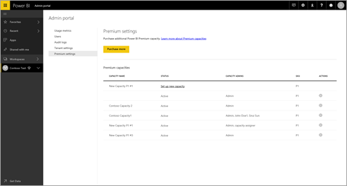
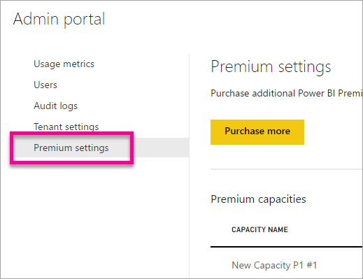
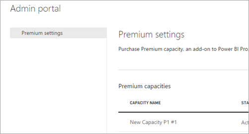
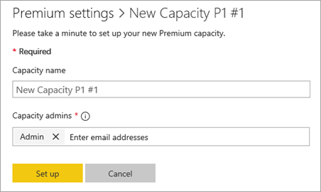
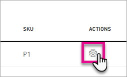
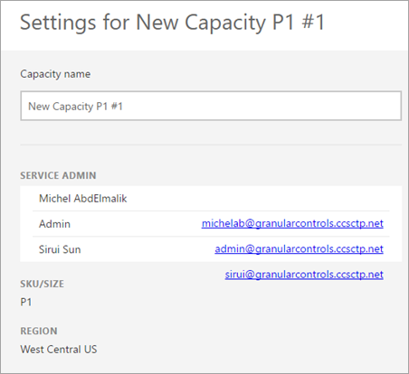
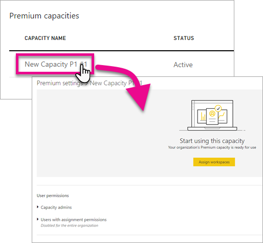
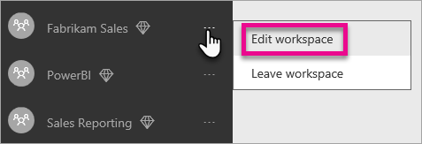

<properties 
   pageTitle="Manage Power BI Premium"
   description="Learn how you can manage Power BI Premium and enable access to content for your entire organization."
   services="powerbi"
   documentationCenter=""
   authors="guyinacube"
   manager="erikre"
   backup=""
   editor=""
   tags=""
   qualityFocus="no"
   qualityDate=""/>
<tags
   ms.service="powerbi"
   ms.devlang="NA"
   ms.topic="article"
   ms.tgt_pltfrm="NA"
   ms.workload="powerbi"
   ms.date="05/19/2017"
   ms.author="asaxton"/>

# Manage Power BI Premium

Learn how you can manage Power BI Premium and enable access to content for your entire organization.

The Power BI Premium offering introduces the concept of dedicated capacity, and it is the heart of the offering.

## What is dedicated capacity?

Power BI Premium enables dedicated capacity, a set of resources reserved for the excludive use by you. Having your own dedicated capacity allows you to publish BI content to users throughout your organization without having to purchase licenses for them. This is all transparent to your report users. Report users will continue to use Power BI as usual. They don't have to ever be aware that some (or all) of the BI content is hosted in your dedicated capacity. For your users, everything works exactly as before.

## Purchase Power BI Premium

In order to take advantage of Power BI Premium and dedicated capacity, you will need to purchase a subscription for Power BI Premium within the Office 365 admin center. For more information, see [How to purchase Power BI Premium](powerbi-admin-premium-purchase.md).

## Capacity admins

Power BI Premium capacity admins can access the capacity admin portal. From there, they can add more capacity admins or give users capacity assignment permissions. They can bulk assign workspaces to a capacity and view usage metrics on a capacity.

For each capacity, you can define capacity admins. Each capacity has its own admins. Defining a capacity admin to one capacity does not give them access to all capacities within your organization.

Capacity admins will be able to manage the capacity through the admin portal. They will only be able to see the capacity items of the admin portal. They will not have access to other areas such as usage metrics, audit logs or tenant settings.

> [AZURE.NOTE] All Office 365 Global Admins and Power BI admins are automatically capacity admins.

## Managing capacity

After you have purchased Power BI Premium, you will then need to manage your capacity nodes. This is done through the [Admin portal](powerbi-admin-portal.md). Within the admin portal, you will see a section called **Premium settings**. This is where you will manage Power BI Premium capacities for your organization.

**Power BI admins and Office 365 global admins:**  

**Capacity admins only:**  

Selecting **Premium settings** will take you to the premium capacity management screen.

### Setting up a new capacity

When you add a new capacity, either seeing one listed in the premium capacities list, or selecting **Purchase more**, you will see the capacity listed and the status will show **Set up new capacity**.

You can setup your new capacity by doing the following.

1. Select **Set up new capacity**.
2. Give your capacity a **name**.
3. Define who the capacity admin is for this capacity.

    > [AZURE.NOTE] Capacity admins do not have to be a Power BI admin or an Office 365 Global admin. For more information, see [Power BI Premium capacity admins](#capacity-admins)

4. Select **Set up**.

Capacity admins, as well as Power BI admins and Office 365 Global Admins, will then see the capacity listed within the admin portal. 

### Capacity settings

Within the Premium capacity management screen, you can select the **gear icon (settings)** under actions. This will allow you to rename or delete a capacity. It will also indicate who the service admins are, the SKU/size of the capacity and what region the capacity is in.

### Capacity

You can manage a capacity be selecting the name of the capacity. This will take you to the capacity management screen.

If no workspaces have been assigned to the capacity, you will see a message allowing you to **assign workspaces**.

#### User permissions

You assign addition **Capacity admins** as well as assign users that will have **capacity assignment permissions**. Users that have assignment permissions can assign an App workspace to the capacity. Users with assignment permissions will not have access to the admin portal.

> [AZURE.NOTE] Even if you are listed as a **Capacity admin**, you will not see the capacity in the advaced dropdown of an App workspace unless you are listed as a user with assignment permissions.

## Usage measurements

For each capacity, you will be able to use usage measurements for CPU, memory and Direct Query. Each KPI has three indications, **Good**, **Marginal** and **Critical**.

## Assign a workspace to a premium capacity

There are a few ways that a workspace could be assigned to a premium capacity.

### Premium capacity management in admin portal

Capacity admins, along with Power BI admins and Office 365 global admins, can assign workspaces within the premium capacity management section of the admin portal. When you manage a capacity, you will see a **Workspaces** section that allows you to assign workspaces.

1. Select **Assign workspaces**. This is listed in multiple places and will all perform the same task.
2. Select either **The entire organization's workspaces** or **Specific workspaces by user**.

    |Selection|Description|
    |---|---|
    |**The entire organization's workspaces**|Assigning the entire organization's workspaces to premium capacity gives all current and future users the permission to reassign individual workspaces to this capacity. This dedicated capacity will become the organization's default capacity.|
    |**Specific workspaces by user**|When you assign workspaces by user, all of the workspaces that the user belongs to become part of premium capacity, including the user's personal workspace. The user automatically gets workspace assignment permissions. If a workspace is already assigned to a capacity, it stay in its currently assigned capacity.|

3. Select **Apply**.

> [AZURE.NOTE] This option does not allow you to assign specific workspaces to a capacity.

### App workspace settings

You can also assign an App Workspace to a premium capacity from the settings of that workspace. To assign an App workspace to a premium capacity, do the following.

1. Edit an app workspace by selecting the **ellipsis (...)** and selecting **Edit workspace**.

    

2. Within **Edit workspace**, expand **Advanced**.
3. If you have been given capacity assignment permissions to any capacity, you will have the option to turn **Premium** on for this workspace.
4. Select the capacity that you want to assign this App workspace to.

    

5. Select **Save**.

> [AZURE.NOTE] Even if you are listed as a **Capacity admin**, you will not see the capacity in the advaced dropdown of an App workspace unless you are listed as a user with assignment permissions.

## What Premium looks like for users

## Next steps

[How to purchase Power BI Premium](powerbi-admin-premium-purchase.md)  
[Power BI admin portal](powerbi-admin-portal.md)  
[Understanding the Power BI admin role](powerbi-admin-role.md)  
[Auditing Power BI in your organization](powerbi-admin-auditing.md)  
[Administering Power BI in your Organization](powerbi-admin-administering-power-bi-in-your-organization.md)  

More questions? [Try asking the Power BI Community](http://community.powerbi.com/)