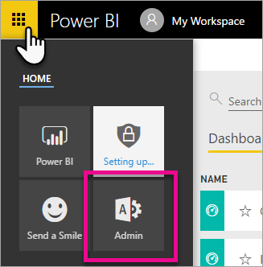
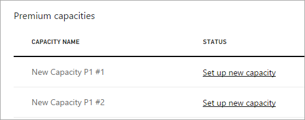

<properties 
   pageTitle="How to purchase Power BI Premium"
   description="Learn how you can manage Power BI Premium and enable access to content for your entire organization."
   services="powerbi" 
   documentationCenter="" 
   authors="guyinacube" 
   manager="erikre" 
   backup=""
   editor=""
   tags=""
   qualityFocus="no"
   qualityDate=""/>
<tags
   ms.service="powerbi"
   ms.devlang="NA"
   ms.topic="article"
   ms.tgt_pltfrm="NA"
   ms.workload="powerbi"
   ms.date="05/31/2017"
   ms.author="asaxton"/>

# How to purchase Power BI Premium

Learn how to purchase Power BI Premium capacity for your organization.

You can purchase a Power BI Premium capacity node through the Office 365 Admin center. You can also have any combination of Premium capacity SKUs (P1 through P3) within your organization. They provide different resource capabilities.

For more information about what Power BI Premium is, see [Power BI Premium - what is it?](powerbi-premium.md). To see the current pricing for Power BI, see the [Power BI pricing page](https://powerbi.microsoft.com/pricing/). You can also plan your costs for Power BI Premium by using the [Power BI Premium calculator](https://powerbi.microsoft.com/calculator/).

## Purchase a Power BI Premium capacity

You need to be either a Global admin or a Billing admin, for your organization, to purchase subscriptions and licenses. For more information, see [About Office 365 admin roles](https://support.office.com/article/About-Office-365-admin-roles-da585eea-f576-4f55-a1e0-87090b6aaa9d).

To purchase a Premium capacity, you will need to do the following.

1. From within the Power BI service, select the **Office 365 app picker** > **Admin**. Alternatively, you can browse to the Office 365 Admin center. You can get there by going to https://portal.office.com and selecting **Admin**.

    

2. Select **Billing** > **Purchase services**.

3. Under **Other plans**, look for Power BI Premium offerings. This will list as P1 through P3.

4. Hover over the **ellipsis (...)** and then select **Buy now**.

    

5. Follow the steps to complete the purchase.

After you have completed the purchase, the Purchase services screen will show that the item is purchased and active.

You can now manage this capacity within the Power BI admin center. For more information, see [Manage Power BI Premium](powerbi-admin-premium-manage.md).

## Purchase more capacities

When you are in the **Premium settings** section of the Power BI Admin portal, if you are an admin, you will see a **Purchase more** button. This button will take you to the Office 365 portal. Once you are in the Office 365 Admin center, you can do the following.

1. Select **Billing** > **Purchase services**.

2. Find the Power BI Premium item you want to purchase more of under **Other plans**.

3. Hover over the **ellipsis (...)** and then select **Change license quantity**.

    

4. Change the number of instances that you want to have for this item. Then select **Submit** when finished.

    > [AZURE.IMPORTANT] Selecting **Submit** will cause charges to be made to the credit card on file.

The **Purchase services** page will then indicate the number of instances you have. Within the Power BI admin portal, under **Premium settings**, you will also see a capacity listed for each instance you have purchased.

You can now manage this capacity within the Power BI admin center. For more information, see [Manage Power BI Premium](powerbi-admin-premium-manage.md).

## Next steps

[Power BI pricing page](https://powerbi.microsoft.com/pricing/)  
[Power BI Premium calculator](https://powerbi.microsoft.com/calculator/)  
[Power BI Premium - what is it?](powerbi-premium.md)  
[Manage Power BI Premium](powerbi-admin-premium-manage.md)  
[Power BI Premium FAQ](powerbi-premium-faq.md)  
[Microsoft Power BI Premium whitepaper](https://aka.ms/pbipremiumwhitepaper)  
[Power BI admin portal](powerbi-admin-portal.md)  
[Administering Power BI in your Organization](powerbi-admin-administering-power-bi-in-your-organization.md)  

More questions? [Try asking the Power BI Community](http://community.powerbi.com/)