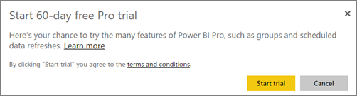

<properties 
   pageTitle="Purchasing Power BI Pro"
   description="Purchasing Power BI Pro"
   services="powerbi" 
   documentationCenter="" 
   authors="guyinacube" 
   manager="mblythe" 
   editor=""
   tags=""
   qualityFocus="no"
   qualityDate=""/>
 
<tags
   ms.service="powerbi"
   ms.devlang="NA"
   ms.topic="article"
   ms.tgt_pltfrm="NA"
   ms.workload="powerbi"
   ms.date="03/09/2016"
   ms.author="asaxton"/>
   
# Purchasing Power BI Pro

You can purchase Power BI Pro directly through the Power BI website, the Office 365 admin center or through your Microsoft representative or partner. This article will look at the two trial options available for Power BI Pro, and then how to purchase Power BI Pro as an individual, or as an organization.

## Power BI Pro 60 day trial

After you have signed up for your free account, you can optionally choose to try Pro for free. You will have access to all of the Pro features for the duration of the trial. [Learn more](powerbi-free-trial-for-power-bi-pro.md)

You will get an option to try Pro for free whenever you try to use a Pro feature. You can also choose to make use of it by going to the gear icon and selecting **Manage personal storage**. Then select **Try Pro for free** on the right.

 
Then you can select **Start trial**.

### What this looks like within the service

When you are in the service, you can verify that you have a Pro trial account by going to the **gear* icon and selecting **Manage personal storage**.

## Purchasing Power BI Pro as an individual

You can purchase Power BI Pro from the start, or can choose to upgrade to Pro after your free trial has ended. If your account is part of an organization, you can purchase Power BI Pro as an individual if your organization has not disabled individual purchases.

To purchase Power BI Pro as an individual, you can do the following.

1.	Browse to [powerbi.com](https://www.powerbi.com).

2.	Select **Products** > **Pricing**.

3.	Select **Purchase**.

    

4.	Answer the questions that are presented to guide the purchase. As an individual, there will be an option to select **Myself**. 

    

    > **Note**: If you are interested in the option to purchase for your team or organization, you can read about purchasing Power BI Pro for your organization. [Learn more]()

5.	If you aren’t already signed into Power BI, you will need to sign in with your Power BI (free) account.

6.	You will need to provide information to make the purchase.

### What this looks like within the service

When you are in the service, you can verify that you have a Pro account by going to the **gear** icon and selecting **Manage personal storage**.

## Subscription trial in Office 365

You can get Power BI Pro as a trial for your organization. Once you have the subscription, you can assign Power BI Pro licenses to your users. [Learn more](https://support.office.com/article/Assign-or-unassign-licenses-for-Office-365-for-business-997596b5-4173-4627-b915-36abac6786dc)
 
1.	Navigate to the [Office 365 admin center](https://portal.office.com/admin/default.aspx).
2.	On the left navigation pane, select Billing > Subscriptions.
3.	Select Add subscriptions + on the right side.
4.	Under Other Plans, hover over the ellipse (…) for Power BI Pro and select Start free trial.

    

5.	On the confirm your order screen, select Try now.
6.	Select Continue on the order receipt.

Under **Billing** > **Subscriptions**, you will see **Power BI Pro Trial** listed with 25 licenses available. This is a one month trial.

### What this looks like within the service

When you are in the service, you can verify that you have a Pro account by going to the **gear** icon and selecting **Manage personal storage**. There will be no indication that this is a trial user.

## Purchase subscription in Office 365

You can purchase Power BI Pro for your organization through the Office 365 admin center. Once you have the subscription, you can assign Power BI Pro licenses to your users. [Learn more](https://support.office.com/article/Assign-or-unassign-licenses-for-Office-365-for-business-997596b5-4173-4627-b915-36abac6786dc)
 
1.	Navigate to the [Office 365 admin center](https://portal.office.com/admin/default.aspx).
2.	On the left navigation pane, select Billing > Subscriptions.
3.	Select Add subscriptions + on the right side.
4.	Under Other Plans, hover over the ellipse (…) for Power BI Pro and select Buy now.

    

5.	Enter the number of licenses you would like to add and select Check out now or Add to cart.

    > **Note**: You can add more at a later date if needed.

6.	Enter the needed information in the check out flow.

> **Note**: If you already had the Power BI Pro Trial, it will go directly to the checkout screen asking to input the number of licenses you want.

Under **Billing** > **Subscriptions**, you will see **Power BI Pro** listed. If you decide later that you want to add more licenses, you can go back to **Add subscriptions**, and select **Change license quantity**.

###What this looks like within the service

When you are in the service, you can verify that you have a Pro account by going to the **gear** icon and selecting **Manage personal storage**.
 

## See also

[Self-service sign up for Power BI](powerbi-service-self-service-signup-for-power-bi.md)

[Power BI (free) in your organization](powerbi-admin-powerbi-free-in-your-organization.md)