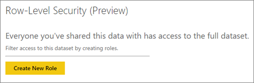
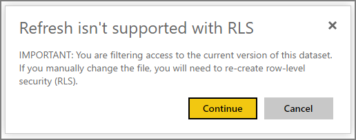
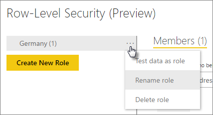
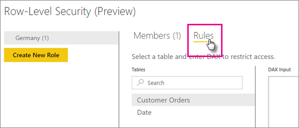
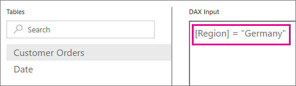

<properties
pageTitle="Row-level security for cloud models"
description="How to configure row-level security for imported datasets within Power BI."
services="powerbi"
documentationCenter=""
authors="guyinacube"
manager="mblythe"
editor=""/>

<tags
ms.service="powerbi"
ms.devlang="NA"
ms.topic="article"
ms.tgt_pltfrm="na"
ms.workload="powerbi"
ms.date="03/31/2016"
ms.author="asaxton"/>
# Row-level security for cloud models

Row-level security (RLS) can be used to restrict data access for given users. This is accomplished by using filters at the row level. Filters are implemented through roles.

You can now configure RLS for data models that have been imported into Power BI. These are referred to as cloud models. Previously, you were only able to implement RLS via live connections to Analysis Services on-premises. Row-level security for Analysis Services is still handled at the on-premises server. The security option will not show up for DirectQuery or Live connection datasets.

> **Note**: The preview is intended to let users to start trying out the feature. It will also allow us to collect feedback for improvements. It is not intended for operational usage. Rules defined during the preview may not be available when the feature is generally available.

## Manage security on your model

To manage security on your data model, you will want to do the following.

1.	Select the **ellipse (…)** for a dataset.
2.	Select **Security**.

    
 
This will take you to the RLS page for you to create roles and add rules with filters. Only the owners of the dataset will see Security available. 

> **Note**: Currently you cannot configure RLS on a dataset that is in a group workspace.

## Working with roles

To create a new role, simply select **Create New Role**.

 
> **Note**: If your model was created from a PBIX file on your local drive, the first time you create a role, you will get a notice indicating that republish is not supported with RLS. Republishing or overwriting the dataset will cause you to have to re-create the RLS settings.

 
OneDrive refresh is not supported with RLS. If you turn that on, then you will lose all RLS configuration you have defined.

You can provide a name for the role when you initial create it. You can rename, or delete, the role by select the **ellipse (…)** for that role and selecting either **Rename** or **Delete**.

## Working with members

### Add members

You can add a member to the role by typing in the email address, or name, of the user you want to add. This user has to be within your organization.

 
You can also see how many members are part of the role by the number in parenthesis next to the role name, or next to Members.

 
### Remove members

You can remove members by selecting the X next to their name. 
 

## Defining a rule for a role

The way you define what the members will see is via a filter on a table within the data model. You can define the filter by doing the following.
Rules are defined by using DAX expressions. In a future release, you will have a more intuitive UI to make it easier for you to define the rule.

1.	Select the role you want to add a rule to.
2.	Select **Rules**.

    

3.	Select the table you want to add the filter to.
4.	Enter your DAX formula, for the selected table, in the **DAX Input** text box.

    

5.	Select **Save**.

> **Note**: There is no validation on the DAX that is supplied. The rule will still save if the DAX is invalid.

When the members, that are defined in the Role, interact with the dataset, report, or dashboard, they will only see data that is allowed based on the rules. If you are assigned to more than one role, you will have access to the data allowed by all roles you belong to.

## Limitations

Here is a list of the current limitations for row-level security on cloud models.

- You can define RLS only on the datasets created using Power BI Desktop client. If you want to enable RLS for datasets created with Excel, you will need to convert your files into PBIX files first. [Learn more](powerbi-desktop-import-excel-workbooks.md)
- Only ETL connections are currently supported. RLS for direct query to various data sources will be supported in later releases.
- If you make a change to your PBIX file, and republish to the service, you will need to re-create RLS.
- Defining RLS in a group workspace is not supported.
- You cannot add security groups or distribution lists to the member list. This is planned for a later release.
- You can’t use RLS with content packs. This is planned for a later release. 
- Q&A and Cortana is not supported with RLS. You will not see the Q&A input box for dashboards if all models have RLS configured.
