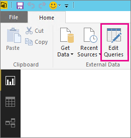
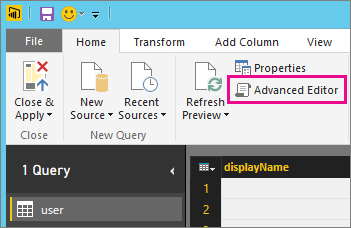
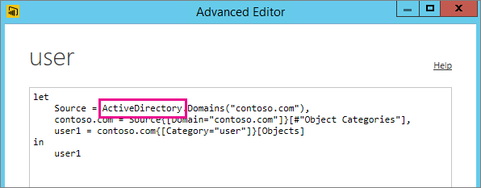

<properties 
   pageTitle="Troubleshooting unsupported data source for refresh"
   description="Troubleshooting unsupported data source for refresh"
   services="powerbi" 
   documentationCenter="" 
   authors="jastru" 
   manager="mblythe" 
   editor=""
   tags=""/>
 
<tags
   ms.service="powerbi"
   ms.devlang="NA"
   ms.topic="article"
   ms.tgt_pltfrm="NA"
   ms.workload="powerbi"
   ms.date="10/16/2015"
   ms.author="jastru"/>

# Troubleshooting unsupported data source for refresh  
[← Troubleshooting](https://support.powerbi.com/knowledgebase/topics/65779-troubleshooting)

You may see an error when trying to configured a dataset for scheduled refresh.

		You cannot schedule refresh for this dataset because it gets data from sources that currently don’t support refresh.

This happens when the data source you used, within Power BI Desktop, isn’t supported for refresh. You will need to find the data source that you are using and compare that against the list of supported data sources at [Refresh data in Power BI](https://support.powerbi.com/knowledgebase/articles/474669-refresh-data). 

## Find the data source  
If you aren’t sure what data source was used, you can find that using the following steps within Power BI Desktop.  

1.  In Power BI Desktop, make sure you are on the **Report** pane.  
    

2.  Select **Edit Queries** from the ribbon bar.  
    

3.  Select **Advanced Editor**.  
    
	
4.  Make note of the provider listed for the source.  In this example, the provider is ActiveDirectory.  
    

5.  Compare the provider with the list of supported data sources found within [Refresh data in Power BI](https://support.powerbi.com/knowledgebase/articles/474669-refresh-data).  You will find that Active Directory is not a supported data source for refresh.  

## See Also  
[Data Refresh](https://support.powerbi.com/knowledgebase/topics/107925-data-refresh)  
[Tools for troubleshooting refresh issues](https://support.powerbi.com/knowledgebase/articles/742023-tools-for-troubleshooting-refresh-issues)  