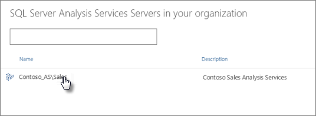

<properties 
   pageTitle="Configure a Power BI Analysis Services Connector"
   description="Configure a Power BI Analysis Services Connector"
   services="powerbi" 
   documentationCenter="" 
   authors="guyinacube" 
   manager="mblythe" 
   editor=""
   tags=""/>
 
<tags
   ms.service="powerbi"
   ms.devlang="NA"
   ms.topic="article"
   ms.tgt_pltfrm="NA"
   ms.workload="powerbi"
   ms.date="09/28/2015"
   ms.author="asaxton"/>
# Configure a Power BI Analysis Services Connector

##  [**Download the Analysis Services Connector now**](http://www.microsoft.com/download/details.aspx?id=45333)

Before users can connect to a SQL Server Analysis Services tabular model, a Power BI Analysis Services connector needs to be configured for the server.  If you have more than one Analysis Services server, you'll need to configure one connector per server. This is done by a server administrator. For more detailed information about how the connector works, be sure to see [Power BI Analysis Services Connector in-depth](powerbi-admin-analysis-services-connector-indepth.md).

Once the connector is configured, tabular model databases on the Analysis Services server instance will appear in the SQL Server Analysis Services page in Power BI. Creating the connection requires a Windows account and password with Server Administrator permissions for the server instance you are connecting to. Once configured, users will need to have at least Read permissions for any tabular model databases they’re connecting to.

The connector can run on any domain computer. It doesn't have to be your local computer or the Analysis Services server, as it's just acting as a proxy between Analysis Services and Power BI. The connector makes the connection to Analysis Services and passes the credentials of the user accessing Power BI along to it. The computer where it is installed has to remain turned on, connected to the network, and able to access the Analysis Services server at all times.

  **Important:** 

-   Only SQL Server Analysis Services Tabular models are supported for Power BI
-   The connector has to continue running and the computer where it is installed has to remain on.
-   Power BI Analysis Services Connector communicates on outbound ports: TCP 443 (default), 5672, 9350, 9354.

**Prerequisites**

-   .NET Framework 4.5.1 or later must be installed on the computer.
-   Installing the Power BI Analysis Services Connector and the Data Management Gateway on the same computer is not supported. If you already have the Data Management Gateway installed, uninstall it before installing the Power BI Analysis Services Connector, or install the Connector on different computer.
-   The Analysis Services server is domain joined.
-   The Analysis Services connector & Analysis Services server are installed on computers in the same domain.
-   If you use a .onmicrosoft.com email address, you'll need to sync your Active Directory to Azure Active Directory using Azure Active Directory Sync (DirSync). To learn more. see [Power BI Analysis Services Connector in-depth](powerbi-admin-analysis-services-connector-indepth.md).

## To install and configure a Power BI Analysis Services Connector

1.  In Power BI, click Download  \> **Analysis Services Connector**.

 **Note**: You can also [download the Analysis Services Connector from the Microsoft Download Center](http://www.microsoft.com/download/details.aspx?id=45333).

 2.  Click **Save** or  **Run**.

3.  Review the terms, then click **Install**. You can click **Options** to change the default location where the connector will be installed.

**  Note**: To uninstall a Power BI Analysis Services Connector, use Uninstall in Control Panel.

4.  After installing, click **Launch** to open the Power BI Analysis Services Connector Wizard. The Wizard will guide you through configuring a connector to your server instance.

5.  In the Wizard, click **Next**.

 

6.  Sign into your Power BI account.

 

7.  On the **Connect to SQL Server Analysis Server** page, enter the ServerName\\Instance, Windows username, and password.

**Note**: The Windows account you enter must have Server Administrator permissions for the instance you are connecting to. The account should also have a password that doesn’t expire, otherwise users could get a connection error.

8.  Type a friendly name, description, and friendly error message for the connection. Power BI users will identify the connection by this name and description.

 

9.  Verify your connector's settings. If all is good, click **Close**.

 

When the Wizard completes, the Tabular model databases for the server instance you configured will appear when users click **Get data** \> **Databases** \> **SQL Server Analysis Services** \> **Connect**.

When a user selects the new connection, all of the tabular models available on the instance appear as data sources.

 

## To uninstall a connector

Uninstall the connector by using Remove Programs in Control Panel.

## Troubleshooting

If you're having trouble when installing and configuring the Connector, be sure to see [Troubleshooting Power BI Analysis Services Connector.](powerbi-admin-troubleshoot-analysis-service-connector.md)

