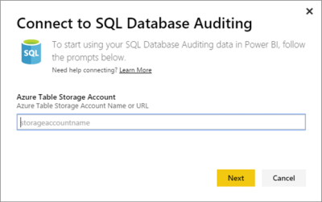
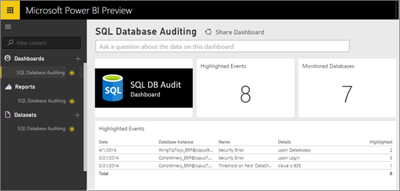

<properties pageTitle="Azure SQL Database Auditing connector for Power BI" description="Azure SQL Database Auditing connector for Power BI" services="powerbi" documentationCenter="" authors="v-anpasi" manager="mblythe" editor=""/>
<tags ms.service="powerbi" ms.devlang="NA" ms.topic="article" ms.tgt_pltfrm="NA" ms.workload="powerbi" ms.date="06/25/2015" ms.author="v-anpasi"/>
# Azure SQL Database Auditing content pack for Power BI

[← Services in Power BI](https://support.powerbi.com/knowledgebase/topics/88770-services-in-power-bi)

The Power BI content pack for [SQL Database Auditing](http://azure.microsoft.com/documentation/articles/sql-database-auditing-get-started/) allows you to understand your database activity and gain insight into discrepancies and anomalies that could indicate business concerns or suspected security violations. 

The content pack imports data from all tables that contain “AuditLogs” in their name and append it to a single data model table named “AuditLogs”. The last 250k events will be included and the data will be refreshed daily.

1. Click **Get Data** at bottom of the left navigation pane.

	 

2. In the Services box, select Get.

     

3. Select the **SQL Database Auditing** content pack and click **Connect**.

    

4. Enter the Azure Table Storage account name or URL where your logs are stored.

    

5. For Authentication Method, select **Key**, enter the **Account Key** \> Sign In.

	

6. After Power BI imports the data, you see a new dashboard, report, and dataset in the left navigation pane. New items are marked with a yellow asterisk *.

	

You can change this dashboard to display your data the way you want it. Plus you can ask a [question in](http://support.powerbi.com/knowledgebase/articles/474566-q-a-in-power-bi)[Q&A](http://support.powerbi.com/knowledgebase/articles/474566-q-a-in-power-bi) or click a tile to [open the underlying report](http://support.powerbi.com/knowledgebase/articles/425669-when-you-click-a-tile-in-a-dashboard) and [c](http://support.powerbi.com/knowledgebase/articles/424878-edit-a-tile-resize-move-rename-delete)[hange the tiles](http://support.powerbi.com/knowledgebase/articles/424878-edit-a-tile-resize-move-rename-delete) in the dashboard.
