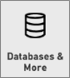
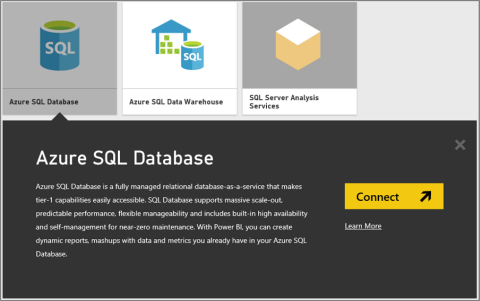
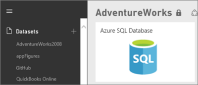
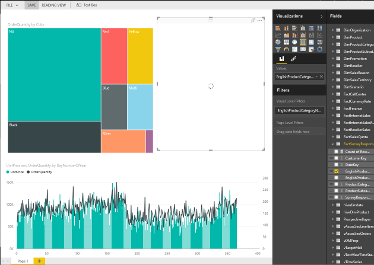

<properties 
   pageTitle="Azure SQL Database with direct connect"
   description="Azure SQL Database with direct connect"
   services="powerbi" 
   documentationCenter="" 
   authors="guyinacube" 
   manager="mblythe" 
   editor=""
   tags=""/>
 
<tags
   ms.service="powerbi"
   ms.devlang="NA"
   ms.topic="article"
   ms.tgt_pltfrm="NA"
   ms.workload="powerbi"
   ms.date="11/06/2015"
   ms.author="asaxton"/>
# Azure SQL Database with direct connect

Azure SQL Database with direct connect allows you to create dynamic reports based on data and metric you already have in your Azure SQL Database. With direct connect, queries are sent back to your Azure SQL Database as you explore the data in the report view. This experience is suggested for users who are familiar with the databases and entities they connect to.

Notes:

-   Specify the fully qualified server name when connecting (see below for more details)

-   Ensure firewall rules for the database are configured to "[Allow access to Azure services](https://msdn.microsoft.com/library/azure/ee621782.aspx)".

-   Every action such as selecting a column or adding a filter will send a query back to the database

-   Tiles are refreshed approximately every 15 mins (refresh does not need to be scheduled)

-   Q&A is not available for Direct Connect datasets

-   Schema changes are not picked up automatically

-   Groups are only available with [Power BI Pro](powerbi-power-bi-pro-content-what-is-it.md).

These restrictions and notes may change as we continue to improve the experiences. The steps to connect are detailed below. 

Connect to the [Azure SQL Database connector](https://app.powerbi.com/getdata/bigdata/azure-sql-database-with-live-connect) for Power BI.

1.  Select Get Data at the bottom of the left navigation pane.

    

2.  Select **Databases & More**.

    

3.  Select the **Azure SQL Database** connector. \> **Connect**.

    

4.  Enter the name of the **server** (fully qualified, such as name.database.windows.net) and **database** you want to connect to, as well as your **username** and **password**.  You can find these parameters in the Azure Portal. See below for more details about finding the parameter values.

5.  After you've connected, you see a new dataset with the same name as the database you connected to, and a placeholder tile for the dataset, created on the dashboard.

    

6.  Selecting the placeholder tile for the dataset opens a new report, where you can explore all of the tables and columns in your database. Selecting a column will send a query back to the source, dynamically creating your visual. These visuals can be saved in a new report, and pinned back to your dashboard.

    

### Finding Parameter Values

Your fully qualified server name and database name can be found in the Azure Portal.

## See Also:

[Get started with Power BI](powerbi-service-get-started.md)

[Get Data for Power BI](powerbi-service-get-data.md)

