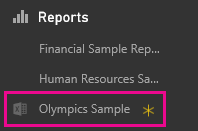
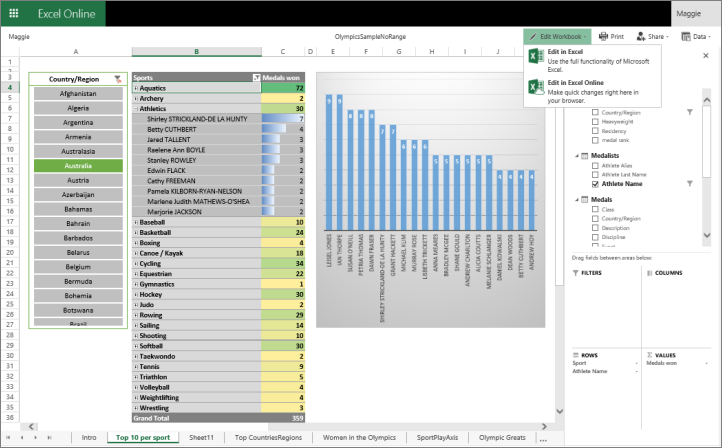

<properties
   pageTitle="Bring whole Excel files into Power BI"
   description="Learn how to bring whole Excel files into Power BI"
   services="powerbi"
   documentationCenter=""
   authors="Minewiskan"
   manager="mblythe"
   editor=""
   tags=""/>

<tags
   ms.service="powerbi"
   ms.devlang="NA"
   ms.topic="article"
   ms.tgt_pltfrm="NA"
   ms.workload="powerbi"
   ms.date="12/14/2015"
   ms.author="owend"/>
# Bring whole Excel files into Power BI

If Excel is your go-to tool for working with data, you can leverage your Excel expertise and investments by using them in Power BI. You can bring any Excel workbook (XLSX or XLSM) into Power BI and explore the whole file, exactly as you would in Excel Online.

>Note: You can't pin items in Excel to a dashboard in Power BI. If you want to pin Power View visuals to a Power BI dashboard, either [connect to it on OneDrive or import it from your computer, as a data source](powerbi-service-get-data-from-files.md). 

To view and explore whole Excel files in Power BI, your workbooks need to be on OneDrive for Business. Here's a big advantage of connecting to files on OneDrive: any changes you make to a file on OneDrive appear automatically in the file in Power BI. The reverse is also true when you bring in whole Excel files: Changes you make to the file in Power BI are saved to the file on OneDrive.

Excel workbooks in Power BI display the same items as workbooks in Excel Online. For example, Excel workbooks can display these items:

-   PivotTables

-   PivotCharts and charts

-   Slicers

-   Data in tables and worksheets  

-   Power View sheets

Excel workbooks can't display named ranges in Excel Online. If you come across a feature that can't be displayed in Excel Online, you can open the workbook in Excel on your computer.

## Some important things to know

-   Here are the maximum sizes of an Excel workbook and Data Model you can connect to:

    250 MB for the workbook.

    250 MB for the Data Model part of the workbook. 

    10 MB for the rest of the workbook.

    Read more about [Excel workbook size](powerbi-reduce-the-size-of-an-excel-workbook.md).

-   The file can't be encrypted -- protected with a password or information or digital rights management (IRM or DRM).

-   You can't connect to a whole Excel file again if you're already connected to it. But you can connect to a single file both as a whole Excel workbook and as a dataset. The whole Excel file appears under Reports in the left navigation pane, and the workbook-as-dataset appears under Datasets.

-   If you have an Excel 2010 workbook with a PowerPivot 2010 data model, you need to [upgrade the workbook to Excel 2013](https://support.office.com/article/Upgrade-Power-Pivot-Data-Models-to-Excel-2013-c66578cb-74d5-43ae-a474-5a01be5db439).

## Connect to an Excel file on OneDrive for Business

1.  Select **Get Data** at the bottom of the left navigation pane. 

    

2.  In the **Files** box, select **Get**.

    

3.  Select **OneDrive - Business**. 

    

4.  In OneDrive for Business, under **Connect, Manage, and View Excel in Power BI**, select **Connect**. This brings the whole Excel workbook into Power BI.

    

5.  The Excel file is under **Reports**, with an Excel icon next to it. The yellow asterisk (\*) shows it's new.

    

6.  No dashboard or dataset is associated with it.

7.  Select the ellipsis (...) next to the file \> **View** or **Edit**.

    

    The workbook opens in Excel Online in a new browser window. All the worksheet tab names are along the bottom.

    

8.  To switch from read-only view to editing view, in the upper-right corner select **Edit Workbook** \> **Edit in Excel Online**.

    Or select **Edit in Excel** if you have Excel installed on your computer.

## Share your workbooks in content packs
With organizational content packs, you can share workbooks you connect to on OneDrive for Business with others in your organization. To learn more, see [Organizational content packs: an introduction](powerbi-service-organizational-content-packs-introduction.md).

## Refresh data in an Excel workbook

With Power BI, if your workbook on OneDrive for Business connects to external online or on-premises data sources, you can setup a data refresh schedule or you can refresh it whenever you want by using Refresh now. When you refresh from Power BI, you're also refreshing it in OneDrive for Business -- it's one and the same file. To learn more, see [Refresh a dataset created from an Excel workbook on OneDrive](powerbi-refresh-excel-file-onedrive.md).
