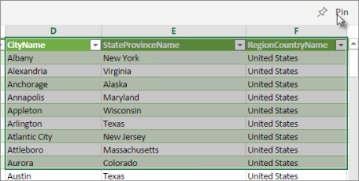
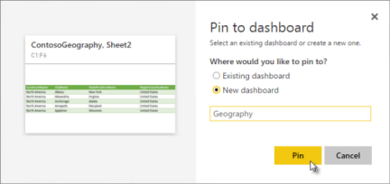
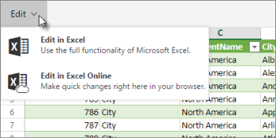

<properties
   pageTitle="Bring whole Excel files into Power BI"
   description="Learn how to bring whole Excel files into Power BI"
   services="powerbi"
   documentationCenter=""
   authors="Minewiskan"
   manager="mblythe"
   editor=""
   tags=""/>

<tags
   ms.service="powerbi"
   ms.devlang="NA"
   ms.topic="article"
   ms.tgt_pltfrm="NA"
   ms.workload="powerbi"
   ms.date="01/20/2016"
   ms.author="owend"/>
# Bring whole Excel files into Power BI

If Excel is your go-to tool for working with data, you can leverage your Excel expertise and investments by using them in Power BI. You can bring any Excel workbook (XLSX or XLSM) into Power BI and explore the whole file, exactly as you would in Excel Online.

To view and explore whole Excel files in Power BI, your workbooks need to be on OneDrive for Business or SharePoint -Team Sites. Here's a big advantage of connecting to files on OneDrive or SharePoint: Any changes you make to a file will appear automatically in the file in Power BI. The reverse is also true when you bring in whole Excel files: Changes you make to the file in Power BI are saved to the file on OneDrive or SharePoint.

Excel workbooks in Power BI display the same elements as workbooks in Excel Online:

-   PivotTables

-   PivotCharts and charts

-   Slicers

-   Data in tables and worksheets  

-   Power View sheets

## Some important things to know

-   Here are the maximum sizes of an Excel workbook and Data Model you can connect to:

    250 MB for the workbook.

    250 MB for the Data Model part of the workbook. 

    10 MB for the rest of the workbook.

    Read more about [Excel workbook size](powerbi-reduce-the-size-of-an-excel-workbook.md).

-   The file can't be encrypted -- protected with a password or information or digital rights management (IRM or DRM).

-   You can't connect to a whole Excel file again if you're already connected to it. But you can connect to a single file both as a whole Excel workbook and as a dataset. The whole Excel file appears under Reports in the left navigation pane, and the workbook-as-dataset appears under Datasets.

-   If you have an Excel 2010 workbook with a PowerPivot 2010 data model, you need to [upgrade the workbook to Excel 2013](https://support.office.com/article/Upgrade-Power-Pivot-Data-Models-to-Excel-2013-c66578cb-74d5-43ae-a474-5a01be5db439).

## Connect to an Excel file on OneDrive for Business or SharePoint -Team Sites

1.  Select **Get Data** at the bottom of the left navigation pane. 

    

2.  In the **Files** box, select **Get**.

    

3.  Select **OneDrive - Business** or **SharePoint - Team Sites**.

    

4.  In OneDrive for Business or SharePoint for Business, under **Connect, Manage, and View Excel in Power BI**, select **Connect**. This brings the whole Excel workbook into Power BI.

    

5.  Once brought into Power BI, your Excel file will under **Reports**, with an Excel icon next to it. The yellow asterisk (\*) shows it's new.

    

  No dataset is associated with your Excel file, and no dashboard is associated with it yet. To explore, just click on the file name under **Reports**. Your workbook will open in read-only view, right in Power BI.

## Pin a range to a dashboard
When you bring whole Excel files into Power BI, you can select a range from a worksheet and pin it to a dashboard you already have or pin to a new dashboard. The range you select can contain data, charts, tables, PivotTables, PivotCharts, and other Excel parts.
It's easy, just select a range, then click **Pin**.

In **Pin to Dashboard**, select an existing dashboard or create a new one, then click **Pin**.

To learn more, see [Pin a tile to a Power BI dashboard from Excel](powerbi-service-pin-a-tile-to-a-dashboard-from-excel.md).

## Edit your workbooks
When exploring your workbook in Power BI, it's read-only. But sometimes you'll need to make some changes. No problem. You can open and edit your Excel files in Excel Desktop on your own computer or in Excel Online, right from Power BI!

Click **Edit**, then click **Edit in Excel** to open the file in Excel Desktop. If you only need to make some quick changes, click **Edit in Excel Online** to open the file right in your browser.

When you edit your file in Excel Online, your changes are immediately saved to the file on OneDrive or SharePoint. When you edit your file in Excel Desktop, you'll need to save your changes. Power BI will pick up those changes, usually in about an hour, or you can refresh Power BI in your browser to see them right away.

## Share your workbooks in content packs
With organizational content packs, you can share workbooks you connect to on OneDrive for Business with others in your organization. To learn more, see [Organizational content packs: an introduction](powerbi-service-organizational-content-packs-introduction.md).

## Refresh data in an Excel workbook

With Power BI, if your workbook on OneDrive for Business connects to external online or on-premises data sources, you can setup a data refresh schedule or you can refresh it whenever you want by using Refresh now. When you refresh from Power BI, you're also refreshing it in OneDrive for Business -- it's one and the same file. To learn more, see [Refresh a dataset created from an Excel workbook on OneDrive](powerbi-refresh-excel-file-onedrive.md).
