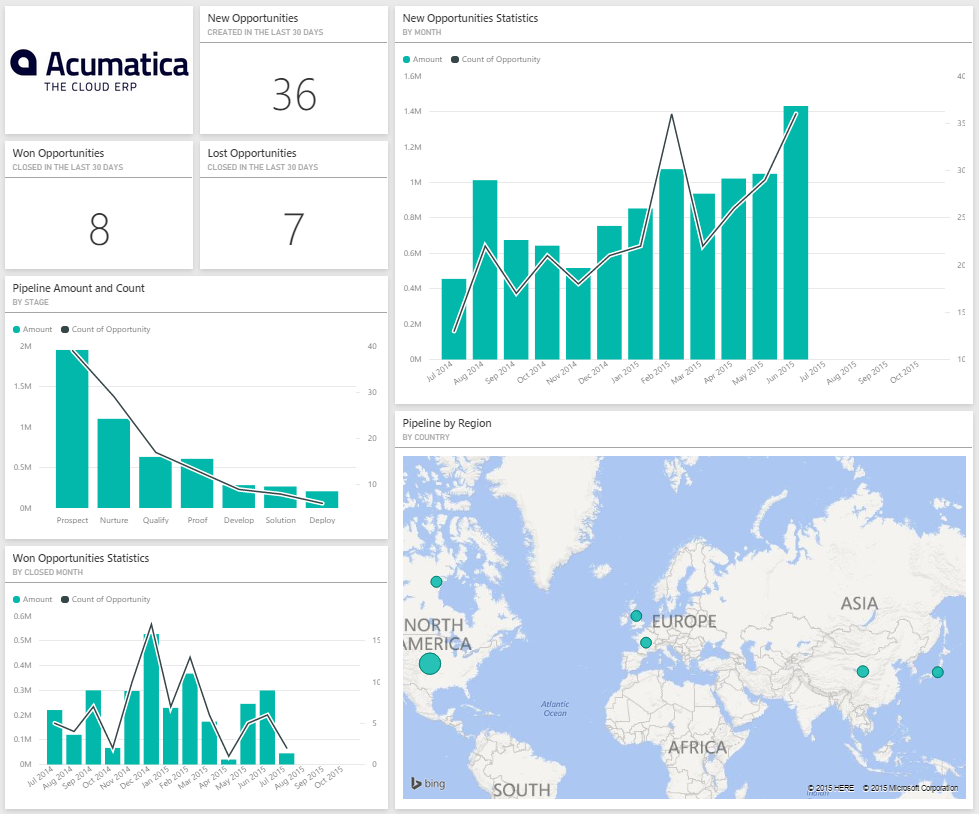
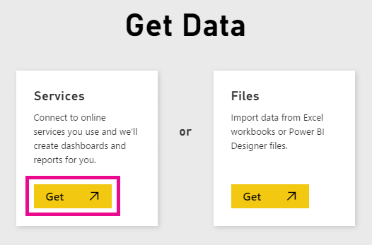
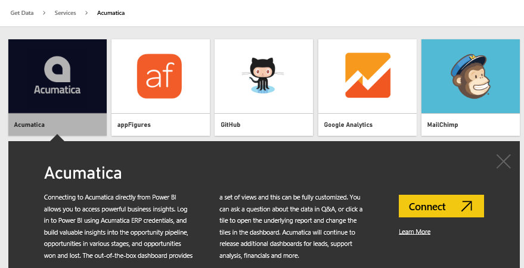
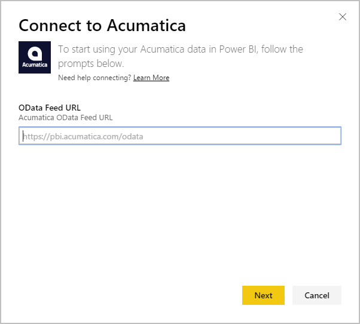
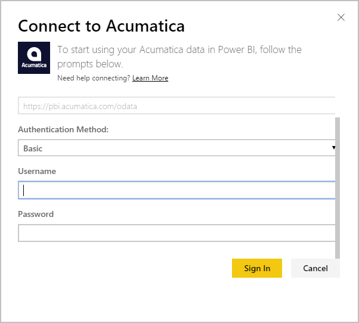
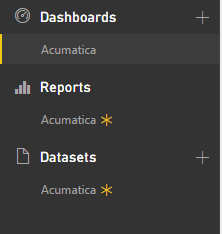

<properties 
   pageTitle="Acumatica content pack for Power BI"
   description="Acumatica content pack for Power BI"
   services="powerbi" 
   documentationCenter="" 
   authors="maggiesMSFT" 
   manager="mblythe" 
   editor=""
   tags=""/>
 
<tags
   ms.service="powerbi"
   ms.devlang="NA"
   ms.topic="article"
   ms.tgt_pltfrm="NA"
   ms.workload="powerbi"
   ms.date="09/28/2015"
   ms.author="maggies"/>
# Acumatica content pack for Power BI

The Power BI Acumatica content pack allows to you quickly gain insights into your opportunity data. Power BI retrieves your data, including opportunities, accounts, and customers, then builds a default dashboard and related reports based on that data.

Connect to the [Acumatica content pack](https://app.powerbi.com/getdata/services/acumatica) for Power BI.

Note: this content pack requires a minimum version of Acumatica v5.2.

After you have created the connection, you can explore your data and customize the dashboard to meet your needs. Data is automatically refreshed every day.

1.	Select **Get Data** at the bottom of the left navigation pane.

	

2.	In the **Services** box, select **Get**.

	

3.	Select **Acumatica** \> **Connect**.

	

4.	Enter your Acumatica OData endpoint. An OData endpoint allows an external system to request data from Acumatica. Acumatica OData endpoint is formatted as follows and should us HTTPS:

		https://<application site domain>/odata/<company name>

	The Company Name is only required if you have a multi-company deployment. More information about finding this parameter in your Acumatica account is included below.

	

5. For Authentication Method, select **Basic**. Enter your username and password from your Acumatica account, then click **Sign In**.

	

6. After Power BI imports the data you will see a new dashboard, report, and dataset in the left navigation pane. New items are marked with a yellow asterisk \* which disappears once selected:

	 

7. Select the Acumatica dashboard. This is the default dashboard that Power BI creates to display your data. You can modify this dashboard to display your data in any way you want.

	

**What can you do now?**

- Try [asking a question in the Q&A box](powerbi-service-q-and-a.md) at the top of the dashboard, such as "total downloads by product"

- [Change the tiles](powerbi-service-edit-a-tile-in-a-dashboard.md) in the dashboard.

- [Select a tile](powerbi-service-dashboard-tiles.md) to open the underlying report.

- While your dataset will be refreshed automatically, you can also refresh it on demand using **Refresh Now**

**Finding your Acumatica OData Endpoint**

The Acumatica OData endpoint is formatted as follows and should us HTTPS:

	https://<application site domain>/odata/<company name>

The Application Site Domain can be found in your browser’s address bar when you’re signed into Acumatica. In the example below, the site domain is “https://pbi.acumatica.com” so the OData endpoint to provide would be “https://pbi.acumatica.com/odata”.

 

The Company Name is only required if you have a multi-company deployment. You can find this information from your Acumatica sign in page.

**Troubleshooting**

If you’re not able to login, verify the Acumatica OData endpoint you provided is formatted correctly. 

	https://<application site domain>/odata/<company name>

If you're having trouble connecting, please confirm with your admin your version of Acumatica. This content pack requires version 5.2 or later.

**See Also**

[Get started in Power BI](powerbi-service-get-started.md)

[Get data in Power BI](https://support.powerbi.com/knowledgebase/topics/63369)

[Services in Power BI](https://support.powerbi.com/knowledgebase/topics/88770)

 

