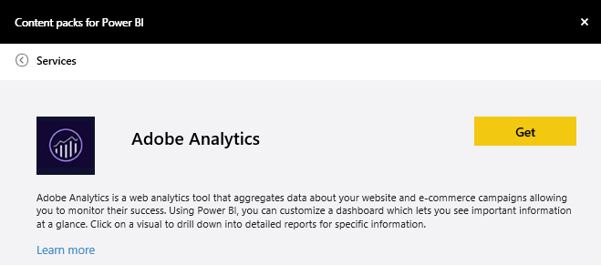
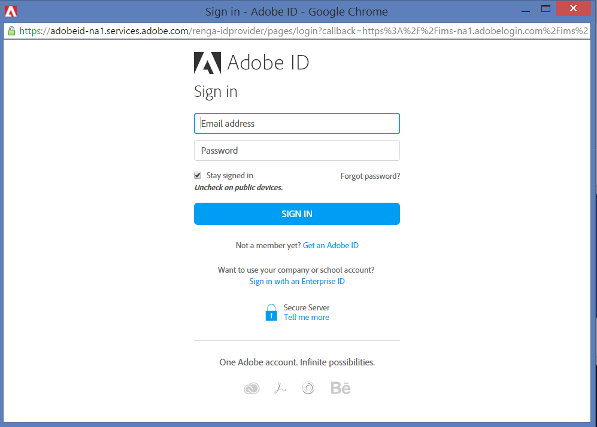
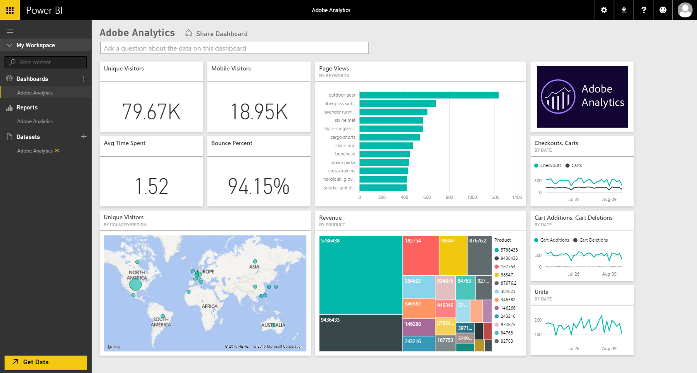
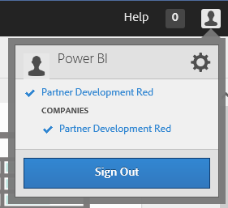
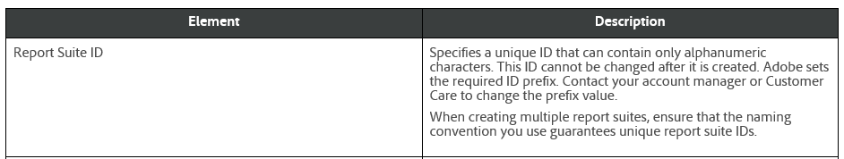

<properties
   pageTitle="Adobe Analytics content pack"
   description="Adobe Analytics content pack for Power BI"
   services="powerbi"
   documentationCenter=""
   authors="joeshoukry"
   manager="erikre"
   backup="maggiesMSFT"
   editor=""
   tags=""
   qualityFocus="no"
   qualityDate=""/>

<tags
   ms.service="powerbi"
   ms.devlang="NA"
   ms.topic="article"
   ms.tgt_pltfrm="NA"
   ms.workload="powerbi"
   ms.date="03/10/2017"
   ms.author="yshoukry"/>
# Adobe Analytics content pack for Power&nbsp;BI

Connecting to Adobe Analytics through Power BI starts by connecting to your Adobe Analytics Marketing Cloud account. You will get a Power BI dashboard and a set of Power BI reports that provide insights about your site traffic and user dimensions. You can use the dashboard and reports provided, or customize them to highlight the information you care most about.  The data will be refreshed automatically once per day.

Connect to the [Adobe Analytics content pack](https://app.powerbi.com/getdata/services/adobe-analytics) or read more about the [Adobe Analytics integration](https://powerbi.microsoft.com/integrations/adobe-analytics) with Power BI.

## How to connect

1.  Select **Get Data** at the bottom of the left navigation pane.

	

2.  In the **Services** box, select **Get**.

	

3.  Select **Adobe Analytics** \>  **Get**.

	

4.  The content pack connects to a specific Adobe Analytics Company and Report Suite ID (not the Report Suite name). See details on [finding those parameters](#FindingParams) below.

	

5. For **Authentication Method**, select **oAuth2** \> **Sign In**. When prompted, enter your Adobe Analytics credentials. 

	

	

6.  Click **Accept** to allow Power BI to access your Adobe Analytics data.

	

7. After approving, the import process will begin automatically. When complete, a new dashboard, report and model will appear in the Navigation Pane. Select the dashboard to view your imported data.

	 

**What Now?**

- Try [asking a question in the Q&A box](powerbi-service-q-and-a.md) at the top of the dashboard

- [Change the tiles](powerbi-service-edit-a-tile-in-a-dashboard.md) in the dashboard.

- [Select a tile](powerbi-service-dashboard-tiles.md) to open the underlying report.

- While your dataset will be schedule to refreshed daily, you can change the refresh schedule or try refreshing it on demand using **Refresh Now**

## What's included
The content pack uses the Adobe Analytics Report API to define and run reports for the following tables:

|**Table Name**|**Column Details**|
|---|---|
|Products|elements=  "product" (top 25)   metrics="cartadditions", "cartremovals", "carts", "cartviews", "checkouts", "revenue", "units"|
|Browsers| elements= "browser" (top 25)   metrics="bounces", "bouncerate", "visitors", "visits", "uniquevisitors", "totaltimespent", "pageviews"|
|Pages| elements= "page" (top 25)   metrics="cartadditions", "cartremovals", "carts", "cartviews", "checkouts", "revenue", "units", "visits", "uniquevisitors", "pageviews", "bounces", "bouncerate", "totaltimespent"|
|JavaScript Enabled| elements=  "javascriptenabled”, “browser” (top 25)|
|Mobile OS| elements= "mobileos"(top 25)  metrics="bounces", "bouncerate", "visitors", "visits", "uniquevisitors", "totaltimespent", "cartadditions", "cartremovals", "checkouts", "revenue", "units", "pageviews"|
|Search Engines Keywords| elements= "searchengine" "searchenginekeyword"   metrics="bounces", "bouncerate", "visitors", "visits", "entries", "uniquevisitors", "totaltimespent", "cartadditions", "cartremovals", "carts", "cartviews", "checkouts", "revenue", "units", "pageviews"|
|Search Engine to Products|	elements= "searchengine", "product"   metrics="bounces", "bouncerate", "visitors", "visits", "entries", "uniquevisitors", "totaltimespent", "cartadditions", "cartremovals", "carts", "cartviews", "checkouts", "revenue", "units", "pageviews"|
|Referring Pages| elements= "referrer" (top 15), “page" (top 10)   metrics="bounces", "bouncerate", "visitors", "visits", "entries", "uniquevisitors", "totaltimespent", "cartadditions", "cartremovals", "carts", "cartviews", "checkouts", "revenue", "units", "pageviews"|
|Geocountry Pages| elements= "geocountry" (Top 20), "page"   metrics="bounces", "bouncerate", "visitors", "visits", "entries", "uniquevisitors", "totaltimespent", "cartadditions", "cartremovals", "carts", "cartviews", "checkouts", "revenue", "units", "pageviews"|
|Geocountry Product| elements= "geocountry" (Top 20), "product"  metrics="bounces", "bouncerate", "visitors", "visits", "entries", "uniquevisitors", "totaltimespent", "cartadditions", "cartremovals", "carts", "cartviews", "checkouts", "revenue", "units"|
|Country and Region Lookup| elements= "geocountry" (Top 200)   metrics="bounces", "bouncerate", "visitors", "visits", "entries", "uniquevisitors", "totaltimespent", "cartadditions", "cartremovals", "carts", "cartviews", "checkouts", "revenue", "units"|
|Language| elements= "language", "browser" (Top 25)   metrics="bounces", "bouncerate", "visitors", "visits", "uniquevisitors", "totaltimespent", "pageviews", "cartadditions", "cartremovals", "checkouts", "carts", "cartviews"|
|Search Engines Look Up| elements= "searchengine" (top 100)   metrics="bounces", "bouncerate", "visitors", "visits", "entries", "uniquevisitors", "totaltimespent", "cartadditions", "cartremovals", "carts", "cartviews", "checkouts", "revenue", "units"|
|Browser Lookup| elements= "browser" (top 25)|

## System requirements
Access to [Adobe Analytics](http://www.adobe.com/marketing-cloud/web-analytics.html) is required, including access to the correct parameters as described below.

## Finding parameters

**Company**

The Company value can be found in the top right of your account once you're signed in. **Note:** the value is case and spacing sensitive, enter it exactly as you see in your account.

**Report Suite ID**

The Suite ID is created when the Report Suite is created. You can contact your administrator to identify the ID value. Note that this is not the Report Suite name.

From Adobe [documentation](https://marketing.adobe.com/resources/help/en_US/reference/new_report_suite.html):

## Troubleshooting
If you're seeing an error after providing your credentials indicating you do not have permissions, please confirm with your admin that you have access to the Adobe Analytics API. Also confirm the Adobe ID provided is linked to your Marketing Cloud Organization (associated to an Adobe Analytics company).

If you've successfully passed the credentials screen and start the content pack loading before hitting an error, it's possible the reports are taking too long to complete. A common error is in the form *"Failed to get data from the Adobe Analytics report. Contents included &quot;referrer, page&quot;, approximate duration was xx seconds"*. Please review the "What's included" section and compare to the size of your Adobe instance. Unfortunately there isn't a way to work around this timeout today however we're considering updates to better support larger instances, please provide feedback to the Power BI team at https://ideas.powerbi.com

### See also

[Get started in Power BI](powerbi-service-get-started.md)

[Get data in Power BI](powerbi-service-get-data.md)
