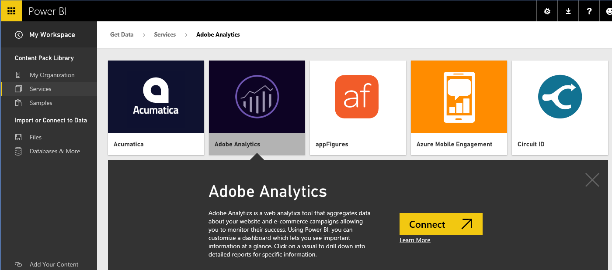

<properties 
   pageTitle="Adobe Analytics content pack for Power BI"
   description="Adobe Analytics content pack for Power BI"
   services="powerbi" 
   documentationCenter="" 
   authors="v-anpasi" 
   manager="mblythe" 
   editor=""
   tags=""/>
 
<tags
   ms.service="powerbi"
   ms.devlang="NA"
   ms.topic="article"
   ms.tgt_pltfrm="NA"
   ms.workload="powerbi"
   ms.date="06/18/2015"
   ms.author="v-anpasi"/>
# Adobe Analytics content pack for Power BI

[← Services in Power BI](https://support.powerbi.com/knowledgebase/topics/88770-services-in-power-bi)

Connecting to Adobe Analytics through Power BI starts by connecting to your Adobe Analytics Marketing Cloud account. You will get a Power BI dashboard and a set of Power BI reports that provide insights about your site traffic and user dimensions. You can use the dashboard and reports provided, or customize them to highlight the information you care most about.  The data will be refreshed automatically once per day.

Connect to the [Adobe Analytics content pack](https://app.powerbi.com/getdata/services/adobe-analytics) for Power BI.

1.  Select Get Data at the bottom of the left navigation pane.

	

2.  In the Services box, select Get.

	

3.  Select Adobe Analytics \> Connect.

	

4.  The content pack connects to a specific Adobe Analytics Company and Report Suite ID (not the Report Suite name). See details on finding those parameters below.

	

5. Select oAuth 2 as the Authentication Mechanism and click Sign In. When prompted, enter your Adobe Analytics credentials. 

	

	

6.  Click Accept to allow Power BI to access your Adobe Analytics data.

	

7. After approving, the import process will begin automatically. When complete, a new dashboard, report and model will appear in the Navigation Pane. Select the dashboard to view your imported data.

	 

You can change this dashboard to display your data the way you want. It allows you to ask a question in Q&A or click a tile to open the underlying report and change the tiles in the dashboard.

### Finding your Adobe Analytics parameter information

**Company**

The Company value can be found in the top right of your account once you're signed in. **Note:** the value is case and spacing sensitive, enter it exactly as you see in your account.

**Report Suite ID**

The Suite ID is created when the Report Suite is created. You can contact your administrator to identify the ID value. Note that this is not the Report Suite name.

From Adobe [documentation](https://marketing.adobe.com/resources/help/en_US/reference/new_report_suite.html%20):

