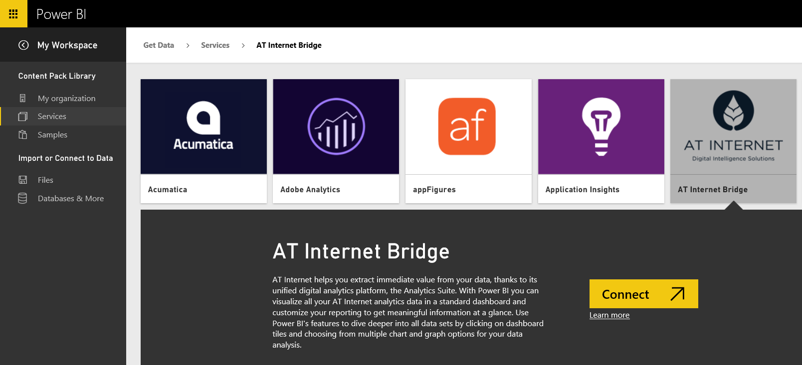
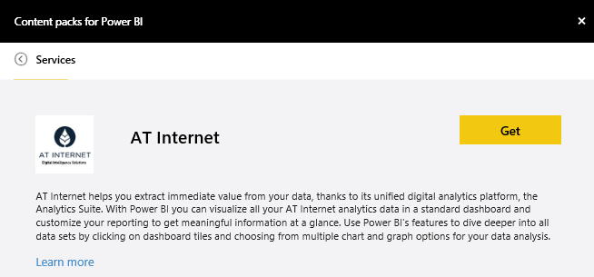

<properties
   pageTitle="AT Internet Bridge content pack for Power BI"
   description="AT Internet Bridge content pack for Power BI"
   services="powerbi"
   documentationCenter=""
   authors="theresapalmer"
   manager="mblythe"
   editor=""
   tags=""/>

<tags
   ms.service="powerbi"
   ms.devlang="NA"
   ms.topic="article"
   ms.tgt_pltfrm="NA"
   ms.workload="powerbi"
   ms.date="12/21/2015"
   ms.author="tpalmer"/>
# AT Internet Bridge content pack for Power&nbsp;BI

AT Internet helps you to extract immediate value from your data using its unified digital analytics platform, the Analytics Suite. The AT Internet Bridge content pack for Power BI includes data around visits, sources, localization and devices for your site.

Connect to the [AT Internet Bridge content pack](https://app.powerbi.com/getdata/services/at-internet-bridge) for Power BI.

1.  Select **Get Data** at the bottom of the left navigation pane.

     

2.  In the **Services** box, select **Get**.

     

3.  Select **AT Internet Bridge** \> **Connect**.

    
    
4.  Specify the AT Internet Website Number you'd like to connect to.

    

5.  Select **Basic** as the Authentication Mechanism, provide your AT Internet username and password, and click **Sign In**. 

    

6.  Click **Connect** to begin the import process. When complete, a new dashboard, report and model will appear in the Navigation Pane. Select the dashboard to view your imported data.

     

You can change this dashboard to display your data the way you want. It allows you to ask a question in Q&A or click a tile to open the underlying report and change the tiles in the dashboard.

## See also

[Get started with Power BI](powerbi-service-get-started.md)

[Power BI - Basic Concepts](powerbi-service-basic-concepts.md)

