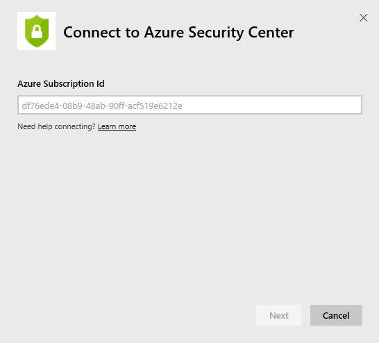

<properties
   pageTitle="Azure Security Center content pack"
   description="Azure Security Center content pack for Power BI"
   services="powerbi"
   documentationCenter=""
   authors="joeshoukry"
   manager="erikre"
   backup="maggiesMSFT"
   editor=""
   tags=""
   qualityFocus="no"
   qualityDate=""/>

<tags
   ms.service="powerbi"
   ms.devlang="NA"
   ms.topic="article"
   ms.tgt_pltfrm="NA"
   ms.workload="powerbi"
   ms.date="03/10/2017"
   ms.author="yshoukry"/>
# Azure Security Center content pack for Power&nbsp;BI

Get insights into your Azure workload security by connecting your Azure Security Data with Power BI. Power BI automatically creates a dashboard and report on top of your Azure Security Center data enabling you to analyze and explore the data.

Connect to the [Azure Security Center content pack](https://app.powerbi.com/getdata/services/azure-security-center) for Power BI.

## How to connect

1.  Select **Get Data** at the bottom of the left navigation pane.

	

2.  In the **Services** box, select **Get**.

	

3.  Select **Azure Security Center** \>  **Get**.

	

4.  Specify your Subscription ID. See details on [finding those parameters](#FindingParams) below.

	

5. For **Authentication Method**, select **oAuth2** \> **Sign In**. When prompted, enter your Azure credentials.

	

7. After approving, the import process will begin automatically. When complete, a new dashboard, report and model will appear in the Navigation Pane. Select the dashboard to view your imported data.

	 

**What Now?**

- Try [asking a question in the Q&A box](powerbi-service-q-and-a.md) at the top of the dashboard

- [Change the tiles](powerbi-service-edit-a-tile-in-a-dashboard.md) in the dashboard.

- [Select a tile](powerbi-service-dashboard-tiles.md) to open the underlying report.

- While your dataset will be schedule to refreshed daily, you can change the refresh schedule or try refreshing it on demand using **Refresh Now**

## What's included

The content pack includes insights around resource security stat, alert analysis and prevention analysis.

## System requirements

This content pack requires access to a subscription ID with Azure Security Center enabled. See more details in the [Azure Security Center](https://portal.azure.com/#blade/Microsoft_Azure_Security/SecurityDashboardStartBladeV2) in the Azure Portal.

The content pack also requires the user to connect with an organizational account (not a personal account).

## Finding parameters

There are two easy ways to find your Subscription Id.

1.  From https://portal.azure.com -&gt; Browse -&gt; Subscriptions -&gt; Subscription Id
2.  From https://manage.windowsazure.com -&gt; Settings  -&gt; Subscription Id

Your subscription ID will be long set of numbers and characters, similar to the example in Step \#4 above. 

## Troubleshooting
The data may take some time to load depending on the size of your account. If you hit an error during login, please confirm your parameters and the account has Azure Security Center enabled.

If the content pack loads but doesn't show any data, please confirm you're connecting with an organizational account. Although personal accounts are supported by Azure Security Center, the API (and therefore the content pack) does not return the expected values if the user connects with a non-organizational account. Please provide access to an organizational account and try connecting again.

### See also

[Get started in Power BI](powerbi-service-get-started.md)

[Get data in Power BI](powerbi-service-get-data.md)
