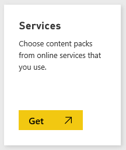
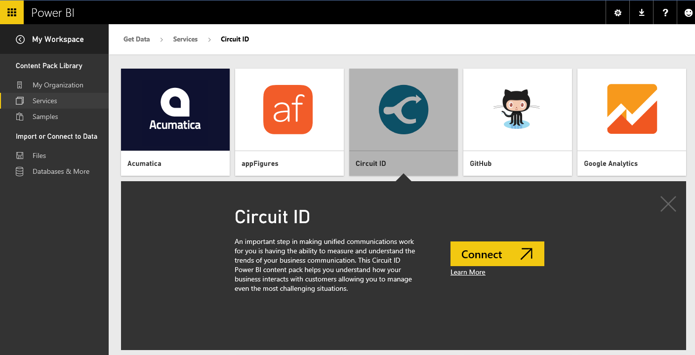
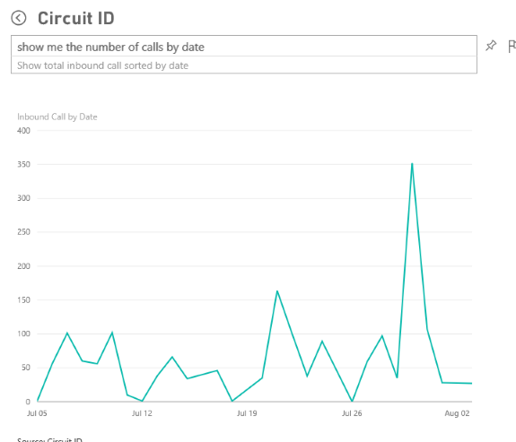

<properties 
   pageTitle="Circuit ID content pack for Power BI"
   description="Circuit ID content pack for Power BI"
   services="powerbi" 
   documentationCenter="" 
   authors="v-anpasi" 
   manager="mblythe" 
   editor=""
   tags=""/>
 
<tags
   ms.service="powerbi"
   ms.devlang="NA"
   ms.topic="article"
   ms.tgt_pltfrm="NA"
   ms.workload="powerbi"
   ms.date="09/28/2015"
   ms.author="v-anpasi"/>
# Circuit ID content pack for Power BI

Analyzing your communication data from Circuit ID is easy with Power BI. Power BI retrieves your data, then builds a default dashboard and related reports based on that data.

Connect to the [Circuit ID content pack](https://app.powerbi.com/getdata/services/circuitid)[ ](https://app.powerbi.com/getdata/services/circuitid)for Power BI.

After you have created the connection, you can explore your data and customize the dashboard to meet your needs. Data is automatically refreshed every day.

1. Select **Get Data** at the bottom of the left navigation pane.

	

2. In the **Services** box, select **Get**.

	

3. Select **Circuit ID \> Connect**.

	

4. For Authentication Method, select Basic and provide your username and password. Then hit Sign In.

	

5. After Power BI imports the data you will see a new dashboard, report, and dataset in the left navigation pane. New items are marked with a yellow asterisk \*:

6. Select the Circuit ID dashboard.
	This is the default dashboard that Power BI creates to display your data. You can modify this dashboard to display your data in any way you want.

What can you do now?

-   Try asking a question in the Q&A box at the top of the dashboard, such as "show me the number of call by date"

-   Change the tiles in the dashboard.

-   Select a tile to open the underlying report.

-   Rename the dashboard: Select the ellipsis (…) next to the dashboard \> Rename.

-   While your dataset will be refreshed automatically, you can also refresh it on demand using Refresh Now.  Scroll to the entry in your datasets list, select the ellipsis (…) and press **Refresh Now**

This dashboard can be fully customized to how you want to display your data. It allows you to ask a [question in ](http://support.powerbi.com/knowledgebase/articles/474566-q-a-in-power-bi)[Q&A](http://support.powerbi.com/knowledgebase/articles/474566-q-a-in-power-bi) or click a tile to [open the underlying report](http://support.powerbi.com/knowledgebase/articles/425669-when-you-click-a-tile-in-a-dashboard) and [c](http://support.powerbi.com/knowledgebase/articles/424878-edit-a-tile-resize-move-rename-delete)[hange the tiles](http://support.powerbi.com/knowledgebase/articles/424878-edit-a-tile-resize-move-rename-delete) in the dashboard.

See Also:

[Get started with Power BI](http://support.powerbi.com/knowledgebase/articles/430814-get-started-with-power-bi)

[Get Data for Power BI](http://support.powerbi.com/knowledgebase/articles/434354-get-data)

