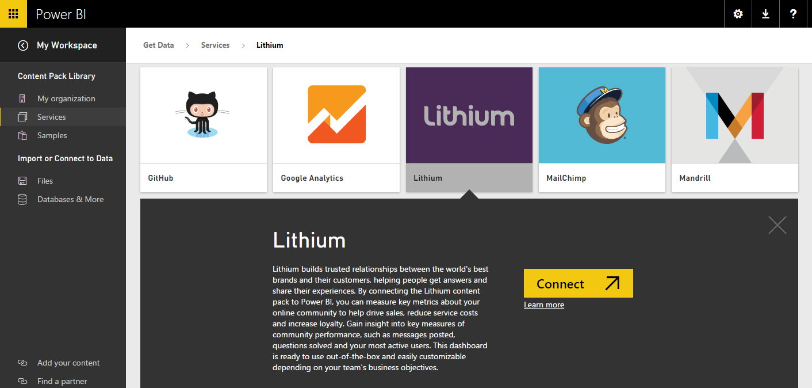

<properties
   pageTitle="Lithium content pack for Power BI"
   description="Lithium content pack for Power BI"
   services="powerbi"
   documentationCenter=""
   authors="theresapalmer"
   manager="mblythe"
   editor=""
   tags=""/>

<tags
   ms.service="powerbi"
   ms.devlang="NA"
   ms.topic="article"
   ms.tgt_pltfrm="NA"
   ms.workload="powerbi"
   ms.date="12/28/2015"
   ms.author="tpalmer"/>
#Lithium content pack for Power&nbsp;BI

Lithium builds trusted relationships between the world's best brands and their customers, helping people get answers and share their experiences. By connecting the Lithium content pack to Power BI, you can measure key metrics about your online community to help drive sales, reduce service costs and increase loyalty. 

Note: The Power BI content pack uses the Lithium API. Excessive calls to the API may result in additional charges from Lithium, please confirm with your Lithium administrator.

Connect to the [Lithium content pack](https://app.powerbi.com/getdata/services/lithium) for Power BI.

1.  Select **Get Data** at the bottom of the left navigation pane.

     

2.  In the **Services** box, select **Get**.

     

3.  Select **Lithium** \> **Connect**.

    
    
4.  Provide the URL of your Lithium community. It will be in the form of *https://community.yoursite.com*.

    

5.  When prompted, enter your Lithium credentials. Select **oAuth 2** as the Authentication Mechanism and click **Sign In** and follow the Lithium authentication flow.

    
    
    

6.  Once the login flow is completed the import process will begin. When complete, a new dashboard, report and model will appear in the Navigation Pane. Select the dashboard to view your imported data.

     

You can change this dashboard to display your data the way you want. It allows you to ask a question in Q&A or click a tile to open the underlying report and change the tiles in the dashboard.

## See also

[Get started with Power BI](powerbi-service-get-started.md)

[Power BI - Basic Concepts](powerbi-service-basic-concepts.md)
