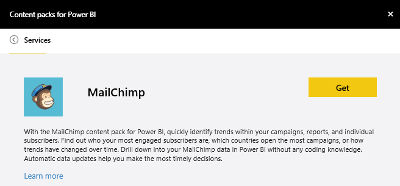
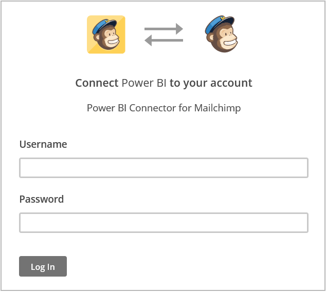
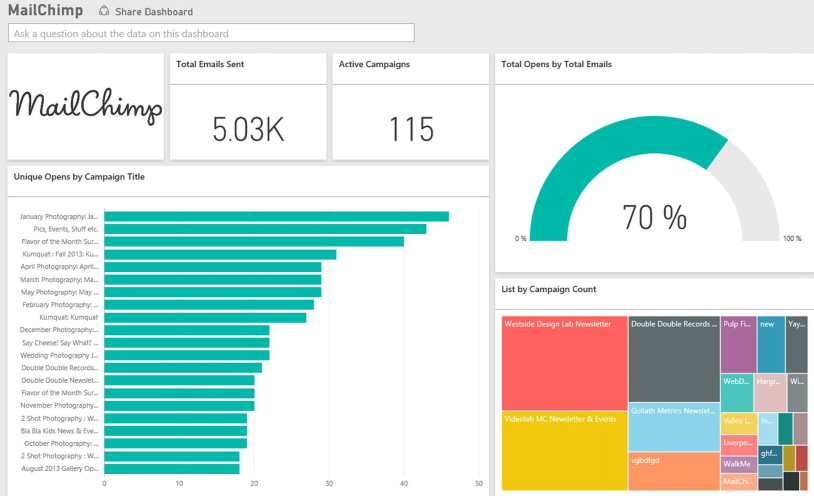

<properties
   pageTitle="MailChimp content pack"
   description="MailChimp content pack for Power BI"
   services="powerbi"
   documentationCenter=""
   authors=”joeshoukry”
   manager="mblythe"
   backup=""
   editor=""
   tags=""
   qualityFocus="no"
   qualityDate=""/>

<tags
   ms.service="powerbi"
   ms.devlang="NA"
   ms.topic="article"
   ms.tgt_pltfrm="NA"
   ms.workload="powerbi"
   ms.date="08/26/2016"
   ms.author=”yshoukry”/>

# MailChimp content pack for Power&nbsp;BI

The Power BI content pack pulls data from your MailChimp account and generates a dashboard, a set of reports and a dataset to allow you to explore your data. Pull in analytics to create [MailChimp dashboards](https://powerbi.microsoft.com/integrations/mailchimp) and quickly identify trends within your campaigns, reports, and individual subscribers. The data is set to refresh daily ensuring the data you're monitoring is up to date.

Connect to the [MailChimp content pack](https://app.powerbi.com/getdata/services/mailchimp) for Power BI.

## How to connect

1. Select **Get Data** at the bottom of the left navigation pane.

	

2.  In the **Services** box, select **Get**.

	

3.  Select **MailChimp** \> **Get**.

	

4. For Authentication Method, select **oAuth2** \> **Sign In**.

	When prompted, enter your MailChimp credentials and follow the authentication process.

	The first time you connect you will be prompted to allow Power BI read-only access to your account. Select **Allow** to begin the import process, which can take a few minutes depending on the volume of data in your account.

	

5.  After Power BI imports the data you will see a new dashboard, report, and dataset in the left navigation pane. This is the default dashboard that Power BI created to display your data. You can modify this dashboard to display your data in any way you want.

	

**What Now?**

- Try [asking a question in the Q&A box](powerbi-service-q-and-a.md) at the top of the dashboard

- [Change the tiles](powerbi-service-edit-a-tile-in-a-dashboard.md) in the dashboard.

- [Select a tile](powerbi-service-dashboard-tiles.md) to open the underlying report.

- While your dataset will be schedule to refreshed daily, you can change the refresh schedule or try refreshing it on demand using **Refresh Now**

### See also

[Get started with Power BI](powerbi-service-get-started.md)

[Power BI - Basic Concepts](powerbi-service-basic-concepts.md)