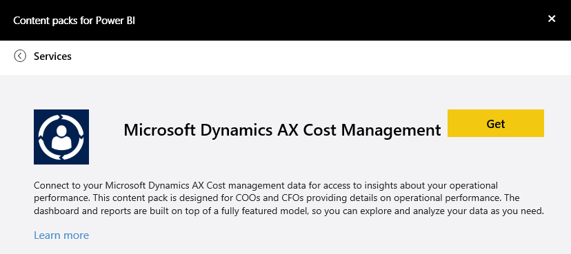
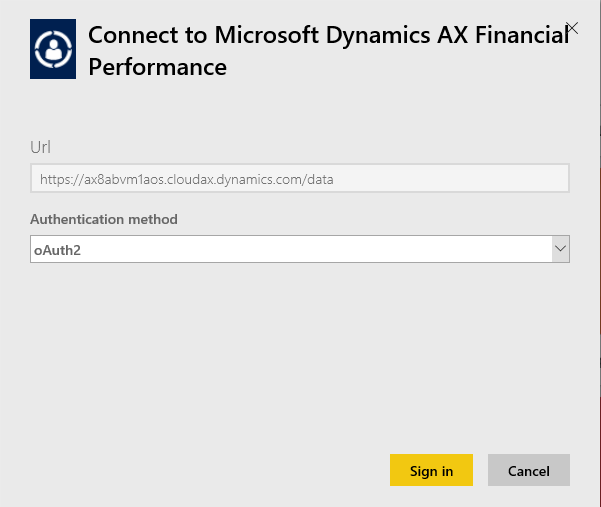
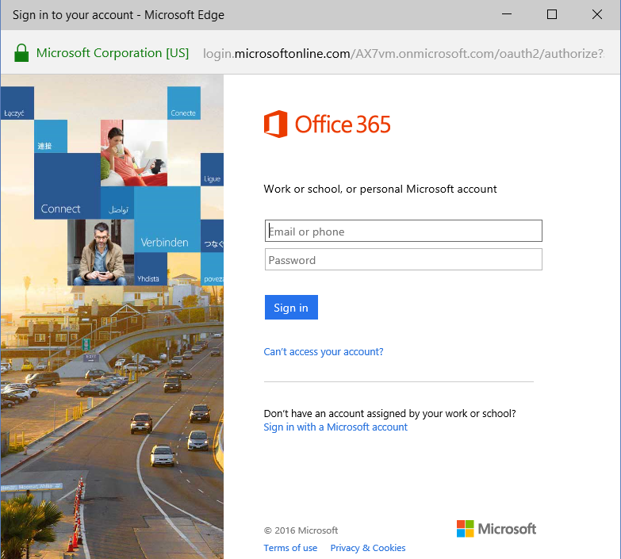

<properties 
   pageTitle="Microsoft Dynamics AX content pack"
   description="Microsoft Dynamics AX content pack for Power BI"
   services="powerbi" 
   documentationCenter="" 
   authors="theresapalmer" 
   manager="mblythe" 
   backup=""
   editor=""
   tags=""
   qualityFocus="no"
   qualityDate=""/>
 
<tags
   ms.service="powerbi"
   ms.devlang="NA"
   ms.topic="article"
   ms.tgt_pltfrm="NA"
   ms.workload="powerbi"
   ms.date="05/17/2016"
   ms.author="tpalmer"/>
# Microsoft Dynamics AX content pack for Power&nbsp;BI

Microsoft Dynamics AX has three Power BI content packs targeted at different business users. The Financial Performance content pack, designed specifically for CFOs, provides access to insights about your organization’s financial performance. The Retail Channel Performance content pack is targeted for channel managers focuses on sales performance to predict trends and uncover insights by drawing directly from Retail & Commerce data. The Cost Management is designed for COOs and CFOs and provides details on operation performance. 

Connect to the Microsoft Dynamics AX [Retail Channel Performance](https://app.powerbi.com/getdata/services/dynamics-ax-retail-channel-performance), the [Financial Performance](https://app.powerbi.com/getdata/services/dynamics-ax-financial-performance) or the [Cost Management](https://app.powerbi.com/getdata/services/dynamics-ax-cost-management) content pack for Power BI.

## How to connect

1.  Select **Get Data** at the bottom of the left navigation pane.

	

2.  In the **Services** box, select **Get**.

	

3.  Select one of the Dynamics AX content packs and choose **Get**.

	

4.  Specify the URL of your Dynamics AX 7 environment. See details on [finding those parameters](#FindingParams) below.

	

5. For **Authentication Method**, select **oAuth2** \> **Sign In**. When prompted, enter your Dynamics AX credentials. 

	

	

7. After approving, the import process will begin automatically. When complete, a new dashboard, report and model will appear in the Navigation Pane. Select the dashboard to view your imported data.

	 

**What Now?**

- Try [asking a question in the Q&A box](powerbi-service-q-and-a.md) at the top of the dashboard

- [Change the tiles](powerbi-service-edit-a-tile-in-a-dashboard.md) in the dashboard.

- [Select a tile](powerbi-service-dashboard-tiles.md) to open the underlying report.

- While your dataset will be schedule to refreshed daily, you can change the refresh schedule or try refreshing it on demand using **Refresh Now**

## What's included

The content pack uses the Dynamics AX 7 OData feed to import data related to Retail Channel, Financial, and Cost Management performance respectively.

## System requirements

This content pack requires a Dynamics AX 7 environment URL and the user should have access to the OData feed.

## Finding parameters

The Dynamics AX 7 environment URL can be found in the browser when the user signs in. Just copy the URL of the root Dynamics AX environment into the Power BI dialog.

## Troubleshooting
The data may take some time to load depending on the size of your instance. If you're seeing empty reports within Power BI, please confirm you have access to the OData tables required for the reports.

### See also

[Get started in Power BI](powerbi-service-get-started.md)

[Get data in Power BI](powerbi-service-get-data.md)
