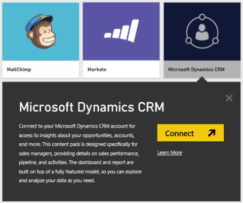
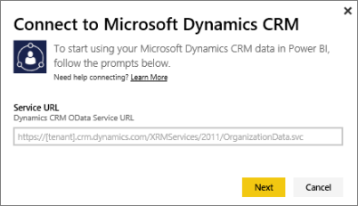
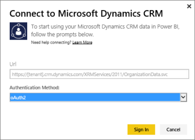
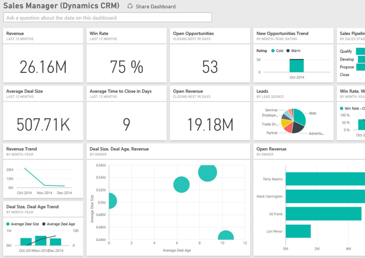

<properties pageTitle="Microsoft Dynamics CRM content pack for Power BI" description="Microsoft Dynamics CRM content pack for Power BI" services="powerbi" documentationCenter="" authors="v-anpasi" manager="mblythe" editor=""/>
<tags ms.service="powerbi" ms.devlang="NA" ms.topic="article" ms.tgt_pltfrm="NA" ms.workload="powerbi" ms.date="06/25/2015" ms.author="v-anpasi"/>
#Microsoft Dynamics CRM content pack for Power BI
[← Services in Power BI](https://support.powerbi.com/knowledgebase/topics/88770-services-in-power-bi)

The Microsoft Dynamics CRM content pack for Power BI Preview allows you to easily access and analyze your data. The content pack uses the OData feed to create a descriptive model, with all the entities and measures needed such as Accounts, Activities, Opportunities, Product, Leads, Users and more.  

The data is filtered down to opportunities that were created or closed in the last 365 days and will be refreshed daily.

Requirements:
- You need to specify valid OData URL for a Dynamics CRM Online instance (the content pack will not work with an on-premises CRM version).
-   An administrator must enable the OData endpoint in the site settings. The address of the OData endpoint can be found by navigating to **Microsoft Dynamics CRM \> Settings \> Customizations \> Developer Resources**.  The OData URL is listed under **Service Endpoints**.  It typically has the format: [https://[instance\_name].crm.dynamics.com/XRMServices/2011/OrganizationData.svc](https://[instance_name].crm.dynamics.com/XRMServices/2011/OrganizationData.svc) 
-   The user account/identity that you use to access Dynamics CRM Online must be the same as the one you are signed up for using with Power BI. When logging into CRM Online, you will be auto-signed into CRM with the same identity you are using for Power BI. If you wish to sign into CRM Online with a different account, please register as a Power BI user using the same account. We hope to resolve this issue in an upcoming release. 

##Connect to Dynamics CRM
1. Select **Get Data** at the bottom of the left navigation pane.
    
	
    
2.  In the **Services** box, select **Get**.
    
	

3.  Select **Microsoft Dynamics CRM** and click **Connect**. 
	
	>**Important**:
	>- Make sure your popup blocker is disabled or is set to allow popups from app.powerbi.com.
    
	

4.  Provide the OData URL associated with your account.  This will be in the form ["<https://mytenant.crm.dynamics.com/XRMServices/2011/OrganizationData.svc>"](https://mytenant.crm.dynamics.com/XRMServices/2011/OrganizationData.svc)

	

5.  When prompted, provide your credentials (this step might be skipped if you are already signed in with your browser). For Authentication Method, enter **oAuth2** and click **Sign In**:
    
	

6.  After connecting, you'll see a dashboard customized for a Sales Manager, populated with your own data:
    
	

This dashboard can be fully changed to how you want to display your data. it allows you to ask a [question in ](http://support.powerbi.com/knowledgebase/articles/474566-q-a-in-power-bi)[Q&A](http://support.powerbi.com/knowledgebase/articles/474566-q-a-in-power-bi), click a tile to [open the underlying report](http://support.powerbi.com/knowledgebase/articles/425669-when-you-click-a-tile-in-a-dashboard), and [c](http://support.powerbi.com/knowledgebase/articles/424878-edit-a-tile-resize-move-rename-delete)[hange the tiles](http://support.powerbi.com/knowledgebase/articles/424878-edit-a-tile-resize-move-rename-delete) in the dashboard.

###Troubleshooting

If you see a "Login failed" message when trying to connect to your Dynamics CRM acount, confirm that you're signing into Power BI with the same account you would use to access the CRM Online OData feed. Try logging into the feed in your browser as well, to test it there.

Ask your admin to confirm the correct OData URL, and that the OData endpoint is enabled.

If you're still having issues, open a support ticket to reach the Power BI team:

-   While in the Power BI app, select the question mark > **Contact Support**.
-   From the Power BI Support site (where you're reading this article), select **Contact Support** on the right side of the page.

###See also
[Get started with Power BI Preview](http://support.powerbi.com/knowledgebase/articles/430814-get-started-with-power-bi)  
[Power BI Preview - Basic Concepts](http://support.powerbi.com/knowledgebase/articles/487029-power-bi-preview-basic-concepts)

