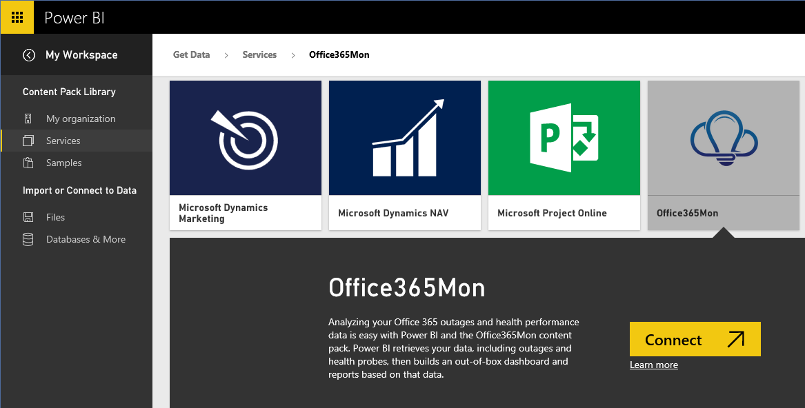
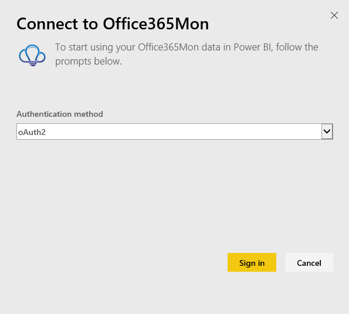

<properties 
   pageTitle="Office365Mon content pack for Power BI"
   description="Office365Mon content pack for Power BI"
   services="powerbi" 
   documentationCenter="" 
   authors="theresapalmer" 
   manager="mblythe" 
   editor=""
   tags=""
   qualityFocus="no"
   qualityDate=""/>
 
<tags
   ms.service="powerbi"
   ms.devlang="NA"
   ms.topic="article"
   ms.tgt_pltfrm="NA"
   ms.workload="powerbi"
   ms.date="05/09/2016"
   ms.author="tpalmer"/>
   
# Office365Mon content pack for Power&nbsp;BI

Analyzing your Office 365 outages and health performance data is easy with Power BI and the Office365Mon content pack. Power BI retrieves your data, including outages and health probes, then builds an out-of-box dashboard and reports based on that data.

Connect to the [Office365Mon content pack](https://app.powerbi.com/groups/me/getdata/services/office365mon) for Power BI.

Note: An Office365Mon admin account is required to connect and load the Power BI content pack.

## How to connect

1.  Select **Get Data** at the bottom of the left navigation pane.

	

2.  In the **Services** box, select **Get**.

	 

3.  Select **Office365Mon \> Connect**.

	

4.  For Authentication Method, select oAuth2 \> Sign In.

	When prompted, enter your Office365Mon admin credentials and follow the authentication process.

	
    
    

6.  After Power BI imports the data you will see a new dashboard, report, and dataset in the left navigation pane. New items are marked with a yellow asterisk \*, select the Office365Mon entry.

	

**What Now?**

- Try [asking a question in the Q&A box](powerbi-service-q-and-a.md) at the top of the dashboard

- [Change the tiles](powerbi-service-edit-a-tile-in-a-dashboard.md) in the dashboard.

- [Select a tile](powerbi-service-dashboard-tiles.md) to open the underlying report.

- While your dataset will be schedule to refreshed daily, you can change the refresh schedule or try refreshing it on demand using **Refresh Now**

## Troubleshooting

If you get a **"login failed"** error after using your Office365Mon subscription credentials to login, then the account you are using doesn't have permissions to retrieve the Office365Mon data from your account. Verify it is an admin account and try again.

### See also

[Get started with Power BI](powerbi-service-get-started.md)

[Get Data for Power BI](powerbi-service-get-data.md)

