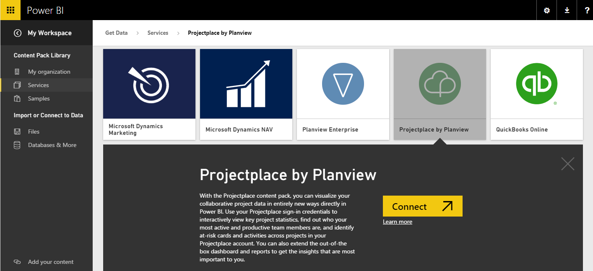
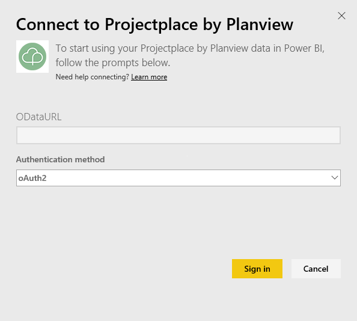
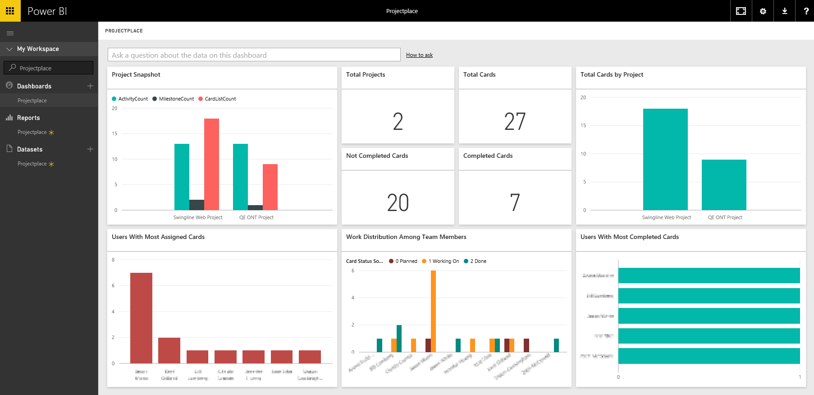

<properties
   pageTitle="Projectplace content pack for Power BI"
   description="Projectplace content pack for Power BI"
   services="powerbi"
   documentationCenter=""
   authors="tpalmer"
   manager="mblythe"
   editor=""
   tags=""/>

<tags
   ms.service="powerbi"
   ms.devlang="NA"
   ms.topic="article"
   ms.tgt_pltfrm="NA"
   ms.workload="powerbi"
   ms.date="11/12/2015"
   ms.author="tpalmer"/>

# Projectplace by Planview content pack for Power BI  

With the Projectplace by Planview content pack, you can visualize your collaborative project data in entirely new ways directly in Power BI. Use your Projectplace sign-in credentials to interactively view key project statistics, find out who your most active and productive team members are, and identify at-risk cards and activities across projects in your Projectplace account. You can also extend the out-of-the box dashboard and reports to get the insights that are most important to you.

[Connect to the Projectplace content pack in Power BI](https://app.powerbi.com/getdata/services/projectplace)

>**Notes:**  

>-   To import your Projectplace data into Power BI, you must be a Projectplace user

>-   This procedure assumes you have already signed in to the Microsoft Power BI home page with a Power BI account. If you do not have a Power BI account, create a new free Power BI account on the Power BI home page, and then click Get Data.

 
1. Select **Get Data** at the bottom of the left navigation pane.

    

2. In the **Services** box, select **Get**.

    

3. On the Power BI page, select **Projectplace by Planview**, then select **Connect**, as shown in the following image:  

	

4. In the OData Feed URL text box, enter the URL for the Projectplace OData feed you want to use, as shown in the following image:

	

5.  On the Authentication Method list, select **OAuth** if it is not already selected. Hit **Sign In** and follow the login flow.  

	

6. On the left pane, select **Projectplace** from the list of dashboards. Power BI imports Projectplace data into the dashboard. Note that the data may take some time to load.  

The dashboard contains tiles that display data from your Projectplace database. The following image shows an example of the default Projectplace dashboard in Power BI.

You can perform the following tasks with the Projectplace content pack for Power BI:  

- Select a tile on the dashboard to view the underlying report in detail.

- Change, resize, and reorder the tiles on the dashboard.

- Rename the default Projectplace dashboard, report, or dataset by clicking the ellipsis (…) next to the Projectplace dashboard, report, or dataset, and selecting Rename.

- Ask a question about your Projectplace data by entering text such as “total cards” in the Q&A box at the top of the dashboard to receive real-time results.
