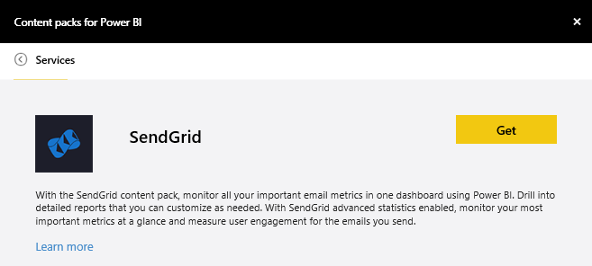

<properties 
   pageTitle="SendGrid content pack"
   description="SendGrid content pack for Power BI"
   services="powerbi" 
   documentationCenter="" 
   authors="joeshoukry" 
   manager="mblythe" 
   backup=""
   editor=""
   tags=""
   qualityFocus="no"
   qualityDate=""/>
 
<tags
   ms.service="powerbi"
   ms.devlang="NA"
   ms.topic="article"
   ms.tgt_pltfrm="NA"
   ms.workload="powerbi"
   ms.date="08/29/2016"
   ms.author="yshoukry"/>
   
# SendGrid content pack for Power&nbsp;BI

The Power BI content pack for SendGrid allows you to extract insights and statistics from your SendGrid account. Using the SendGrid content pack you can visualize your SendGrid statistics in a dashboard.

Connect to the [SendGrid content pack](https://app.powerbi.com/getdata/services/sendgrid) for Power BI.

## How to connect

1.  Select **Get Data** at the bottom of the left navigation pane.

     

2.  In the **Services** box, select **Get**.

     

3.  Select the **SendGrid** content pack and click **Get**.

     

4.  When prompted, provide your SendGrid user name and password. Select **Sign In**.

    

5.  After Power BI imports the data, you see a new dashboard, report, and dataset in the left navigation pane, populated with your email statistics for the past 90 days. New items are marked with a yellow asterisk \*.

    

**What Now?**

- Try [asking a question in the Q&A box](powerbi-service-q-and-a.md) at the top of the dashboard

- [Change the tiles](powerbi-service-edit-a-tile-in-a-dashboard.md) in the dashboard.

- [Select a tile](powerbi-service-dashboard-tiles.md) to open the underlying report.

- While your dataset will be schedule to refreshed daily, you can change the refresh schedule or try refreshing it on demand using **Refresh Now**

## What's included

The following metrics are available in the SendGrid dashboard:

-   Overall email statistics - Requests, Delivered, Bounced, Spam Blocked, Spam Report, etc.

-   Email statistics by category

-   Email statistics by geography

-   Email statistics by ISP

-   Email statistics by device, client, browser

### See also

[Get started with Power BI](powerbi-service-get-started.md)

[Get Data](powerbi-service-get-data.md)

