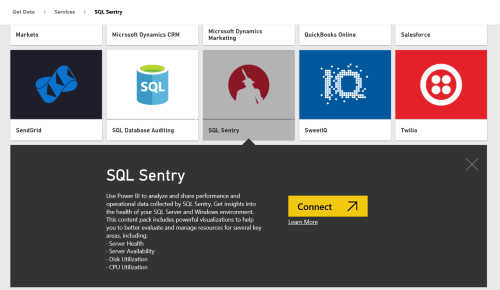
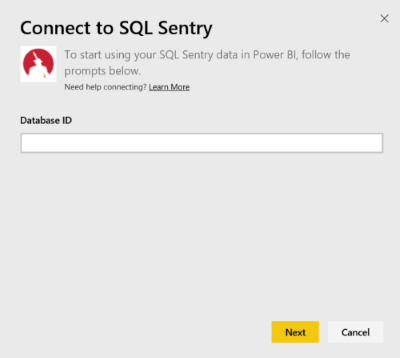
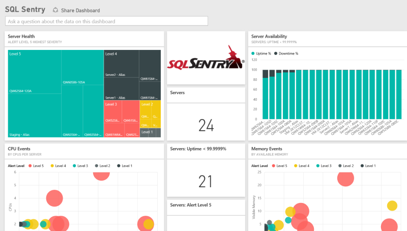
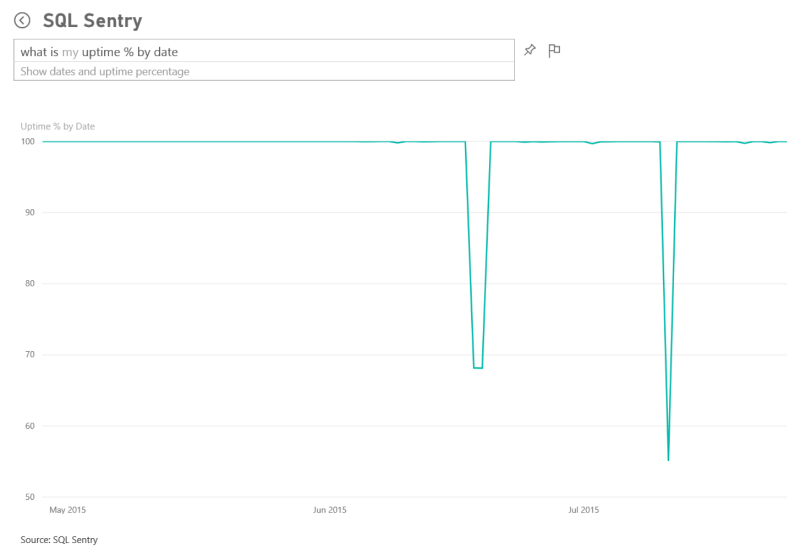

<properties 
   pageTitle="SQL Sentry content pack for Power BI"
   description="SQL Sentry content pack for Power BI"
   services="powerbi" 
   documentationCenter="" 
   authors="v-anpasi" 
   manager="mblythe" 
   editor=""
   tags=""/>
 
<tags
   ms.service="powerbi"
   ms.devlang="NA"
   ms.topic="article"
   ms.tgt_pltfrm="NA"
   ms.workload="powerbi"
   ms.date="09/28/2015"
   ms.author="v-anpasi"/>
# SQL Sentry content pack for Power BI

Analyzing your performance data collected by SQL Sentry is easy with Power BI. Power BI retrieves your data, then builds a default dashboard and related reports based on that data.

**Requirements:**

-   The SQL Sentry account you use for connecting to http://cloud.sqlsentry.com. 
-   A Database ID you will monitor.  Instructions for where to find the Database ID are below.

Connect to the [SQL Sentry content pack](https://app.powerbi.com/groups/me/getdata/services/sql-sentry) for Power BI.

After you have created the connection, you can explore your data and customize the dashboard to meet your needs. Data is automatically refreshed every day.

1.  Select **Get Data** at the bottom of the left navigation pane.

	

2.  In the **Services** box, select **Get**.

	 

3.  Select **SQL Sentry  \> Connect**.

	

4.  Provide the **Database ID** of the database you’d like to monitor in Power BI.

	

	The **Database ID** can be found by logging into <https://cloud.sqlsentry.com> in a new web browser window.  The **Database ID** is listed on the main overview page:

	

	The **Database ID** is also shown on the Database Details screen:

	

5.  For Authentication Method, select oAuth2 \> Sign In.

	When prompted, enter your cloud.sqlsentry.com credentials and follow the SQL Sentry authentication process.

	

	The first time you connect, Power BI prompts you to allow read-only access to your account. Select Grant to begin the import process.  The import process can take a few minutes depending on the volume of data in your account.

	

6.  After Power BI imports the data you will see a new dashboard, report, and dataset in the left navigation pane. New items are marked with a yellow asterisk \*:

	

7.  Select the SQL Sentry dashboard.

	This is the default dashboard that Power BI creates to display your data. You can modify this dashboard to display your data in any way you want.

	

What can you do now?

-   Try asking a question in the Q&A box at the top of the dashboard, such as "What is my uptime % by date"

	

-   Change the tiles in the dashboard.

-   Select a tile to open the underlying report.

-   Rename the dashboard: Select the ellipsis (…) next to the SQL Sentry dashboard \> Rename.

-   While your dataset will be refreshed automatically, you can also refresh it on demand using Refresh Now.  Scroll to the SQL Sentry entry in your datasets list, select the ellipsis (…) and press **Refresh Now**

	

This dashboard can be fully customized to how you want to display your data. It allows you to ask a [question in ](powerbi-service-q-and-a.md)[Q&A](powerbi-service-q-and-a.md) or click a tile to [open the underlying report](powerbi-service-dashboard-tiles.md) and [c](powerbi-service-edit-a-tile-in-a-dashboard.md)[hange the tiles](powerbi-service-edit-a-tile-in-a-dashboard.md) in the dashboard.

 

The following data is available from SQL Sentry  in Power BI :

|Table name|Description|
|---|---|
|Connection|This table provides information about your SQL Sentry defined connections.|
|Date |This table contains dates from today back to the earliest date from which performance data was collected and retained.|
|Downtime |This table contains information related to your downtime and uptime for each server that is monitored in your environment.|
|Memory Usage |This table contains data about how much memory is available or free in each of your servers. |
|Server |This table contains records for each server in your environment.|
|Server Health |This table contains data for all the events generated by custom conditions in your environment, including severity and count.|

## Troubleshooting

If data from some of your apps is not showing up in Power BI, check to make sure that you are using the correct Database ID and that you have the authority to view the data. 

If you are not the owner if the SQL Sentry database that is being synchronized to <https://cloud.sqlsentry.com>, please contact your administrator to make sure you have rights to view the collected data.

See Also:

[Get started with Power BI](powerbi-service-get-started.md)

[Get Data for Power BI](powerbi-service-get-data.md)

