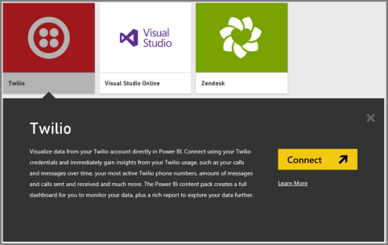
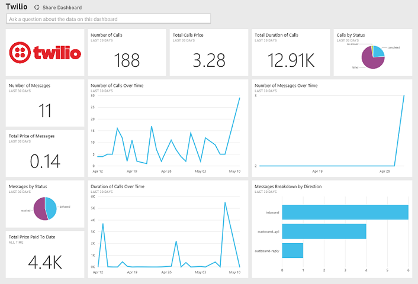

<properties pageTitle="Twilio content pack for Power BI" description="Twilio content pack for Power BI" services="powerbi" documentationCenter="" authors="v-anpasi" manager="mblythe" editor=""/>
<tags ms.service="powerbi" ms.devlang="NA" ms.topic="article" ms.tgt_pltfrm="NA" ms.workload="powerbi" ms.date="06/25/2015" ms.author="v-anpasi"/>
#Twilio Content Pack for Power BI

[← Services in Power BI](https://support.powerbi.com/knowledgebase/topics/88770-services-in-power-bi)

The Microsoft Twilio content pack for Power BI allows you to retrieve your Twilio data to Power BI and creates an out of box dashboard and report that shows insights on your data. You can also create your custom reports and dashboard on the dataset Power BI creates.

The data will be refreshed once a day so you are always looking at the latest data.

##Get started using the content pack

1.  Click the **Get Data** link at the top of the navigation pane.

    
    
2.  In the **Services** box, select **Get**.
    
    
    
3.  Select **Twilio** \> **Connect**.
    
    

4.  For **Authentication Method**, select **oAuth2** \> Sign In.

5.  When prompted provide your Twilio credentials and authorize the Power BI application to access your data.

       
    
6.  This will begin importing data from your Twilio account, and you will have your dashboard populated with your calls and messages usage for the past 30 days. 

    

This dashboard can be fully changed to how you want to display your data. It allows you to ask a [question in ](http://support.powerbi.com/knowledgebase/articles/474566-q-a-in-power-bi)[Q&A](http://support.powerbi.com/knowledgebase/articles/474566-q-a-in-power-bi) or click a tile to [open the underlying report](http://support.powerbi.com/knowledgebase/articles/425669-when-you-click-a-tile-in-a-dashboard) and [c](http://support.powerbi.com/knowledgebase/articles/424878-edit-a-tile-resize-move-rename-delete)[hange the tiles](http://support.powerbi.com/knowledgebase/articles/424878-edit-a-tile-resize-move-rename-delete) in the dashboard. 

##The data that the content pack brings from Twilio

1.  The details for all calls and messages transactions for the last 30 days. You can do all sorts of analysis and aggregation on this data.
2.  A set of already aggregated stats that you may want to keep an eye on. This set includes:

> All Time Calls Count  
> All Time Calls Duration  
> All Time Calls Price  
> All Time Messages Price  
> All Time Messages Count  
> All Time Count of Phone Numbers  
> All Time Price of Phone Numbers  
> All Time Twilio Client Calls Price  
> All Time Twilio Client Calls Duration  
> All Time Twilio Client Calls Count  
> All Time Total Price  
> All Time Inbound Calls Price  
> All Time Inbound Calls Duration  
> All Time Inbound Calls Count  
> All Time Outbound Calls Price  
> All Time Outbound Calls Duration  
> All Time Outbound Calls Count  
> This Month Calls Price  
> This Month Calls Duration  
> This Month Calls Count  
> This Month Messages Count  
> This Month Messages Price  
> This Month Count of Phone Numbers  
> This Month Price of Phone Numbers  
> This Month Twilio Client Calls Price  
> This Month Twilio Client Calls Duration  
> This Month Twilio Client Calls Count  
> This Month Total Price  
> This Month Inbound Calls Price  
> This Month Inbound Calls Duration  
> This Month Inbound Calls Count  
> This Month Outbound Calls Price  
> This Month Outbound Calls Duration  
> This Month Outbound Calls Count  
> This Month Inbound Messages Price  
> This Month Inbound Messages Count  
> This Month Outbound Messages Price  
> This Month Outbound Messages Count  

##Known Issues

If you have a very large amount of data in the past 30 days (hundreds of thousands of transactions), the data retrieval step might fail. We are aware of the problem and working on solving it. Meanwhile, if you hit this issue please use the support link at the top of your Power BI page to let us know and we'll contact you for further investigations.
