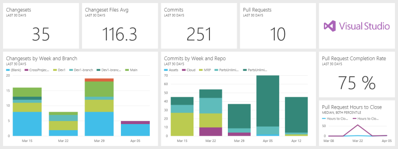

<properties pageTitle="Visual Studio Online content pack for Power BI" description="Visual Studio Online content pack for Power BI" services="powerbi" documentationCenter="" authors="v-anpasi" manager="mblythe" editor=""/>
<tags ms.service="powerbi" ms.devlang="NA" ms.topic="article" ms.tgt_pltfrm="NA" ms.workload="powerbi" ms.date="06/25/2015" ms.author="v-anpasi"/>
#Visual Studio Online content pack for Power BI

[← Services in Power BI](https://support.powerbi.com/knowledgebase/topics/88770-services-in-power-bi)

Use the Visual Studio content pack for Power BI to gain insights into your git and TFVC team projects. After you make a connection, your data comes to you automatically on a dashboard and in reports. 

Before you start, you’ll need:

-   Access to the Visual Studio Online account with permission to collect the data using the REST API.
-   Permission granted to the “Power BI for VSO” application during initial connection

Having trouble logging in? Skip to Authentication Troubleshooting
To import data from your Visual Studio Online project, complete the following steps:

1. Click the **Get Data** link at the top of the navigation pane.
  
	

2. In the **Services** box, select **Get**.

	

3. Select the **Visual Studio Online** content pack and click **Connect**.   

	 	

4. Enter information about your Visual Studio Online account.

	 

	Your account name is the front of your URL to visualstudio.com:  
	

	Your Project name is the name you see at the top of every page in VSO:  
	  
	For more information, see: <https://www.visualstudio.com/get-started/setup/connect-to-visual-studio-online-vs>

	**Note** You can use wildcards to select multiple projects. For example, you can select all projects by entering just “*”, or all projects that start with “Azure” by entering “Azure*”.

5. Authenticate with Visual Studio Online using oAuth2. You may see a VSO sign-in dialog box as a result. 

	**Important:** Some Visual Studio Online deployments do not support oAuth2.  Follow the guidance in the Authentication Troubleshooting section if login fails.
  
	    

6. Follow the Visual Studio Online authentication screens to grant the Visual Studio content pack for Power BI permission to your team project data. 
  
	  

	This connects Power BI with Visual Studio Online and allows Power BI to connect to the data.  The data will be refreshed once per day, by default.  

7. After you connect to your Visual Studio Online project, you see a new dashboard, report, and dataset in the left navigation pane. New items are marked with a yellow asterisk *.

 

You can customize the dashboard to show the data the way you want to see it. You can ask a question in Q&A to investigate your data or click a tile to open the underlying report and change the tiles in the dashboard.

Visual Studio Online in Power BI provides the following data:

| **Table name** | **Description** |
|---|---|
| Git Commits | Date, description, number of files changed (adds, edits, deletes), and who made the commit |
| Git Pull Requests | Who initiated the pull request, status (pending, abandoned, or completed), and source and target branch details.     Includes calculations for completion and abandonment rate, hours to close median and 90th percentile |
| Git Repositories | All git repositories in the selected team projects. |
| Projects | The projects you selected during initial configuration |
| TFVC Branches | The branches, links to their parents, and their overall depth in the hierarchy |
| TFVC Changesets | The changesets in your projects, who checked them in and when |
| TFVC File Changes | Operation details for files involved in TFVC changesets – Merge, Rollback, Rename, Add, Edit, Delete |
| TFVC Files | The TFVC files across all your branches at their most recent change |
| Users | User names and email addresses for users who have pushed changes to git or checked in changes to TFVC. |

To disconnect Power BI and remove its authorization to access your Visual Studio Online account, you can Revoke access in Visual Studio Online. See: <https://www.visualstudio.com/get-started/setup/change-application-access-policies-vs>

##Authentication Troubleshooting

When you attempt to login to your Visual Studio Online, you may receive a Login failed message.  

There are two common reasons why you may not be able to authenticate successfully:  
1) You are signed in with a personal account, rather than your work or school account
2) Your Visual Studio Online deployment does not support oAuth

**Signing in with your work or school account**
If you see this issue, it may mean that you’re already authenticated with Visual Studio Online under a different account than the account you’re trying to load data from – for example, if you have connected to Visual Studio Online with a personal Microsoft account, and connected to PowerBI with a work or school account.

To resolve this:

-   Cancel out of the configuration dialog
-   Sign out of Visual Studio Online under your personal account
-   Sign into Visual Studio Online using your work or school account
-   Restart the “Get data” process above 

Connecting with your work or school account (Azure Active Directory / AAD):

If you see this dialog, and you want to connect with your work or school account (Azure Active Directory), make sure to click the link on the left to sign in with that account – do not provide your AAD credentials on the right hand side, as that is expecting a Microsoft account (your personal account).

**Visual Studio Online deployments that do not support oAuth2**
Your VSO administrator may have disabled oAuth for your Visual Studio Online deployment.  When this happens you will not be able to use the Visual Studio content pack for Power BI at this time. 