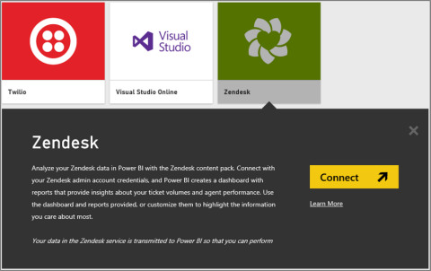
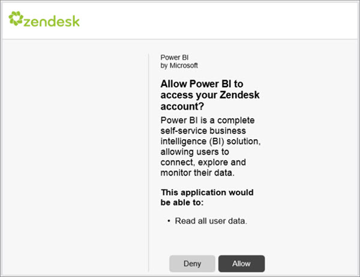
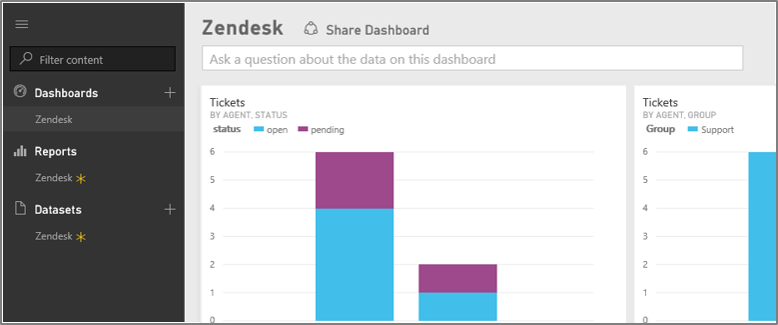

<properties 
   pageTitle="Zendesk content pack for Power BI"
   description="Zendesk content pack for Power BI"
   services="powerbi" 
   documentationCenter="" 
   authors="v-anpasi" 
   manager="mblythe" 
   editor=""
   tags=""/>
 
<tags
   ms.service="powerbi"
   ms.devlang="NA"
   ms.topic="article"
   ms.tgt_pltfrm="NA"
   ms.workload="powerbi"
   ms.date="06/18/2015"
   ms.author="v-anpasi"/>
# Zendesk content pack for Power BI

[← Services in Power BI](https://support.powerbi.com/knowledgebase/topics/88770-services-in-power-bi)

To analyze your Zendesk data in Power BI, you must connect to Zendesk using your Zendesk **admin** account credentials so that Power BI will be able to import  your data.  You will get a Power BI dashboard and a set of Power BI reports that provide insights about your ticket volumes and agent performance. You can use the dashboard and reports provided, or customize them to highlight the information you care most about.  The data will be refreshed automatically once a day. 

Connect to the [Zendesk content pack](https://app.powerbi.com/getdata/services/zendesk) for Power BI.

1.  Select **Get Data** at the bottom of the left navigation pane.

    

2.  In the **Services** box, select **Get**.

     

3.  Select **Zendesk** \> **Connect.**

    

4.  Provide the URL associated with your account. This will be in the form [https://company.zendesk.com](http://company.zendesk.com).

	

5.  When prompted, enter your Zendesk credentials.  Select **oAuth 2** as the Authentication Mechanism and click **Sign In**. Follow the Zendesk authentication flow. Note that these credentials must be an Admin for your account.  (If you are already signed in to Zendesk in your browser, you may not be prompted for credentials.)

	

6.  Click **Allow** to allow Power BI to access your Zendesk data.

	

7.  Click **Connect** to begin the import process. After Power BI imports the data, you see a new dashboard, report, and dataset in the left navigation pane. New items are marked with a yellow asterisk \*.

	

You can change this dashboard to display your data any way you want. It allows you to ask a [question in Q&A](http://support.powerbi.com/knowledgebase/articles/474566-q-a-in-power-bi) or click a tile to [open the underlying report](http://support.powerbi.com/knowledgebase/articles/425669-when-you-click-a-tile-in-a-dashboard) [change the tiles in the dashboard](http://support.powerbi.com/knowledgebase/articles/424878-edit-a-tile-resize-move-rename-delete).

##See Also:
-  [Get started with Power BI](http://support.powerbi.com/knowledgebase/articles/430814-get-started-with-power-bi)
-  [Get Data](http://support.powerbi.com/knowledgebase/articles/434354-get-data)
-  [Power BI blog: Better insights into your Zendesk customer support with Power BI](http://blogs.msdn.com/b/powerbi/archive/2015/03/24/better-insights-into-your-zendesk-customer-support-with-power-bi.aspx)