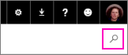

<properties 
   pageTitle="Connect to services with content packs for Power BI"
   description="Connect to services with content packs for Power BI"
   services="powerbi" 
   documentationCenter="" 
   authors="maggiesMSFT" 
   manager="mblythe" 
   editor=""
   tags=""/>
 
<tags
   ms.service="powerbi"
   ms.devlang="NA"
   ms.topic="article"
   ms.tgt_pltfrm="NA"
   ms.workload="powerbi"
   ms.date="11/06/2015"
   ms.author="tpalmer"/>
# Connect to services with content packs for Power BI

You can connect to content packs for a number of services you use to run your business, such as Salesforce, Microsoft Dynamics, and Google Analytics. Power BI starts by using your credentials to connect to service, and then creates a Power BI dashboard and a set of Power BI reports that automatically show your data and provide visual insights about your business. 

View all of the [content packs for services](https://app.powerbi.com/getdata/services) for Power BI. The Power BI team is working with other services to add new content packs every week. 

Start with the dashboard and reports Power BI creates. Then you can customize them to highlight the information you care most about. The data is refreshed automatically once per day. 

You can also use [Power BI Desktop](powerbi-desktop-get-the-desktop.md) to connect to some services, such as Google Analytics, and create your own customized dashboards and reports.  

### Get started using a content pack

1.  Select **Get Data** at the bottom of the left navigation pane.

     

2.  In the **Services** box, select **Get**.

     

3.  Browse the content packs, or tap in the search box and type key words:  

    

After you connect to a content pack, you see dashboard created with your own data. You can change this dashboard to display your data the way you want. You can ask a question by typing in the Q&A box, or click a tile to open the underlying report and pin other tiles to the dashboard.

Do you use a service you'd like to suggest for a Power BI content pack? Go to the [Power BI Support](https://support.powerbi.com/forums/265200-power-bi) page and let us know.

## See also

[Get started with Power BI](powerbi-service-get-started.md)

[Power BI - Basic Concepts](powerbi-service-basic-concepts.md)

