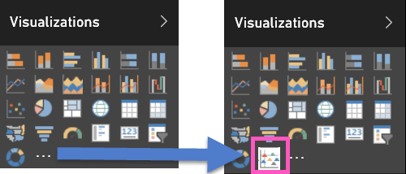
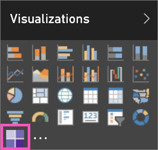
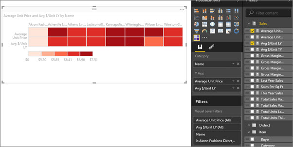

<properties
   pageTitle="Add a custom visualization to a Power BI report"
   description="Add a custom visual to a Power BI report"
   services="powerbi"
   documentationCenter=""
   authors="mihart"
   manager="mblythe"
   editor=""
   tags="power bi"/>

<tags
   ms.service="powerbi"
   ms.devlang="NA"
   ms.topic="article"
   ms.tgt_pltfrm="NA"
   ms.workload="powerbi"
   ms.date="03/03/2016"
   ms.author="mihart"/>
# Add a custom visualization to a Power BI report

You've [downloaded a custom visual template](powerbi-custom-visuals-download-from-the-gallery.md) and saved it to your computer or another location.  The next step is to 
import that visual template into a report so that it is added, as an option, to your Visualization pane.
    

>**Important**:
A custom visual template is added to a specific report when imported. If you'd like to use the visual template in another report, you need to import it into that report as well. 
When a report with a custom visual is saved using the **Save As** option, a copy of the custom visual template is saved with the new report.

1. Open [Power BI](http://app.powerbi.com) and select the report where you want to add the custom visualization.  

2.  Open the report in [Editing View](powerbi-service-interact-with-a-report-in-editing-view.md).

2. In the **Visualizations** pane, select the ellipses (...).

    

3. Select **Import** and navigate to the location where you saved the downloaded custom visualization (.pbiviz file).

4. **IMPORTANT**: Review the warning and ensure the visual comes from a trustworthy source. Microsoft recommends you work with your IT department if you're not sure whether to 
use a specific Custom Visual you obtained from the Power BI visuals gallery, through email, or from some other source. 
See [Review custom visuals for security and privacy](powerbi-custom-visuals-review-for-security-and-privacy.md).

5. Select **Open**. The custom visualization is added to the Visualization pane.

    

    A custom visual template is added to a specific report's Visualization pane when imported. It is now available for you to select and use in that report. 
    If you'd like to use the visual in another report, you need to import it into that report's Visualization pane as well. 
    When a report with a custom visual is saved using the **Save As** option, a copy of the custom visualtemplate is saved with the new report. 
    You cannot currently pin a custom visual to a dashboard. Don't worry, this capability is coming soon. Once you import a custom visual template you cannot remove it from that specific report's Visualization pane. If you've used it
    to create a visualization, you can remove the visualization; but the icon will remain in the Visualization pane.

6. Still in Editing View, select the custom visualization icon.  This adds a watermark (template) to your report canvas.

    

7. Drag fields onto the template to create the visualization.  This example shows the Table Heatmap custom visualization.

    

8. Continue to work with and explore this visualization as you would any other (native) visualization in Power BI.

### See also

[Microsoft's custom visual playlist on YouTube](https://www.youtube.com/playlist?list=PL1N57mwBHtN1vIjfvuBIzZllrmKo-Vz6x)

[Visualizations in Power BI](powerbi-service-visualizations-for-reports.md)

[Custom Visualizations in Power BI](powerbi-custom-visuals.md)

[The Power BI custom visuals gallery](https://app.powerbi.com/visuals)

[Use custom visualizations in Power BI Desktop](powerbi-custom-visuals-use.md)

[Review custom visuals for security and privacy](powerbi-custom-visuals-review-for-security-and-privacy.md)

[Getting started with custom visuals developer tools (Preview)](powerbi-custom-visuals-getting-started-with-developer-tools.md)

[Video: Creating custom visualizations for Power BI with Sachin Patney and Nico Cristache](https://www.youtube.com/watch?v=kULc2VbwjCc)
