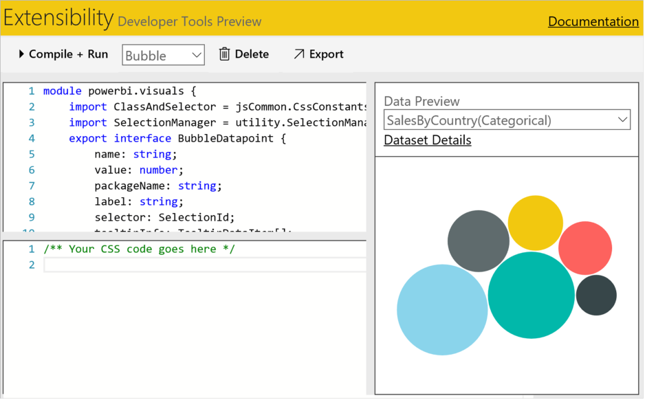

<properties
   pageTitle="Create and submit a visual to the gallery "
   description="Create and submit a visual to the gallery "
   services="powerbi"
   documentationCenter=""
   authors="asaxton"
   manager="mblythe"
   backup=""
   editor=""
   tags=""
   qualityFocus="no"
   qualityDate=""/>

<tags
   ms.service="powerbi"
   ms.devlang="NA"
   ms.topic="article"
   ms.tgt_pltfrm="NA"
   ms.workload="powerbi"
   ms.date="06/21/2016"
   ms.author="asaxton"/>

# Create and submit a visual to the gallery  

Want to create your own visual and add it to the Visuals Gallery for others to use?  Just follow these few steps.

1.   [Create a custom visual with the Power BI Developer Tools (Preview)](#devtools)
2.   [Submit the custom visual to the Power BI visuals gallery](#submit)

### Create a custom visual with the Power BI Developer Tools (Preview)  

You can create a custom visual using the Power BI Developer Tools (Preview). In the Power BI **Developer Tools**, design and test a custom visual by writing custom visual **TypeScript** code, and creating CSS. Once you've tested your custom visual, you can export it to Power BI, or submit it to the **Power BI visuals** gallery.

To learn more about the Developer Tools, see [Get started with Developer Tools (Preview)](powerbi-custom-visuals-getting-started-with-developer-tools.md).  

### Submit your custom visual to the Power BI visuals gallery  
Submit your custom visual to the Power BI visuals gallery via email. To learn how, see [Get started with Developer Tools (Preview)](powerbi-custom-visuals-getting-started-with-developer-tools.md).  

## See also
[Custom visuals in Power BI](powerbi-custom-visuals.md)

[Download a custom visual from the gallery](powerbi-custom-visuals-download-from-the-gallery.md)

[Use a custom visual in a report (Power BI Service)](powerbi-custom-visuals-add-to-report.md)

[Use a custom visual in a report (Power BI Desktop)](powerbi-custom-visuals-use.md)
