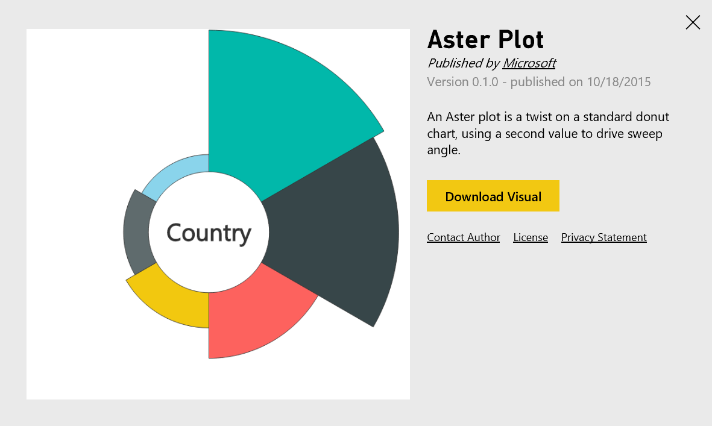

<properties 
   pageTitle="Download a custom visual from the gallery"
   description="Download a custom visual from the gallery"
   services="powerbi" 
   documentationCenter="" 
   authors="jastru" 
   manager="mblythe" 
   editor=""
   tags=""/>
 
<tags
   ms.service="powerbi"
   ms.devlang="NA"
   ms.topic="article"
   ms.tgt_pltfrm="NA"
   ms.workload="powerbi"
   ms.date="10/27/2015"
   ms.author="v-jastru"/>

# Download a custom visual from the gallery  
[← Knowledge Base](https://support.powerbi.com/knowledgebase)

Power BI has a **visuals gallery** which contains many useful visualizations created by the community and Microsoft that you can download, and use in your Power BI reports. There is an active developer community creating a wide range of custom visuals. To learn more about how to create a Power BI visual, see [Extend Power BI with custom visuals](https://powerbi.microsoft.com/custom-visuals).

It's easy to download, and use a custom visual in your reports.

1.  Go to [http://visuals.powerbi.com](http://visuals.powerbi.com/).
2.  On the **Welcome to Power BI visuals gallery** page, choose a **visual tile**.
3.  On the tile page, choose **Download Visual**.
    
4.  On the **This visual is published and is licensed to you by a Power BI community member ...** page, read the visual agreement, and choose **I Agree**.
5.  Save the .pbiviz file.
6.  To use a custom visual, see [Use a custom visual](https://support.powerbi.com/knowledgebase/articles/750216).