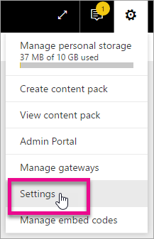
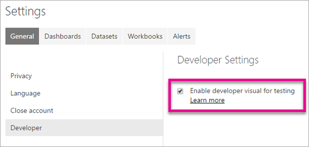
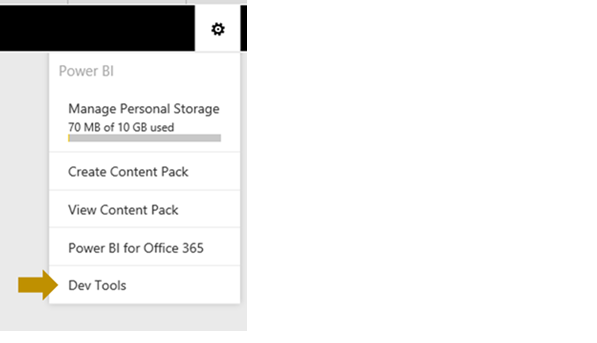

<properties
   pageTitle="Create a custom visual with the custom visual developer tools"
   description="Custom visuals allow you to meet your users' needs and match your app's design. Learn how to create a custom visual for Power BI using the developer tools."
   services="powerbi"
   documentationCenter=""
   authors="guyinacube"
   manager="mblythe"
   backup=""
   editor=""
   tags=""
   qualityFocus="no"
   qualityDate=""/>

<tags
   ms.service="powerbi"
   ms.devlang="NA"
   ms.topic="article"
   ms.tgt_pltfrm="NA"
   ms.workload="powerbi"
   ms.date="09/22/2016"
   ms.author="asaxton"/>

# Create a custom visual with the custom visual developer tools

Custom visuals allow you to meet your users' needs and match your app's design. Learn how to create a custom visual for Power BI using the developer tools.

## Requirements

- NodeJS 4.0+ Required (5.0 or later recommended) [Download NodeJS](https://nodejs.org)

## Install NodeJS and the Power BI tools

In order to create a custom visual, you will need to install NodeJS. NodeJS is required to run the command line tools.

1. Download and install [NodeJS](https://nodejs.org). Version 4.0 or later is required but it is recommended to have 5.0 or later.

2. Install the command line tools. Run the following command from a command prompt.

        npm install -g powerbi-visuals-tools

3. You can confirm that the tools are installed by running the following command without any parameters.

        pbiviz

    You should see the help output.

    <pre><code>
         +syyso+/
    oms/+osyhdhyso/
    ym/       /+oshddhys+/
    ym/              /+oyhddhyo+/
    ym/                     /osyhdho
    ym/                           sm+
    ym/               yddy        om+
    ym/         shho /mmmm/       om+
     /    oys/ +mmmm /mmmm/       om+
    oso  ommmh +mmmm /mmmm/       om+
   ymmmy smmmh +mmmm /mmmm/       om+
   ymmmy smmmh +mmmm /mmmm/       om+
   ymmmy smmmh +mmmm /mmmm/       om+
   +dmd+ smmmh +mmmm /mmmm/       om+
         /hmdo +mmmm /mmmm/ /so+//ym/
               /dmmh /mmmm/ /osyhhy/
                 //   dmmd
                       ++

       PowerBI Custom Visual Tool

    Usage: pbiviz [options] [command]

    Commands:

    new [name]        Create a new visual
    info              Display info about the current visual
    start             Start the current visual
    package           Package the current visual into a pbiviz file
    update [version]  Updates the api definitions and schemas in the current visual. Changes the version if specified
    help [cmd]        display help for [cmd]

    Options:

    -h, --help      output usage information
    -V, --version   output the version number
    --install-cert  Install localhost certificate
    </code></pre>

### Server Certificate setup

To enable a live preview of your visual, a trusted https server is needed. Before you can start, you will need to install an SSL certificate which will allow visual assets to load in your web browser. 

> [AZURE.NOTE] This is a one-time setup for your developer workstation.

To *add* a certificate, run the following command.

    pbiviz --install-cert

**Windows OS**

1. Select **Install Certificate...***.

    

2. Select **Current User** and then select **Next**.

    

3. Select **Place all certificate in the following store** and select **Browse...**.

4. Select **Trusted Root Certification Authorities** and then select **OK**. Select **Next**.

    

5. Select **Finish**.

    

6. Select **Yes** on the security warning dialog.

    

7. Close any browsers that you have open.

> [AZURE.NOTE] If the certificate is not recognized, you may need to restart your computer.

**OSX**

1. If the lock in the upper left is locked, select it to unlock. Search for *localhost* and double click on the certificate.

    


2. Select **Always Trust** and close the window.

    

3. Enter your username and password. Select **Update Settings**.

    

4. Close any browsers that you have open.

> [AZURE.NOTE] If the certificate is not recognized, you may need to restart your computer.

### Enable live preview of developer visual

To enable a live preview of your custom visual, follow these steps. This allows the visual to be used within the Power BI service when editing reports.

1. Browse and sign into [app.powerbi.com](https://app.powerbi.com).

2. Select the **gear icon** and then select **Settings**.

    

3. Select **Developer** and then select **Enable developer visual for testing**.

    

4. Select the **Developer Visual** in the **Visualization** pane.

    

    > [AZURE.NOTE] This requires that you have run `pbiviz start` from the visual folder on your development machine. For more information on creating your visual, see [Placeholder](#placeholder) in this article.

5. Select the visual in the report canvas. You can bind data in the same way you do other visuals.

You can now begin developing your visual.

## Create a new visual

You can create a new visual project by running the following command.

```
pbiviz new My Visual name
```

You can replace *My Visual Name* with the name you want to give the visual. This can be changed later by modifying the `name` and `displayName` fields within the generated `pbiviz.json` file.

This command will create a new folder in the direct where the command was run. It will generate a basic starter template for your visual. Once the command completes, you can open the directory and use your favorite editor to start working on your new visual.

## Testing your visual in Power BI

You can test your visual within the Power BI service within reports and dashboards.

### Running your visual

You can run your visual by doing the following.

1. Open a prompt.

2. Change your directory to be your visual folder. This is the folder that contains the `pbiviz.json` file.

3. Run the following command.

    ```
    pbiviz start
    ```

    

If you are in the wrong location, you will see an error similar to the following.

```
    error  LOAD ERROR Error: pbiviz.json not found. You must be in the root of a visual project to run this command.
        at e (C:\Users\[user]\AppData\Roaming\npm\node_modules\powerbi-visuals-tools\lib\VisualPackage.js:67:35)
        at Function.loadVisualPackage (C:\Users\[user]\AppData\Roaming\npm\node_modules\powerbi-visuals-tools\lib\VisualPackage.js:62:16)
        at Object.<anonymous> (C:\Users\[user]\AppData\Roaming\npm\node_modules\powerbi-visuals-tools\bin\pbiviz-start.js:43:15)
        at Module._compile (module.js:556:32)
        at Object.Module._extensions..js (module.js:565:10)
        at Module.load (module.js:473:32)
        at tryModuleLoad (module.js:432:12)
        at Function.Module._load (module.js:424:3)
        at Module.runMain (module.js:590:10)
        at run (bootstrap_node.js:394:7)
```

*************************************
OLD STUFF BELOW!!!!!!!!!!!!!!!
*************************************

## Building your first custom visual for Power BI

As a first step, familiarized yourself with how to build a custom visual using our IVisual interface. You can find resources and examples on how to do this in our open source project [Microsoft/PowerBI-visuals](http://www.github.com/Microsoft/PowerBI-visuals) on GitHub. The easiest way to get started is to fork the GitHub repo, follow the instructions in [Readme.md](https://github.com/Microsoft/PowerBI-visuals/blob/master/README.md) to build it, and follow the documentation in the [Wiki](https://github.com/Microsoft/PowerBI-visuals/wiki). Once you have the visual working in your copy of the GitHub repo, you’re ready to try it in the Developer Tools.

### Using the Developer Tools

Before using the **Developer Tools**, please note that the **Developer Tools** feature is in preview, so there are many features that we are still working on to enable in the future.

Here's how to use the **Power BI Custom Visuals Developer Tools**.

**Step 1: Open the developer tools**
1. Under the settings icon, choose **Developer Tools**.

  

  A new tab will open that represents the **Developer Tools**. Here’s an example of the Developer Tools page:  

  

**Step 2: Create your custom visual**

The diagram below shows the major parts of using the developer tools. You write your [TypeScript](http://www.typescriptlang.org/) code in the **TypeScript code pane** and any CSS styles in the **CSS pane**.

**To run your custom visual**
1.  Choose **Compile + Run** to see a preview of your visual. If your visual is not shown, you may see errors highlighted in red in the code window. You may also check your browser debugging tools for JavaScript errors.

  

The developer tools allow you to also specify an Icon, work with multiple visuals and delete visuals. The **Data Preview** option allows you to select from sample data views to test your visual’s behavior. To test with additional data, see [Testing your custom visual in Reports and Dashboards](#testing).

**Step 3: Debug your custom visual**

You can debug your custom visual using your web browser’s debugger. For most browsers, you can press **F12** to launch the browser’s debugger.

>**Note:**
>The code you write is [TypeScript](http://www.typescriptlang.org/) which is ‘typed’ JavaScript. Before debugging, your TypeScript code is compiled into JavaScript. You debug the resulting JavaScript code in your browser. To make fixes to your code, you’ll need to make them in your TypeScript and then choose **Compile + Run** again.

**Locating your code in the Browser Debugger**

**Internet Explorer**

The code you write will be located under **File** &gt; **Dynamic Scripts** in IE’s debugger.

  

**Chrome**

It will be located under (no domain) within Sources in Chrome’s debugger.

  

**To set a break point**

To set a break point, open your browser’s debugger (typically press **F12**), find the JavaScript line of code, and set a break point there. You cannot set a breakpoint directly within Power BI’s developer tools.

**Step 4: Iterating on your custom visual code**

You can work in two browser windows or two tabs one with the **Developer Tools** open to edit your visual code and a second open with the report or dashboard you are testing with. As you make changes in the **Developer Tools** and choose **Compile + Run**, you need to remember to refresh the tab in which you have your report or dashboard for testing. To refresh the tab, press **CTRL + F5** in most browsers.

>**Note:**
>When testing your custom visual in a Report or Dashboard, press **CTRL+F5** to ensure the latest version of your custom visual code is used. Repeat this each time you choose **Compile + Run** in the Developer Tools. Otherwise, you may be using an older version of your code.

<a name ="testing"></a>
**Step 5: Testing your custom visual in Reports and Dashboards**

After you test your visual and get it working in the Developer Tools, you should test that it is working in Reports and Dashboards in Power BI. Here’s how to do this:

1.  If you’re using a browser tab you already have open press **Ctrl+F5** to refresh the page.
2.  Open the report you wish to edit.
3.  Choose **Edit Report**.
4.  If you specified a custom icon for your custom visual, you will see the icon for your custom visual in the visualizations pane.

**Notes and Caveats**

The Developer Tools are in an early preview, as such there are some caveats to be aware. As we bring Developer Tools into broader previews, we will remove these limitations.

1.  You can test your custom visual in IE, Edge, Chrome, or Firefox. You will need to re-load your custom visual code for each browser you wish to test on. To re-load your custom visual, follow steps 1 through 5 above in each browser.
2.  There may be times when due to a service change, your code will no longer work. We will try to minimize this as much as possible.
3.  Ensure you keep a copy of your code in your own source control to ensure you do not lose it in such cases.
4.  The custom visual you test using the Developer tools is only visible to you in the browser you loaded it into.

## Export a custom visual
After you design your custom visual, you export it to share it with others or upload it to the community gallery.

### To export a custom visual
1.  In **Developer Tools**, choose **Export**.
2.  In **Visuals Settings**, enter your custom visual settings.
     
3.  Choose **Export**.

## See also

[Visualizations in Power BI](powerbi-service-visualizations-for-reports.md)  
[Custom Visualizations in Power BI](powerbi-custom-visuals.md)  
[The Power BI custom visuals gallery](https://app.powerbi.com/visuals)  
More questions? [Try the Power BI Community](http://community.powerbi.com/)