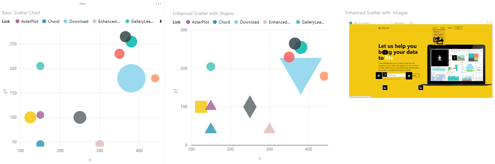

<properties
   pageTitle="Custom visuals from Microsoft"
   description="Using Custom Visuals provided by Microsoft"
   services="powerbi"
   documentationCenter=""
   authors="meysun"
   manager="mblythe"
   editor=""
   tags=""/>

<tags
   ms.service="powerbi"
   ms.devlang="NA"
   ms.topic="article"
   ms.tgt_pltfrm="NA"
   ms.workload="powerbi"
   ms.date="11/16/2015"
   ms.author="meysun"/>

# Custom visuals

Introducing custom visuals from Microsoft! Check them out in the power bi [visuals gallery](https://visuals.powerbi.com).
This article provides a quick overview of the custom visuals submitted by Microsoft to the visuals gallery and how to use them in your report.
>Watch a video on how to use these charts. Here is the link to the [video playlist](https://www.youtube.com/playlist?list=PL1N57mwBHtN1vIjfvuBIzZllrmKo-Vz6x) on how to use these charts.

# Enhanced Scatter

Enhanced Scatter chart is useful for finding correlations and non-linear relationships between variables. It builds on top of the existing scatter chart and provides advanced options such as displaying shapes or images instead of the standard bubbles.This also includes background image support

For Shape, Image, and Backdrop values, you must use a measure that returns a text value. If you have a column containing the shape name or image URLs, then you need to create a measure to return the first non-blank row (or any other logic that would return one text value and use that in this field bucket).

For Shape the allowed values are circle, cross, diamond, square, triangle-up, triangle-down, star, hexagon, x, up arrow, and down arrow. For Image and Backdrop, provide a URL that points to an image file.

Use Backdrop to display an image as the background for the chart. If you are using the Backdrop, then the xmin, xmax, ymin, and ymax fields allow you to align your background image with the x andy coordinates used to plot the data.

Here is a screenshot of Enhanced Scatter with Shapes and Images along with basic scatter chart

      

 [Here](https://youtu.be/xCfM0cjM4do?list=PL1N57mwBHtN1vIjfvuBIzZllrmKo-Vz6x) is the link to the video

## See also

[Add a custom visual to a report in the Power BI Service](powerbi-custom-visuals-add-to-report.md)

[Create and submit a custom visual](powerbi-custom-visuals-create-for-the-gallery.md)

[Visualizations in Power BI](powerbi-service-visualizations-for-reports.md)

Back to [Custom Visualizations in Power BI](powerbi-custom-visuals.md)

[The Power BI custom visuals gallery](https://app.powerbi.com/visuals.md)
