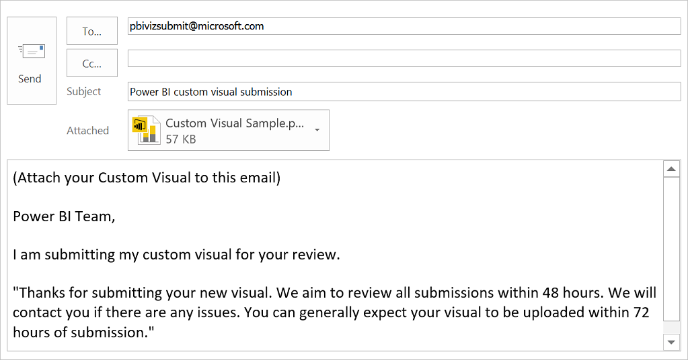

<properties
   pageTitle="Submit a custom visual to the gallery"
   description="Submit a custom visual to the gallery"
   services="powerbi"
   documentationCenter=""
   authors="mihart"
   manager="mblythe"
   editor=""
   tags=""/>

<tags
   ms.service="powerbi"
   ms.devlang="NA"
   ms.topic="article"
   ms.tgt_pltfrm="NA"
   ms.workload="powerbi"
   ms.date="10/27/2015"
   ms.author="mihart"/>

# Submit a custom visual to the gallery  

Power BI supports custom visuals that you can create with the [Power BI Developer Tools](https://support.powerbi.com/knowledgebase/articles/722121). Once you create a custom visual, share it with others by submitting it to the [Power BI visuals gallery](http://visuals.powerbi.com).

1. [Create the visual](powerbi-custom-visuals-getting-started-with-developer-tools.md).

2. Go to [http://visuals.powerbi.com](http://visuals.powerbi.com/).

3.  On the **Welcome to Power BI visuals gallery** page, choose **Learn how to submit visuals**.
    

4.  On the **How to create and submit a visual** page, choose **Submit a visual**.

5.  Choose your email client.

6.  Attach your custom visual .pbiviz file, and send us your custom visual.  
	 

## See also:

  [Visualizations in Power BI](powerbi-service-visualizations-for-reports.md)

  [Custom Visualizations in Power BI](powerbi-custom-visuals.md)

  [The Power BI custom visuals gallery](https://app.powerbi.com/visuals)
