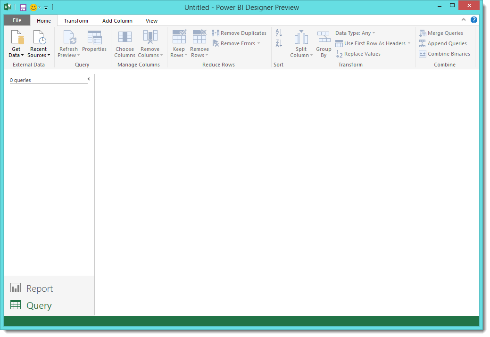
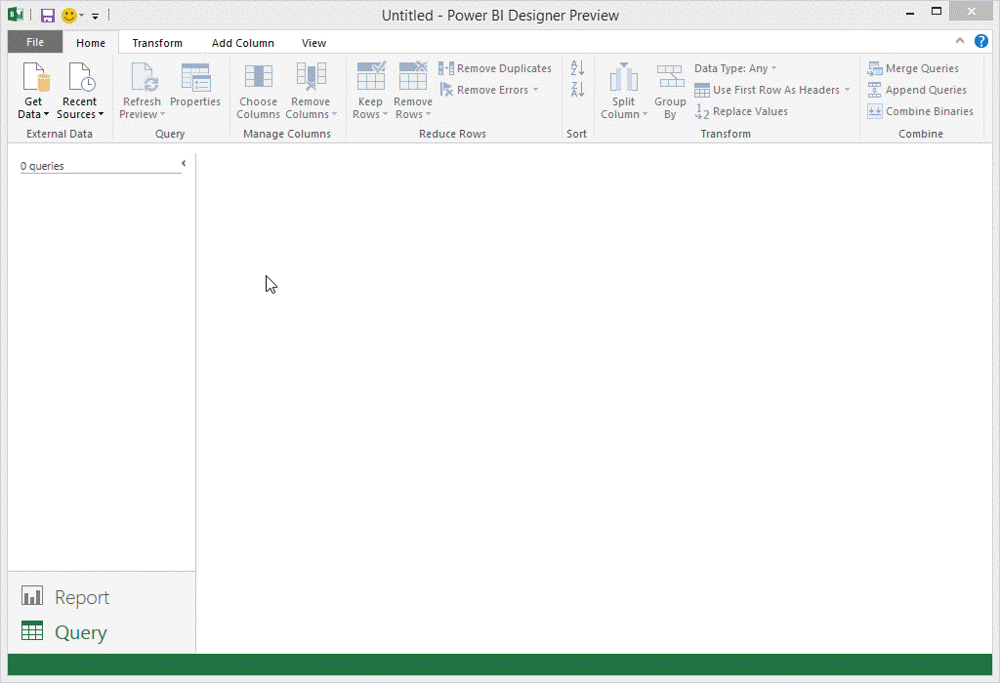
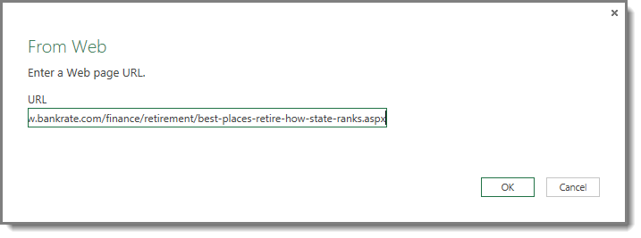
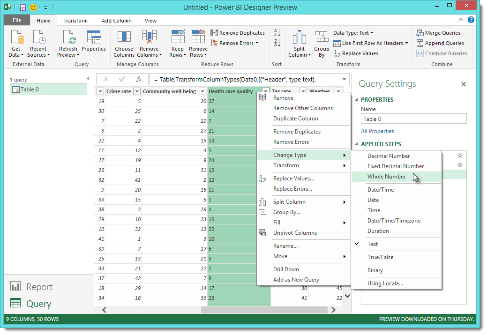
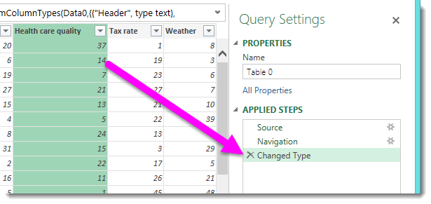
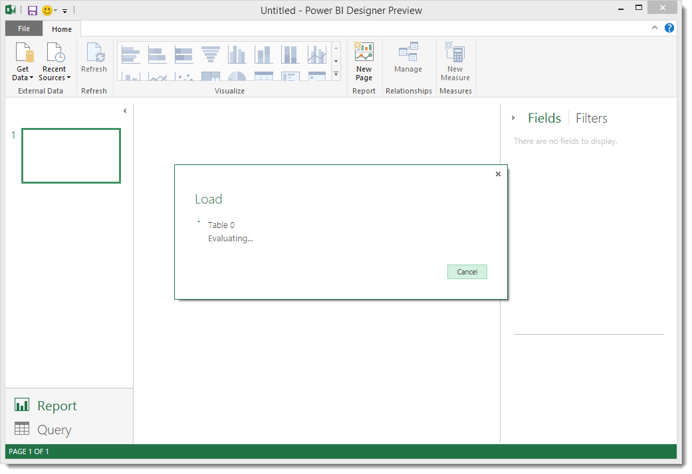
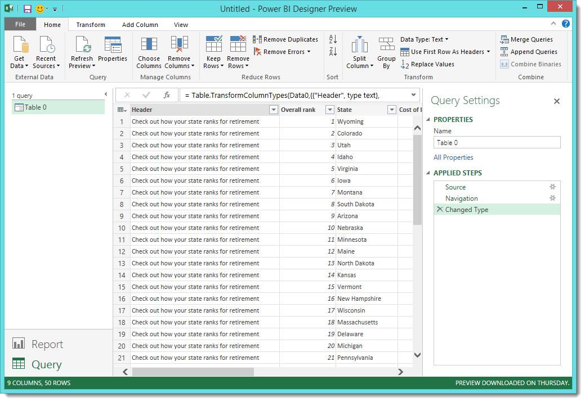

<properties pageTitle="Connect to Data in Power BI Designer" description="Connect to Data in Power BI Designer" services="powerbi" documentationCenter="" authors="v-anpasi" manager="mblythe" editor=""/> 
<tags ms.service="powerbi" ms.devlang="NA" ms.topic="article" ms.tgt_pltfrm="NA" ms.workload="powerbi" ms.date="06/16/2015" ms.author="v-anpasi"/>
#Connect to Data in Power BI Designer

[← Power BI Designer](https://support.powerbi.com/knowledgebase/topics/68530-power-bi-designer)

The Power BI Designer lets you easily connect to the ever expanding world of data. If you don’t have the Power BI Designer, you can download and install it from **here**. When you start the Power BI Designer, you’re presented with a new **Report** view.

From the bottom left corner of the Power BI Designer, select **Query**.

There are *all sorts* of data sources available in the Query window. The following image shows how to connect to data, by selecting the **File** ribbon, then **Get Data \> More**.

For this example, we'll connect to a **Web** data source.

Imagine you’re retiring – you want to live where there’s lots of sunshine, preferable taxes, and good health care. Or… perhaps you’re a data analyst, and you want that information to help your customers – as in, help your raincoat manufacturing client target sales where it rains a *lot*.

Either way, you find a Web resource that has interesting data about those topics, and more:

[*http://www.bankrate.com/finance/retirement/best-places-retire-how-state-ranks.aspx*](http://www.bankrate.com/finance/retirement/best-places-retire-how-state-ranks.aspx)

You select **Get Data \> Web** and type the address.

When you select **OK**, the **Query** functionality of the Power BI Designer goes to work. Query contacts the Web resource, and the **Navigator** window returns the results of what it found on that Web page. In this case, it found a table (Table 0) and the overall Document. We’re interested in the table, so we select it from the list. The **Navigator** window displays a preview.

At this point we can edit the query before loading the table, by selecting **Edit Query** from the bottom of the window, or we can load the table.

If we select **Edit**, the table is loaded and the Query view is presented. The Query Settings pane is displayed (if it’s not, you can select **View** from the ribbon, then **Show \> Query Settings** to display the Query Settings pane). Here’s what that looks like.

All those scores are text rather than numbers, and we need them to be numbers. No problem – just right-click the column header, and select **Change Type \> Whole Number** to change them. To choose more than one column, first select a column then hold down **SHIFT**, select additional adjacent columns, and then right-click a column header to change all selected columns. Use **CTRL** to choose columns that are not adjacent.

In **Query Settings**, the Applied Steps will reflect any changes that were made. As you make additional changes to the data, Query will record those changes in the Applied Steps section, which you can adjust, revisit, rearrange, or delete as necessary.

Additional changes to the table can still be made after it’s loaded, but for now this will do. When we select Report, the Power BI Designer switches to **Report** view, and the data (as modified by the query steps) is loaded into the model.

Once the table is loaded, the Query view in the Power BI Designer lets you to shape the query, combine it with other data, or otherwise transform it however you see fit.

Of course, this is a simple model with a single data connection; most Power BI Designer reports will have connections to different data sources, shaped to meet your needs, with relationships that produce a rich data model.  

##More Information

There are all sorts of things you can do with the Power BI Designer. For more information on its capabilities, check out the following resources:

-   [Getting Started with Power BI Designer](https://powerbi.uservoice.com/knowledgebase/articles/471664)
-   [Query Overview with Power BI Designer](https://powerbi.uservoice.com/knowledgebase/articles/471646)
-   [Data Sources in Power BI Designer](https://powerbi.uservoice.com/knowledgebase/articles/471643)
-   [Shape and Combine Data with Power BI Designer](https://powerbi.uservoice.com/knowledgebase/articles/471644)
-   [Common Query Tasks in the Power BI Designer](https://powerbi.uservoice.com/knowledgebase/articles/471648)    

Want to give us feedback? Great – use the **Send Feedback** menu item in the Power BI Designer. We look forward to hearing from you!

