<properties pageTitle="Create and manage relationships in Power BI Designer" description="Create and manage relationships in Power BI Designer" services="powerbi" documentationCenter="" authors="v-anpasi" manager="mblythe" editor=""/>
<tags ms.service="powerbi" ms.devlang="NA" ms.topic="article" ms.tgt_pltfrm="NA" ms.workload="powerbi" ms.date="06/16/2015" ms.author="v-anpasi"/>
# Create and manage relationships in Power BI Designer
[← Power BI Designer](https://support.powerbi.com/knowledgebase/topics/68530-power-bi-designer)

When you import multiple tables, chances are you’re going to do some analysis using data from all those tables. Relationships between those tables are necessary in order to accurately calculate results and display the correct information in your reports. The Power BI Designer makes creating those relationships easy. In-fact, in most cases you won’t have to do anything, the designer’s Autodetect feature can do it for you. However, in some cases you might have to create relationships yourself, or you might need to make some changes to a relationship. Either way, it’s important to understand relationships in Power BI and how to create and edit them.

## Autodetect during load

If you query two or more tables at the same time, when the data is loaded, the designer will attempt to find and create relationships for you. Cardinality, Cross filter direction, and Active properties are automatically set. The designer looks at column names in the tables you are querying to determine if there are any potential relationships. If there are, those relationships are created automatically. If the designer cannot determine with a high-level of confidence there is a match, it will not automatically create the relationship. You can still use the Manage Relationships dialog to create or edit relationships.

## Create a relationship by using Autodetect

In Power BI Designer, in Report View, on the **Home** tab, click **Manage Relationships** \> **AutoDetect.**

> 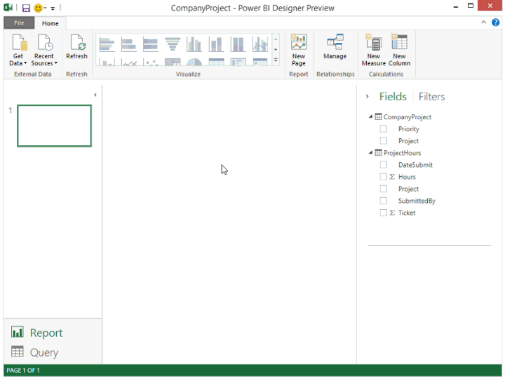

## Create a relationship manually

1.  On the **Home** tab, click **Manage Relationships** \> **New**.

2.  In the **Create Relationship** dialog, in the first table drop-down list, select a table,  and then select the column you want to use in the relationship.

3.  In the to second table drop-down list, select the other table you want in the relationship, then select the other column you want to use, and then click **OK**.

> 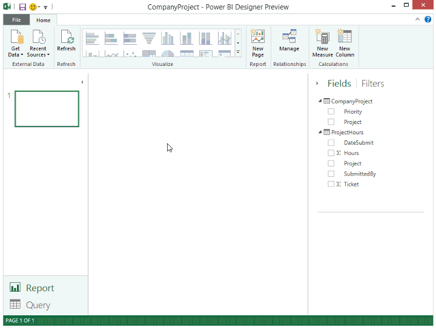

By default, the designer will automatically configure the Cardinality (direction), Cross filter direction, and Active properties for your new relationship; however, you can change these if necessary in **Advanced options**. To learn more, see the Understanding advanced options section later in this article.

### Edit a relationship

1.  On the **Home** tab, click **Manage Relationships**.

2.  In the **Manage Relationships** dialog, select the relationship, then click **Edit**.

### Configure advanced options

When you create or edit a relationship, you can configure advanced options.  By default, the designer will automatically configure the advanced options based on a best guess. This can be different for each relationship based on the data in the columns.

#### Cardinality

**Many to One (\*:1)**  - This is the most common, default type. This means the column in one table can have more than one instance of a value, and the other related table, often know as the Lookup table, has only one instance of a value.

**Many to Many (\*.\*)** - This means the column in one table can have more than one instance of a value, and the other related table can also have more than one instance of a value.

**One to One (1:1)** - This means the column in one table has only one instance of a particular value, and the other related table has only one instance of a particular value.

See the Understanding advanced options section later in this article for more details about when to change cardinality.

#### Cross filter direction

**Both -** This is the most common, default direction. This means for filtering purposes, both tables are treated as if they are a single table.

**Single –** This means that filtering choices in connected tables work on the table where values are being aggregated. If you import a Power Pivot in Excel 2013 or earlier data model, all relationships will have a single direction. 

See the Understanding advanced options section later in this article for more details about when to change cross filter direction.

#### Make this relationship active

When checked, this means the relationship serves as the active, default relationship.  In cases where there are more than one relationship between two tables, the active relationship provides a way for the designer to automatically create visuals that include both tables.

See the Understanding advanced options section later in this article for more details about when to make a particular relationship active.

## Understanding relationships

Once you have connected two tables together with a relationship, you can work with the data in both tables as if they were a single table, freeing you from having to worry about relationship details, or flattening those tables into a single table before importing them into Power BI.  In many situations, Power BI can automatically create relationships for you, so manually creating those relationships might not even be needed; however, if Power BI can’t determine with a high-degree of certainty that a relationship between two tables should exist, it will *not* automatically create the relationship for you. In that case, you will need to create the relationship.   

Let’s do a little tutorial, to better show you how relationships work in Power BI.

> **Tip:** You can complete this lesson yourself. Copy the ProjectHours table below into an Excel worksheet, select all of the cells, click INSERT \> Table. In the Create Table dialog, just click OK. Then in Table Name, type ProjectHours. Do the same for the CompanyProject table. You can then import the data by using Get Data in the Power BI Designer. Select your workbook and tables as a data source.

This first table, ProjectHours, is a record of work tickets that record the number of hours a person has worked on a particular project.  
**ProjectHours**

<table>
<colgroup>
<col width="20%" />
<col width="20%" />
<col width="20%" />
<col width="20%" />
<col width="20%" />
</colgroup>
<tbody>
<tr class="odd">
<td align="left">
<strong>Ticket</strong>
</td>
<td align="left">
<strong>SubmittedBy</strong>
</td>
<td align="left">
<strong>Hours</strong>
</td>
<td align="left">
<strong>Project</strong>
</td>
<td align="left">
<strong>DateSubmit</strong>
</td>
</tr>
<tr class="even">
<td align="left">
1001
</td>
<td align="left">
Brewer, Alan
</td>
<td align="left">
22
</td>
<td align="left">
Blue
</td>
<td align="left">
1/1/2013
</td>
</tr>
<tr class="odd">
<td align="left">
1002
</td>
<td align="left">
Brewer, Alan
</td>
<td align="left">
26
</td>
<td align="left">
Red
</td>
<td align="left">
2/1/2013
</td>
</tr>
<tr class="even">
<td align="left">
1003
</td>
<td align="left">
Ito, Shu
</td>
<td align="left">
34
</td>
<td align="left">
Yellow
</td>
<td align="left">
12/4/2012
</td>
</tr>
<tr class="odd">
<td align="left">
1004
</td>
<td align="left">
Brewer, Alan
</td>
<td align="left">
13
</td>
<td align="left">
Orange
</td>
<td align="left">
1/2/2012
</td>
</tr>
<tr class="even">
<td align="left">
1005
</td>
<td align="left">
Bowen, Eli
</td>
<td align="left">
29
</td>
<td align="left">
Purple
</td>
<td align="left">
10/1/2013
</td>
</tr>
<tr class="odd">
<td align="left">
1006
</td>
<td align="left">
Bento, Nuno
</td>
<td align="left">
35
</td>
<td align="left">
Green
</td>
<td align="left">
2/1/2013
</td>
</tr>
<tr class="even">
<td align="left">
1007
</td>
<td align="left">
Hamilton, David
</td>
<td align="left">
10
</td>
<td align="left">
Yellow
</td>
<td align="left">
10/1/2013
</td>
</tr>
<tr class="odd">
<td align="left">
1008
</td>
<td align="left">
Han, Mu
</td>
<td align="left">
28
</td>
<td align="left">
Orange
</td>
<td align="left">
1/2/2012
</td>
</tr>
<tr class="even">
<td align="left">
1009
</td>
<td align="left">
Ito, Shu
</td>
<td align="left">
22
</td>
<td align="left">
Purple
</td>
<td align="left">
2/1/2013
</td>
</tr>
<tr class="odd">
<td align="left">
1010
</td>
<td align="left">
Bowen, Eli
</td>
<td align="left">
28
</td>
<td align="left">
Green
</td>
<td align="left">
10/1/2013
</td>
</tr>
<tr class="even">
<td align="left">
1011
</td>
<td align="left">
Bowen, Eli
</td>
<td align="left">
9
</td>
<td align="left">
Blue
</td>
<td align="left">
10/15/2013
</td>
</tr>
</tbody>
</table>

This second table, CompanyProject, is a list of projects with an assigned priority, A, B, or C. 

**CompanyProject**

<table>
<colgroup>
<col width="50%" />
<col width="50%" />
</colgroup>
<tbody>
<tr class="odd">
<td align="left">
<strong>Project</strong>
</td>
<td align="left">
<strong>Priority</strong>
</td>
</tr>
<tr class="even">
<td align="left">
Blue
</td>
<td align="left">
A
</td>
</tr>
<tr class="odd">
<td align="left">
Red
</td>
<td align="left">
B
</td>
</tr>
<tr class="even">
<td align="left">
Green
</td>
<td align="left">
C
</td>
</tr>
<tr class="odd">
<td align="left">
Yellow
</td>
<td align="left">
C
</td>
</tr>
<tr class="even">
<td align="left">
Purple
</td>
<td align="left">
B
</td>
</tr>
<tr class="odd">
<td align="left">
Orange
</td>
<td align="left">
C
</td>
</tr>
</tbody>
</table>

Notice that each table has a column named Project, and the values look like they’re the same. That’s important, and we’ll get back to it in a little bit.

Now that we have our two tables imported into a model, let’s create a report. The first thing we want to get is the number of hours submitted by project priority, so we select **Priority** and **Hours** from Fields.

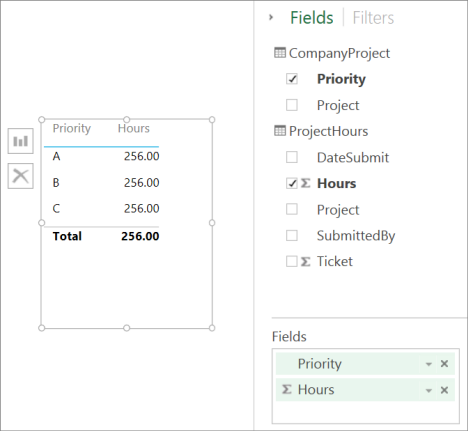

If we look at our table in the Report canvas, you’ll see the number of hours is **256.00** for each project, and it’s also the total. Clearly this isn’t correct. Why? It’s because we can’t calculate a sum total of values from one table (Hours in the Project table), sliced by values in another table (Priority in the CompanyProject table) without a relationship between these two tables.

So, let’s create a relationship between these two tables.

Remember that Project column we saw in both tables, with values that look alike? We’re going to use these two columns to create a relationship between our tables.

Why these columns? Well, if we look at the Project column in the ProjectHours table, we see values like Blue, Red, Yellow, Orange, and so on. In fact, we see several rows that have the same value. In-effect, we have *many* color values for Project.

If we look at the Project column in the CompanyProject table, we see there’s only *one* of each of the color values for project. In-effect, each color value in this table is *unique*, and that’s important, because we can create a relationship between these two tables. In this case, a *many-to-one* relationship. In a many-to-one relationship, at least one column in one of the tables must contain unique values. There are some advanced options for some relationships, and we’ll look at those later, but for now, let’s create a relationship between the Project columns in each of our two tables.

### To create the new relationship

1.  In the Designer, click **Manage Relationships**. This opens the Manage Relationship dialog.

2.  In **Manage Relationships**, click **New**. This opens the **Create Relationship** dialog, where we can select the tables, columns, and any advanced settings we want for our relationship.

3.  In the first table, select **ProjectHours**, then select the **Project** column. This is the *many* side of our relationship.

4.  In the second table, select **CompanyProject**, then select the **Project** column. This is the *one* side of our relationship.

5.  Go ahead and click **OK** in both the **Create Relationship** dialog and the **Manage Relationships** dialog.

In the interest of full disclosure,  we really just created this relationship the hard way. We could have just clicked on the **Autodetect** button in the **Manage Relationships** dialog. In-fact, Autodetect probably had already done it for you when you loaded the data. Because each table has a column named Project, the designer would have known with a high level of confidence that these columns could be related. But, what’s the challenge in that?

Now, let’s look at the table in our Report canvas again.

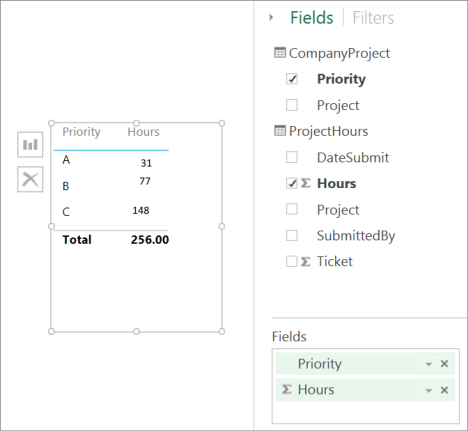
Now that looks a whole lot better, doesn’t it?

When we sum up hours by Priority, Power BI will look for every instance of the unique color values in the CompanyProject lookup table, and then look for every instance of each of those values in the CompanyProject table, and calculate a sum total for each unique value.

That was pretty easy, in-fact, with Autodetect, you might not even have to do this much.

## Understanding advanced options

When a relationship is created, either with Autodetect or one you create manually, the designer will automatically configure advanced options based on the data in your tables. You can configure advanced relationship properties by expanding **Advanced options** in the Create/Edit relationship dialog.

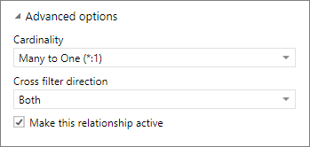

As we said, these are usually set automatically and you won’t need to mess with them; however, there are several situations where you might want to configure advanced options yourself.

### Future updates to the data require a different cardinality

Normally, the designer can automatically determine the best cardinality for the relationship.  If you do need to override the automatic setting, because you know the data will change in the future, you can select it in the Cardinality control. Let’s look at an example where we need to select a different cardinality.

The CompanyProjectPriority table below is a list of all company projects and their priority. The ProjectBudget table is the set of projects for which budget has been approved.

**ProjectBudget**

<table>
<colgroup>
<col width="33%" />
<col width="33%" />
<col width="33%" />
</colgroup>
<tbody>
<tr class="odd">
<td align="left">
<strong>Approved Projects</strong>
</td>
<td align="left">
<strong>BudgetAllocation</strong>
</td>
<td align="left">
<strong>AllocationDate</strong>
</td>
</tr>
<tr class="even">
<td align="left">
Blue
</td>
<td align="left">
     40,000 
</td>
<td align="left">
12/1/2012
</td>
</tr>
<tr class="odd">
<td align="left">
Red
</td>
<td align="left">
   100,000 
</td>
<td align="left">
12/1/2012
</td>
</tr>
<tr class="even">
<td align="left">
Green
</td>
<td align="left">
     50,000 
</td>
<td align="left">
12/1/2012
</td>
</tr>
</tbody>
</table>

**CompanyProjectPriority**
<table>
<colgroup>
<col width="50%" />
<col width="50%" />
</colgroup>
<tbody>
<tr class="odd">
<td align="left">
<strong>Project</strong>
</td>
<td align="left">
<strong>Priority</strong>
</td>
</tr>
<tr class="even">
<td align="left">
Blue
</td>
<td align="left">
A
</td>
</tr>
<tr class="odd">
<td align="left">
Red
</td>
<td align="left">
B
</td>
</tr>
<tr class="even">
<td align="left">
Green
</td>
<td align="left">
C
</td>
</tr>
<tr class="odd">
<td align="left">
Yellow
</td>
<td align="left">
C
</td>
</tr>
<tr class="even">
<td align="left">
Purple
</td>
<td align="left">
B
</td>
</tr>
<tr class="odd">
<td align="left">
Orange
</td>
<td align="left">
C
</td>
</tr>
</tbody>
</table>

If we create a relationship between the Project column in the CompanyProjectPriority table and ApprovedProjects column in the ProjectBudget table, like this:

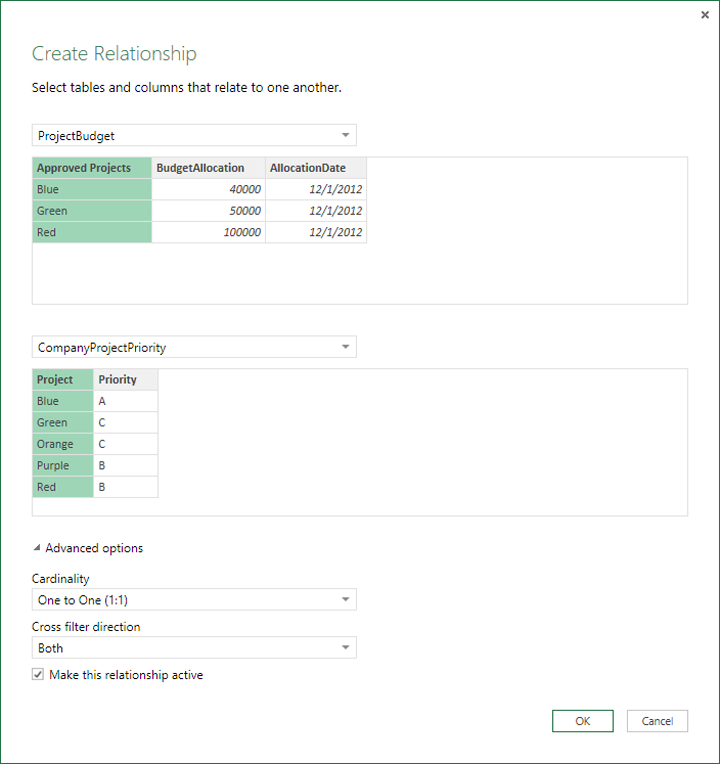

The designer will automatically set the cardinality to One-to-One (1:1), and cross filtering to be Both (as shown).  This is because, to the designer the best combination of the two tables really looks like this:

<table>
<colgroup>
<col width="25%" />
<col width="25%" />
<col width="25%" />
<col width="25%" />
</colgroup>
<tbody>
<tr class="odd">
<td align="left">
<strong>Project</strong>
</td>
<td align="left">
<strong>Priority</strong>
</td>
<td align="left">
<strong>BudgetAllocation</strong>
</td>
<td align="left">
<strong>AllocationDate</strong>
</td>
</tr>
<tr class="even">
<td align="left">
Blue
</td>
<td align="left">
A
</td>
<td align="left">
         40,000 
</td>
<td align="left">
12/1/2012
</td>
</tr>
<tr class="odd">
<td align="left">
Red
</td>
<td align="left">
B
</td>
<td align="left">
       100,000 
</td>
<td align="left">
12/1/2012
</td>
</tr>
<tr class="even">
<td align="left">
Green
</td>
<td align="left">
C
</td>
<td align="left">
         50,000 
</td>
<td align="left">
12/1/2012
</td>
</tr>
<tr class="odd">
<td align="left">
Yellow
</td>
<td align="left">
C
</td>
<td align="left"></td>
<td align="left"></td>
</tr>
<tr class="even">
<td align="left">
Purple
</td>
<td align="left">
B
</td>
<td align="left"></td>
<td align="left"></td>
</tr>
<tr class="odd">
<td align="left">
Orange
</td>
<td align="left">
C
</td>
<td align="left"></td>
<td align="left"></td>
</tr>
</tbody>
</table>

There is a one-to-one relationship between our two tables because there are no repeating values in the combined table’s Project column. The Project column is *unique*, because each value occurs only once, so, the rows from the two tables can be combined directly without any duplication.

But, let’s say you know the data will change the next time you refresh it. A refreshed version of the ProjectBudget table now has additional rows for Blue and Red:

**ProjectBudget**

<table>
<colgroup>
<col width="33%" />
<col width="33%" />
<col width="33%" />
</colgroup>
<tbody>
<tr class="odd">
<td align="left">
<strong>Approved Projects</strong>
</td>
<td align="left">
<strong>BudgetAllocation</strong>
</td>
<td align="left">
<strong>AllocationDate</strong>
</td>
</tr>
<tr class="even">
<td align="left">
Blue
</td>
<td align="left">
          40,000 
</td>
<td align="left">
12/1/2012
</td>
</tr>
<tr class="odd">
<td align="left">
Red
</td>
<td align="left">
        100,000 
</td>
<td align="left">
12/1/2012
</td>
</tr>
<tr class="even">
<td align="left">
Green
</td>
<td align="left">
          50,000 
</td>
<td align="left">
12/1/2012
</td>
</tr>
<tr class="odd">
<td align="left">
Blue
</td>
<td align="left">
          80,000 
</td>
<td align="left">
6/1/2013
</td>
</tr>
<tr class="even">
<td align="left">
Red
</td>
<td align="left">
          90,000 
</td>
<td align="left">
6/1/2013
</td>
</tr>
</tbody>
</table>

 This means the best combination of the two tables now really looks like this: 

<table>
<colgroup>
<col width="25%" />
<col width="25%" />
<col width="25%" />
<col width="25%" />
</colgroup>
<tbody>
<tr class="odd">
<td align="left">
<strong>Project</strong>
</td>
<td align="left">
<strong>Priority</strong>
</td>
<td align="left">
<strong>BudgetAllocation</strong>
</td>
<td align="left">
<strong>AllocationDate</strong>
</td>
</tr>
<tr class="even">
<td align="left">
Blue
</td>
<td align="left">
A
</td>
<td align="left">
     40,000 
</td>
<td align="left">
12/1/2012
</td>
</tr>
<tr class="odd">
<td align="left">
Red
</td>
<td align="left">
B
</td>
<td align="left">
   100,000 
</td>
<td align="left">
12/1/2012
</td>
</tr>
<tr class="even">
<td align="left">
Green
</td>
<td align="left">
C
</td>
<td align="left">
     50,000 
</td>
<td align="left">
12/1/2012
</td>
</tr>
<tr class="odd">
<td align="left">
Yellow
</td>
<td align="left">
C
</td>
<td align="left"></td>
<td align="left"></td>
</tr>
<tr class="even">
<td align="left">
Purple
</td>
<td align="left">
B
</td>
<td align="left"></td>
<td align="left"></td>
</tr>
<tr class="odd">
<td align="left">
Orange
</td>
<td align="left">
C
</td>
<td align="left"></td>
<td align="left"></td>
</tr>
<tr class="even">
<td align="left">
Blue
</td>
<td align="left">
A
</td>
<td align="left">
80000
</td>
<td align="left">
6/1/2013
</td>
</tr>
<tr class="odd">
<td align="left">
Red
</td>
<td align="left">
B
</td>
<td align="left">
90000
</td>
<td align="left">
6/1/2013
</td>
</tr>
</tbody>
</table>

In this new combined table, the Project column has repeating values.  The two original tables won’t have a one-to-one relationship once the table is refreshed. In this case, because we know those future updates will cause the Project column to have duplicates, we want to set the Cardinality to be Many-to-One (\*:1), with the Many on the ProjectBudget side and the One on the CompanyProject side.

## Adjusting cross filter direction for a complex set of tables of relationships

For most relationships, the cross filter direction is set to ‘Both’.  There are, however, some more uncommon circumstances where you might need to set this different from the default, like if you’re importing a model from an older version of Power Pivot, where every relationship is set to a single direction. 

The Both setting enables the designer to treat all aspects of connected tables as if they are a single table.  There are some situations, however, where the designer cannot set a relationship’s cross filter direction to ‘Both’ and also keep an unambiguous set of defaults available for reporting purposes.  If the designer doesn’t set a relationship cross filter direction to Both, then it’s usually because it would create ambiguity.  If the default cross filter setting isn’t working for you, you can set it to be toward a particular table or Both.

Single direction cross filtering works for many situations.  In fact, if you’ve imported a model from Power Pivot in Excel 2013 or earlier, all of the relationships will be set to single direction.  Single direction means that filtering choices in connected tables work on the table where aggregation work is happening.  Sometimes, understanding cross filtering can be a little difficult, so let’s look at an example.

With single direction cross filtering, if you create a report that summarizes the project hours and then you can choose to summarize (or filter) by CompanyProject, Priority or CompanyEmployee, City.   If however, you want to count the number of employee per projects (a less common question), it won’t work. You’ll get a column of values that are all the same.  In the example below, both relationships cross filtering direction is set to a single direction – towards the ProjectHours table:

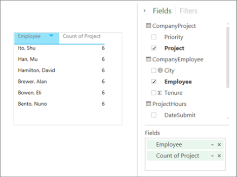

Filter specification will flow from CompanyProject to CompanyEmployee (as shown in the image below)  but, it won’t flow up to CompanyEmployee.  However, if you set the cross filtering direction to Both it will work.  The Both setting allows the filter specification to flow up to Employee.

With the cross filtering direction set to Both, our report now appears correct:

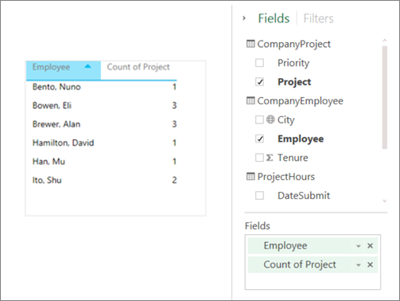
Cross filtering both directions works well for a pattern of table relationships that look like the pattern above. This is most commonly called a star schema, like this:

Cross filtering direction does not work well with a more general pattern often found in databases, like in this diagram:

If you have a table pattern like this, with loops, then cross filtering can create an ambiguous set of relationships. For instance, if you sum up a field from Table X and then choose to filter by a field on Table Y, then it’s not clear how the filter should travel, through the top table or the bottom table.  Just like with active/inactive relationships, the designer won’t allow a relationship to be set as Both if it will create ambiguity in reports. There are several different ways you can deal with this, here are the two most common:

-   Delete or mark relationships as inactive to reduce ambiguity. Then you might be able to set a relationship cross filtering as Both.

-   Bring in a table twice (with a different name the second time) to eliminate loops.  This makes the pattern of relationships like a star schema.  With a star schema all of the relationships can be set to Both.

### Wrong active relationship

When the designer automatically creates relationships, it sometimes encounters more than one relationship between two tables.  When this happens only one of the relationships is set to be active.  The active relationship serves as the default relationship so that when you choose fields from two different tables, the designer can automatically create a visualization for you.  However, in some cases the automatically selected relationship can be wrong.  You can use the Manage Relationships dialog to set a relationship as active or inactive, or you can set the active relationship in the Edit relationship dialog. 

To ensure there’s a default relationship, the designer only allows a single active relationship between two tables at a given time.  So, you must first set the current relationship as inactive and then set the relationship you want to be active.

Let’s look at an example. This first table is ProjectTickets, and the next table is EmployeeRole.

**ProjectTickets**

<table>
<colgroup>
<col width="16%" />
<col width="16%" />
<col width="16%" />
<col width="16%" />
<col width="16%" />
<col width="16%" />
</colgroup>
<tbody>
<tr class="odd">
<td align="left">
<strong>Ticket</strong>
</td>
<td align="left">
<strong>OpenedBy</strong>
</td>
<td align="left">
<strong>SubmittedBy</strong>
</td>
<td align="left">
<strong>Hours</strong>
</td>
<td align="left">
<strong>Project</strong>
</td>
<td align="left">
<strong>DateSubmit</strong>
</td>
</tr>
<tr class="even">
<td align="left">
1001
</td>
<td align="left">
Perham, Tom
</td>
<td align="left">
Brewer, Alan
</td>
<td align="left">
22
</td>
<td align="left">
Blue
</td>
<td align="left">
1/1/2013
</td>
</tr>
<tr class="odd">
<td align="left">
1002
</td>
<td align="left">
Roman, Daniel
</td>
<td align="left">
Brewer, Alan
</td>
<td align="left">
26
</td>
<td align="left">
Red
</td>
<td align="left">
2/1/2013
</td>
</tr>
<tr class="even">
<td align="left">
1003
</td>
<td align="left">
Roth, Daniel
</td>
<td align="left">
Ito, Shu
</td>
<td align="left">
34
</td>
<td align="left">
Yellow
</td>
<td align="left">
12/4/2012
</td>
</tr>
<tr class="odd">
<td align="left">
1004
</td>
<td align="left">
Perham, Tom
</td>
<td align="left">
Brewer, Alan
</td>
<td align="left">
13
</td>
<td align="left">
Orange
</td>
<td align="left">
1/2/2012
</td>
</tr>
<tr class="even">
<td align="left">
1005
</td>
<td align="left">
Roman, Daniel
</td>
<td align="left">
Bowen, Eli
</td>
<td align="left">
29
</td>
<td align="left">
Purple
</td>
<td align="left">
10/1/2013
</td>
</tr>
<tr class="odd">
<td align="left">
1006
</td>
<td align="left">
Roth, Daniel
</td>
<td align="left">
Bento, Nuno
</td>
<td align="left">
35
</td>
<td align="left">
Green
</td>
<td align="left">
2/1/2013
</td>
</tr>
<tr class="even">
<td align="left">
1007
</td>
<td align="left">
Roth, Daniel
</td>
<td align="left">
Hamilton, David
</td>
<td align="left">
10
</td>
<td align="left">
Yellow
</td>
<td align="left">
10/1/2013
</td>
</tr>
<tr class="odd">
<td align="left">
1008
</td>
<td align="left">
Perham, Tom
</td>
<td align="left">
Han, Mu
</td>
<td align="left">
28
</td>
<td align="left">
Orange
</td>
<td align="left">
1/2/2012
</td>
</tr>
<tr class="even">
<td align="left">
1009
</td>
<td align="left">
Roman, Daniel
</td>
<td align="left">
Ito, Shu
</td>
<td align="left">
22
</td>
<td align="left">
Purple
</td>
<td align="left">
2/1/2013
</td>
</tr>
<tr class="odd">
<td align="left">
1010
</td>
<td align="left">
Roth, Daniel
</td>
<td align="left">
Bowen, Eli
</td>
<td align="left">
28
</td>
<td align="left">
Green
</td>
<td align="left">
10/1/2013
</td>
</tr>
<tr class="even">
<td align="left">
1011
</td>
<td align="left">
Perham, Tom
</td>
<td align="left">
Bowen, Eli
</td>
<td align="left">
9
</td>
<td align="left">
Blue
</td>
<td align="left">
10/15/2013
</td>
</tr>
</tbody>
</table>

**EmployeeRole**

<table>
<colgroup>
<col width="50%" />
<col width="50%" />
</colgroup>
<tbody>
<tr class="odd">
<td align="left">
<strong>Employee</strong>
</td>
<td align="left">
<strong>Role</strong>
</td>
</tr>
<tr class="even">
<td align="left">
Bento, Nuno
</td>
<td align="left">
Project Manager
</td>
</tr>
<tr class="odd">
<td align="left">
Bowen, Eli
</td>
<td align="left">
Project Lead
</td>
</tr>
<tr class="even">
<td align="left">
Brewer, Alan
</td>
<td align="left">
Project Manager
</td>
</tr>
<tr class="odd">
<td align="left">
Hamilton, David
</td>
<td align="left">
Project Lead
</td>
</tr>
<tr class="even">
<td align="left">
Han, Mu
</td>
<td align="left">
Project Lead
</td>
</tr>
<tr class="odd">
<td align="left">
Ito, Shu
</td>
<td align="left">
Project Lead
</td>
</tr>
<tr class="even">
<td align="left">
Perham, Tom
</td>
<td align="left">
Project Sponsor
</td>
</tr>
<tr class="odd">
<td align="left">
Roman, Daniel
</td>
<td align="left">
Project Sponsor
</td>
</tr>
<tr class="even">
<td align="left">
Roth, Daniel
</td>
<td align="left">
Project Sponsor
</td>
</tr>
</tbody>
</table>

There are actually two relationships here. One is between SubmittedBy in the ProjectTickets table and Employee in the EmployeeRole table, and the other is between OpenedBy in the ProjectTickets table and Employee in the EmployeeRole table. 

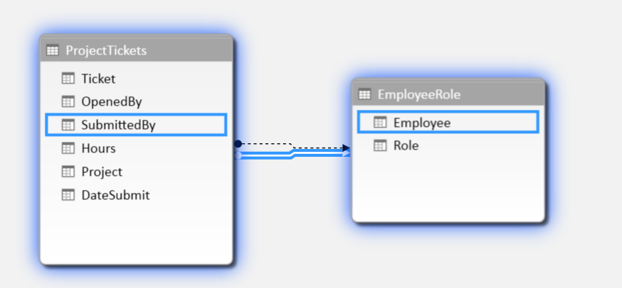

If we add both relationships to the model (OpenedBy first), then the Manage Relationships dialog will show that **OpenedBy** is active:

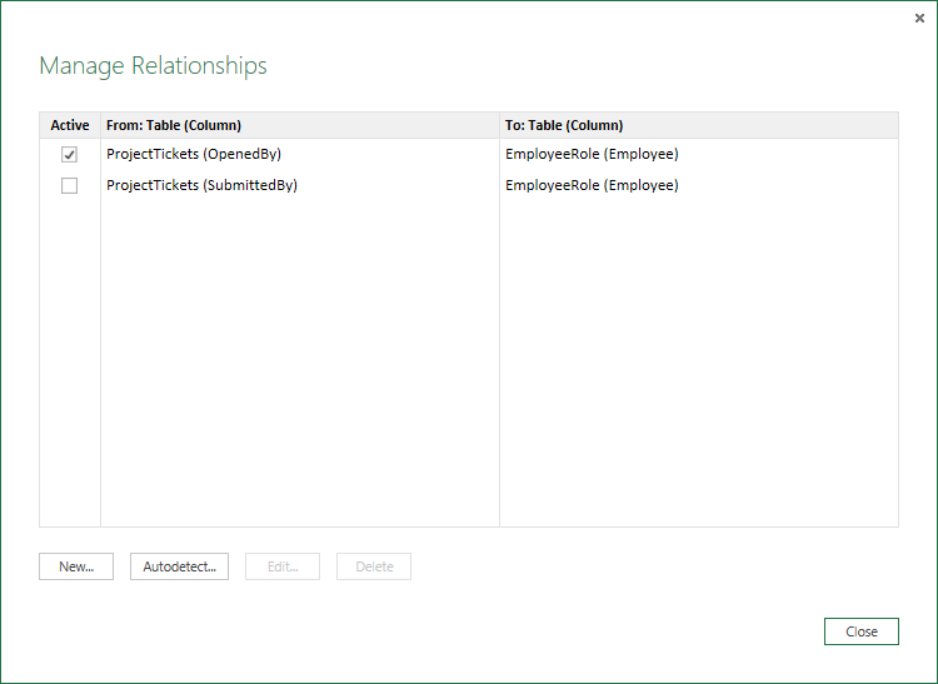

Now, if we create a report that uses **Role** and **Employee** fields from **EmployeeRole**, and the **Hours** field from **ProjectTickets** in a table visualization in the Report canvas, we’ll see only project sponsors because they’re the only ones that opened a project ticket.

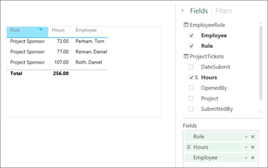

We can change the active relationship and get SubmittedBy instead of OpenedBy. In Manage Relationships, we uncheck the **ProjectTickets(OpenedBy)** to **EmployeeRole(Employee)** relationship, and then we check the **Project Tickets(SubmittedBy)** to **EmployeeRole(Employee)** relationship.

