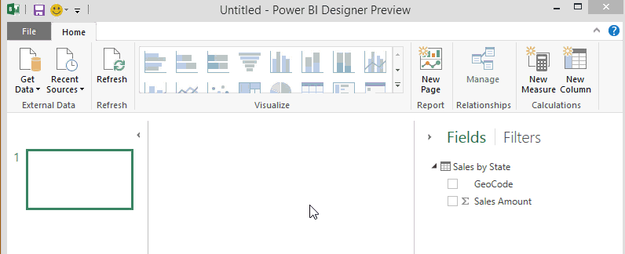

<properties pageTitle="Data categorization in Power BI Designer" description="Data categorization in Power BI Designer" services="powerbi" documentationCenter="" authors="v-anpasi" manager="mblythe" editor=""/>
<tags ms.service="powerbi" ms.devlang="NA" ms.topic="article" ms.tgt_pltfrm="NA" ms.workload="powerbi" ms.date="06/19/2015" ms.author="v-anpasi"/>
#Data categorization in Power BI Designer

[← Power BI Designer](https://support.powerbi.com/knowledgebase/topics/68530-power-bi-designer)

In Power BI Designer, you can specify the Data Category for a column so the designer knows how it should treat its values when in a visualization.

When the designer imports data, not only does it get the data itself, it also gets information such as the table and column names, whether it’s a primary key, etc.  With that information, the designer makes some assumptions about how to give you a good default experience when creating a visual.  

Here’s an example: When the designer knows a column has numeric values, you’ll probably want to aggregate it in some way, so it’s placed in the Values area. Or, for a column with date time values, it assumes you’ll probably use it as a time hierarchy axis on a line chart.

But, there are some cases that are a bit more challenging, like geography. Consider this table from an Excel worksheet:

Should the designer treat the codes in the GeoCode column as an abbreviation for a Country or a US State? It’s not clear because a code like this can mean either one.  For instance, AL can mean Alabama or Albania, AR can mean Arkansas or Argentina, or CA can mean California or Canada. It makes a difference when we go to chart our GeoCode field on a map.  Should the designer show a picture of the world with countries highlighted or a picture of the United States with states highlighted?  You can specify a Data Category for data just like this.Data categorization further refines the information the designer can use to provide the best visualizations.

**To specify a Data Category**

1.  In Report View, in the **Fields** list, select the field you want to be sorted by a different categorization.

2.  On the ribbon, in the **Data Tools Modeling** tab, click on the **Data Category:** drop down list. This shows the list of possible data categories you can choose for your column.  Some selections might be disabled if they won’t work with the current data type of your column.  For example, if a column is a binary data type, the designer won’t let you choose geographic data categories.  

 

And, that’s it!  Any automatic behavior that normally accrues to a visual will now work automatically.

