<properties pageTitle="Getting Started with Power BI Designer" description="Getting Started with Power BI Designer" services="powerbi" documentationCenter="" authors="v-anpasi" manager="mblythe" editor=""/>
<tags ms.service="powerbi" ms.devlang="NA" ms.topic="article" ms.tgt_pltfrm="NA" ms.workload="powerbi" ms.date="06/16/2015" ms.author="v-anpasi"/>
# Getting Started with Power BI Designer
[← Power BI Designer](https://support.powerbi.com/knowledgebase/topics/68530-power-bi-designer)

Welcome to the **Power BI Designer Getting Started Guide**. This short tour of the Power BI Designer gets you acquainted with how it works, demonstrates what it can do, and accelerates your ability to build robust data models — along with amazing reports — that amplify your business intelligence efforts. 

Prefer to watch instead of read? Feel free to [take a look at our getting started video](http://go.microsoft.com/fwlink/?LinkID=522675&clcid=0x409). And if you want to follow along with the video with matching sample data, you can [download this sample Excel workbook.](http://go.microsoft.com/fwlink/?LinkID=521962)

The Power BI Designer lets you create a collection of queries, data connections, and reports that can easily be shared with others. The Power BI Designer integrates proven Microsoft technologies – the powerful Query engine, data modeling, and visualizations – and works seamlessly with the online [**Power BI Service**](https://preview.powerbi.com/).

With the combination of the **Power BI Designer** (where analysts and others can create powerful data connections, models and reports) and the [**Power BI Service**](https://preview.powerbi.com/) (where Power BI Designer reports can be shared so users can view and interact with them), new insights from the world of data are easier to model, build, share, and extend.

Data analysts will find the Power BI Designer a powerful, flexible, and a highly accessible tool to connect with and shape the world of data, build robust models, and craft well-structured reports.

## How to Use This Guide

You can use this guide in a couple of ways – scan it for a quick overview, or read through each section for a strong understanding of how the Power BI Designer works.

If you’re in a hurry you can do a visual sweep of this guide in just a couple minutes, and come away with a good sense of how the Power BI Designer operates, and how to use it. Most of this guide consists of screens that visually show how the Power BI Designer works.

For a more thorough understanding you can read through each section, perform the steps, and walk away with your own Power BI Designer file that’s ready to post onto the **Power BI Service**, and share with others.

## How the Power BI Designer Works

With the Power BI Designer, you *connect to data* (usually multiple data sources), *shape that data* (with queries that build insightful, compelling data models), and use that model to *create reports* (which others can leverage, build upon, and share).

When the steps are completed to your satisfaction – connect, shape, and report – you can save that work in the Power BI Designer file format, which is the .pbix extension. Power BI Designer files can be shared like any other file, but the most compelling way to share Power BI Designer files is to upload them (share them) on the [**Power BI Service**](https://preview.powerbi.com/). 

The Power BI Designer centralizes, simplifies, and streamlines what can otherwise be a scattered, disconnected, and arduous process of designing and creating business intelligence repositories and reports.

Ready to give it a try? Let’s get started.

## Install and Run the Power BI Designer

You can download the Power BI Designer from the Power BI Service, by selecting the **gear** icon, then select **Power BI Designer Preview**.

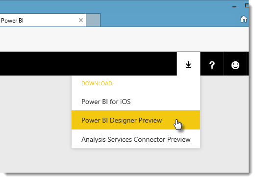

The Power BI Designer is installed as an application, and runs on your desktop.
 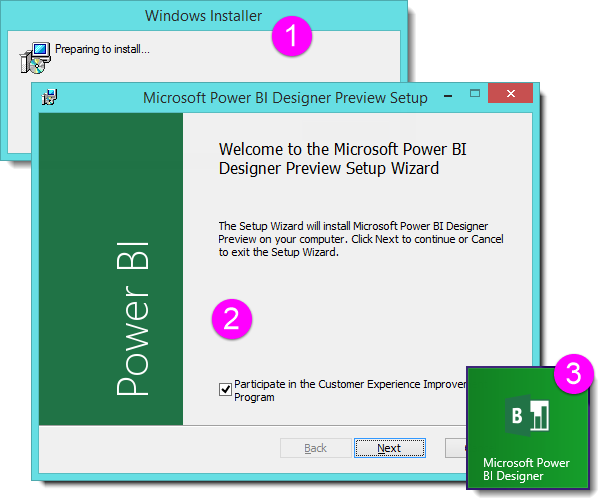

When you run the Power BI Designer, a *Getting Started* screen is displayed.

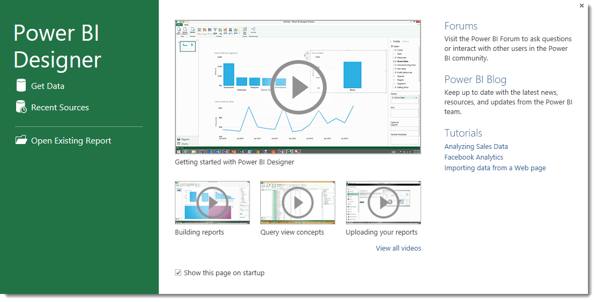

You can **Get Data**, see **Recent Sources**, or **Open** (an) **Existing Report** directly from the *Getting Started* screen (from the links in the left pane). If you close the screen (select the **x** in the top right corner), the **Report** view of Power BI Designer is displayed.

 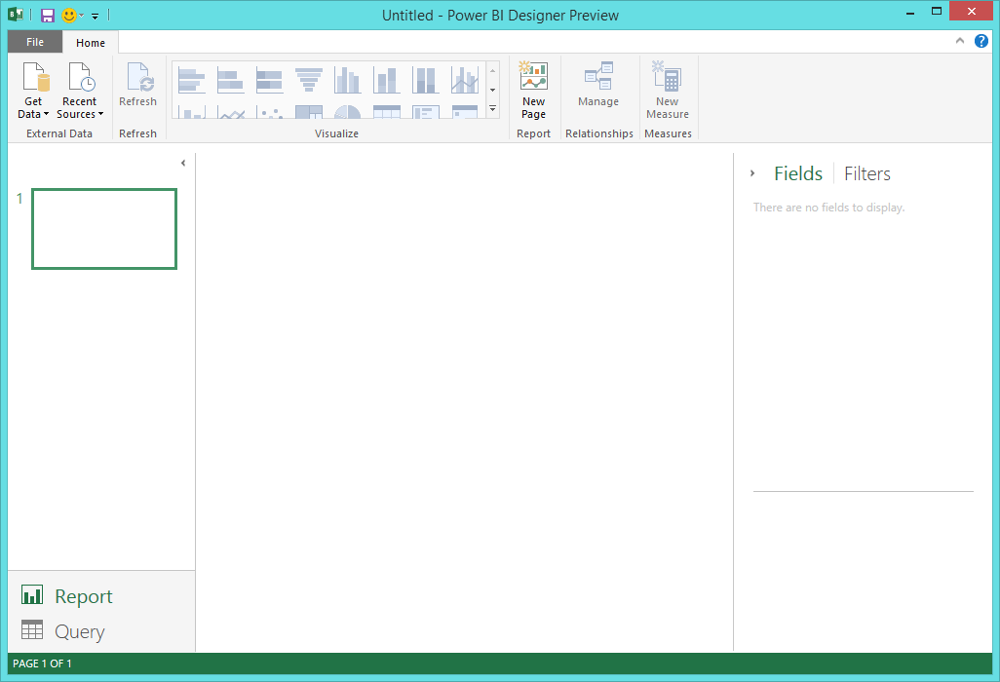

There are two primary views in the Power BI Designer: the **Report** view, and the **Query** view. You can switch between **Report** and **Query** by selecting either from the lower left corner. The currently displayed view is highlighted.

 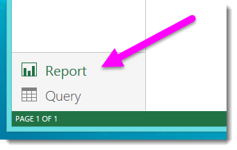

With the Power BI Designer installed you’re ready to connect to data, shape data, and build reports (usually in that order). In the next few sections, we take a tour through each in turn.

## Connect to Data

With the Power BI Designer installed, you’re ready to connect to the ever expanding world of data. From the bottom left corner of the Power BI Designer select **Query**.

 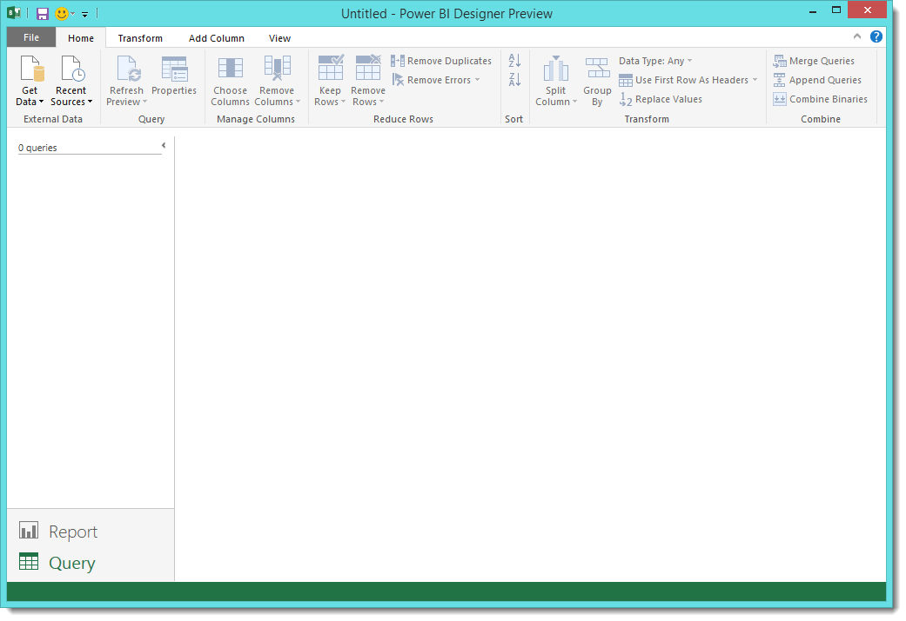

There are *all sorts* of data sources available in the Query window. The following image shows how to connect to data, by selecting the **File** ribbon, then **Get Data \> More**.

 

For this quick tour, we'll connect to a couple different **Web** data sources.

Imagine you’re retiring – you want to live where there’s lots of sunshine, preferable taxes, and good health care – or perhaps you’re a data analyst, and you want that information to help your customers. For example, perhaps you want to help your sunglasses retailer target sales where the sun shines most frequently.

Either way, the following Web resource has interesting data about those topics, and more:

[*http://www.bankrate.com/finance/retirement/best-places-retire-how-state-ranks.aspx*](http://www.bankrate.com/finance/retirement/best-places-retire-how-state-ranks.aspx)

Select **Get Data \> Web** and paste the address.

 

When you select **OK**, the **Query** functionality of the Power BI Designer goes to work. Query contacts the Web resource, and the **Navigator** window returns what it found on that Web page. In this case, it found a table (*Table 0*) and the overall Web Document. We’re interested in the table, so we select it from the list. The **Navigator** window displays a preview.

 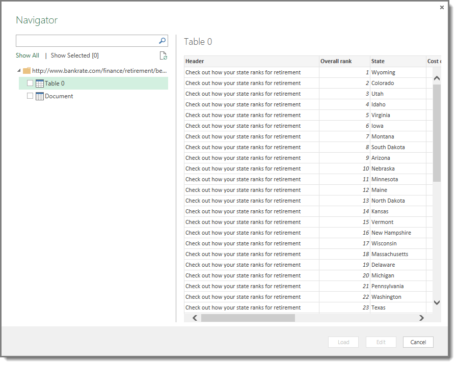

At this point we can edit the query before loading the table, by selecting **Edit** from the bottom of the window, or we can load the table.

If we select **Edit**, a representative view of the table is presented in the Query view. The **Query Settings** pane is displayed (if it’s not, you can select **View** from the ribbon, then **Show \> Query Settings** to display the **Query Settings** pane). Here’s what that looks like.

 

For more information about connecting to data, see [Connect to Data in Power BI Designer](https://powerbi.uservoice.com/knowledgebase/articles/471635).

In the next section, we adjust the data so it meets our needs. The process of adjusting connected data is called *shaping* data.

## Shape and Combine Data

Now that we’ve connected to a data source, we need to adjust the data to meet our needs. Sometimes adjusting means *transforming* the data – such as renaming columns or tables, changing text to numbers, removing rows, setting the first row as headers, and so on.

The Query view in Power BI Designer makes ample use of right-click menus, in addition to having tasks available on the ribbon. Most of what you can select in the **Transform** ribbon is also available by right-clicking an item (such as a column) and choosing from the menu that appears.

### Shape Data

When you shape data in the **Query** view, you’re providing step-by-step instructions (that Query carries out for you) to adjust the data as Query loads and presents it. The original data source is not affected; only this particular view of the data is adjusted, or *shaped*.

The steps you specify (such as rename a table, transform a data type, or delete columns) are recorded by Query, and each time this query connects to the data source those steps are carried out so that the data is always shaped the way you specify. This process occurs whenever you use the query in the Power BI Designer, or for anyone who uses your shared query, such as on the Power BI Service. Those steps are captured, sequentially, in the **Query Settings** pane under **Applied Steps**.

The following image shows the **Query Settings** pane for a query that has been shaped – we’ll go through each of those steps in the next few paragraphs.

 

Let’s get back to our retirement data, which we found by connecting to a Web data source, and shape that data to fit our needs.

For starters, most ratings were brought into Query as whole numbers, but not all of them (one column contained text and numbers, so it wasn't automatically converted). We need the data to be numbers. No problem – just right-click the column header, and select **Change Type \> Whole Number** to change the data type. If we needed to choose more than one column, we could first select a column then hold down **SHIFT**, select additional adjacent columns, and then right-click a column header to change all selected columns. You can also use **CTRL** to select non-adjacent columns.

 

You can also change, or *transform,* those columns from text to header by using the **Transform** ribbon. Here’s the **Transform** ribbon, with an arrow pointing toward the **Data Type** button, which lets you transform the current data type to another.

 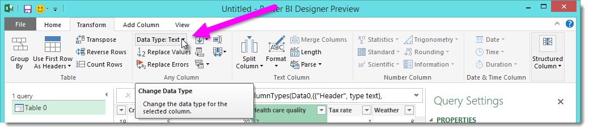

Note that in **Query Settings**, the **Applied Steps** reflect the changes that were made. If I want to remove any step from the shaping process, I simply select that step, and then select the **X** to the left of the step.

 

We need to make a few more changes to get the query where we want it:

-   *Remove the first column* – we don’t need it, it just includes redundant rows that say “Check out how your state ranks for retirement” which is an artifact of this being a Web based table

-   *Fix a few Errors* – on the Web page, one column had text mixed in with the numbers (some states tied in one category). That works well in the website, but not for our data analysis. It's easy (in this case) to fix, and shows some cool features and capabilities of Query and its Applied Steps

-   *Change the Table Name* – that **Table 0** is not a useful descriptor, but changing it simple

Each of these steps is demonstrated in **[Shape and Combine Data in Power BI Designer](http://support.powerbi.com/knowledgebase/articles/471644)**. Feel free to check out that page, or keep going in this document to see what you would do next. The next section picks up after the changes above are applied.

### Combine Data

That data about various states is interesting, and will be useful for building additional analysis efforts and queries. But there’s one problem: most data out there uses a two-letter abbreviation for state codes, not the full name of the state. We need some way to associate state names with their abbreviations.

We’re in luck: there’s another public data source that does just that, but it needs a fair amount of shaping before we can connect it to our retirement table. Here’s the Web resource for state abbreviations:

<http://en.wikipedia.org/wiki/List_of_U.S._state_abbreviations>

From the **Home** ribbon in **Query** view, we select **Get Data \> Web** and type the address, select **OK**, and the **Navigator** window shows what it found on that Web page.

 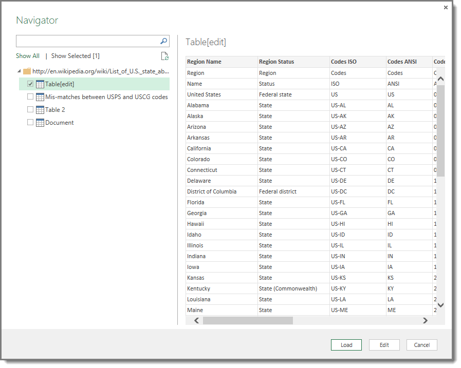

We select **Table[edit]** because it includes the data we want, but it’s going to take quite a bit of shaping to pare that table’s data down. Each of these steps is also demonstrated in **[Shape and Combine Data in Power BI Designer](http://support.powerbi.com/knowledgebase/articles/471644)**. To summarize those steps, here's what we do:

We select **Edit**, then:

-   *Remove the top two rows* – they’re a result of the way that Web page’s table was created, and we don’t need them.

-   *Remove the bottom 26 rows* – they’re all the territories, which we don’t need to include.

-   *Remove a few unneeded columns* – we only need the mapping of state to its official two-letter abbreviation, so we can remove the other columns.

-   *Use the first row as headers* – since we removed the top three rows, the current top row is the header we want.

  >**Note:** This is a good time to point out that the *sequence* of applied steps in Query is important, and can affect how the data is shaped. It’s also important to consider how one step may impact another subsequent step; if you remove a step from the **Applied Steps**, subsequent steps may not behave as originally intended, because of the impact of the query’s sequence of steps.

-   *Rename the columns, and the table itself* – as usual, there are a couple ways to rename a column, you can choose whichever you prefer.

 
With the *StateCodes* table shaped, we can combine these two tables, or queries, into one; since the tables we now have are a result of the queries we applied to the data, they’re often referred to as *queries*.
There are two primary ways of combining queries – *merging* and *appending*.

When you have one or more columns that you’d like to add to another query, you **merge** the queries. When you have additional rows of data that you’d like to add to an existing query, you **append** the query.

In this case we want to merge queries. To get started, we select the query *into which* we want the other query to merge, then select **Merge Queries** from the **Home** tab on the ribbon.

 

The **Merge** window appears, prompting us to select which table we’d like merged into the selected table, and then, the matching columns to use for the merge. Select *State* from the *RetirementStats* table (query), then select the *StateCodes* query (easy in this case, since there’s only one other query – when you connect to many data sources, there are many queries to choose from). When we select the correct matching columns – *State* from *RetirementStats*, and *State Name* from *StateCodes* – the **Merge** window looks like the following, and the **OK** button is enabled.

 

A **NewColumn** is created at the end of the query, which is the contents of the table (query) that was merged with the existing query. All columns from the merged query are condensed into the **NewColumn**, but you can select to **Expand** the table, and include whichever columns you want.

 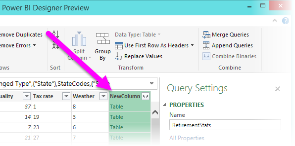

To expand the merged table, and select which columns to include, select the expand icon (). The **Expand** window appears.

 

In this case, we only want the *State Code* column, so we select only that column and then select **OK**. We clear the checkbox from **Use original column name as prefix** because we don’t need or want that; if we leave that selected, the merged column would be named *NewColumn.State Code* (the original column name, or *NewColumn*, then a dot, then the name of the column being brought into the query).

**Note:** Want to play around with how to bring in that *NewColumn* table? You can experiment a bit, and if you don’t like the results, just delete that step from the **Applied Steps** list in the **Query Settings** pane; your query returns to the state prior to applying that **Expand** step. It’s like a free do-over, which you can do as many times as you like until the expand process looks the way you want it.

We now have a single query (table) that combined two data sources, each of which has been shaped to meet our needs. This query can serve as a basis for lots of additional, interesting data connections – such as housing cost statistics, demographics, or job opportunities in any state.

For a more complete description of each of these shape and combine data steps, see [Shape and Combine Data in Power BI Designer](http://support.powerbi.com/knowledgebase/articles/471644).

For now, we have enough data to create a few interesting reports, all within the Power BI Designer. Since this is a milestone let’s save this Power BI Designer file – we’ll call it **Get Started**.

## Build Reports

Additional changes can still be made after the table is loaded, but for now this will do. When we select **Report**, the Power BI Designer switches to **Report** view, and the data (as modified by the query steps) is loaded into the model. Once the table is loaded, the Power BI Designer is ready to build reports.

The **Report** view has four main areas:

1.  The ribbon, which displays common tasks associated with reports and visualizations
2.  The **Pages** pane, which shows thumbnails of each report page
3.  The **Report** view, where visualizations are created and arranged
4.  The **Fields** **and** **Filters** pane, where query elements and filters can be dragged onto the **Report** view, or dragged to the **Filters** and applied to the entire page or a specific visualization

 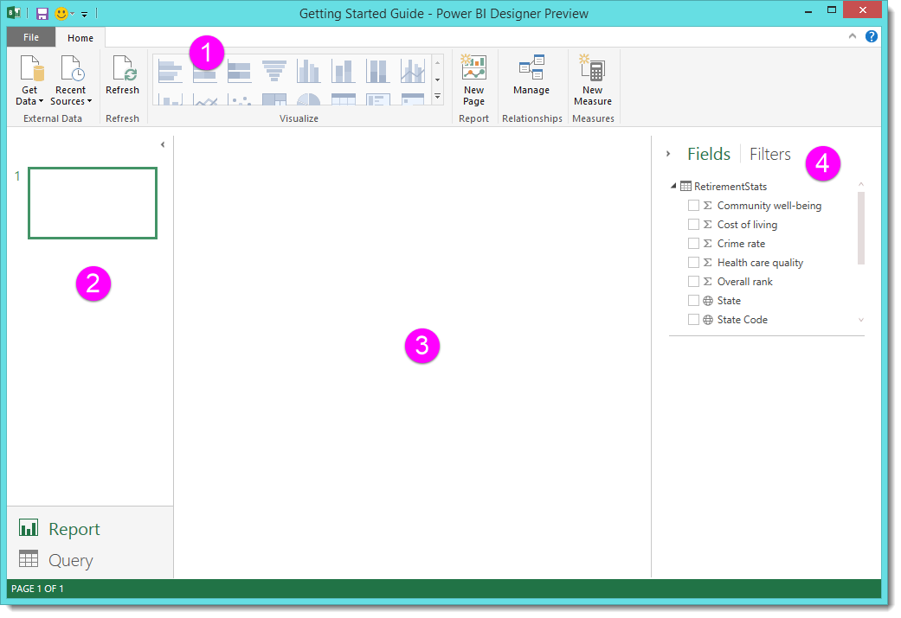

The **Pages** pane and the **Fields and Filters** pane can be collapsed by selecting the small arrow along the edge, providing more space in the Report view to build cool visualizations.

 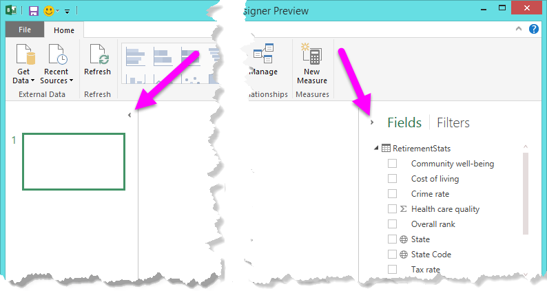

To create a visualization, just drag a field from the **Fields** list onto the **Report** view. In this case, let’s drag the *State* field from *RetirementStats*, and see what happens.

 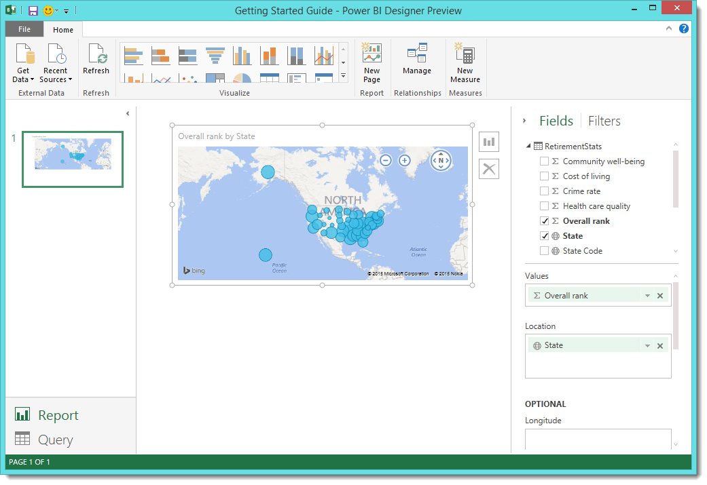

Look at that... the Power BI Designer automatically created a map-based visualization, because it recognized that the *State* field contained geolocation data. It also selected the *Overall rank* field to apply to the visualization.

Notice that in the ribbon, the **Visualize** section of the **Home** tab is now enabled, letting us easily switch the visualization to something else. You can also change the visualization by selecting the bar chart icon that appears in the upper-right corner of a selected visualization. When selected, a menu of visualization types appears, letting us select the type we want. In the following image, we're hovering over the *Filled Map* visualization; we'll use that in subsequent images.

 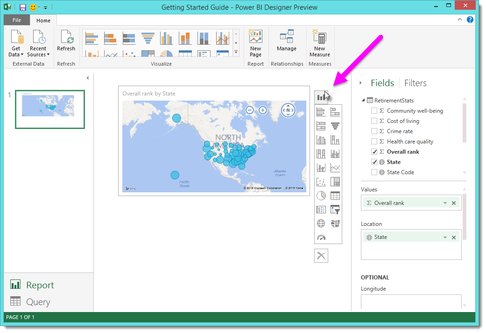

Let’s fast-forward a bit, and see what the **Report** view looks like after a handful of visualizations have been added, as well as a few new Report pages.For more information about reports, see **[Report View in the Power BI Designer](http://support.powerbi.com/knowledgebase/articles/461283)**.

The first Report page provides a perspective of the data based on *Overall rank*. When we select one of the visualizations, the **Fields and Filters** pane shows which fields are selected, and the structure of the visualization (which fields are applied to the **Shared Axis**, **Column Values**, and **Line Values**).

 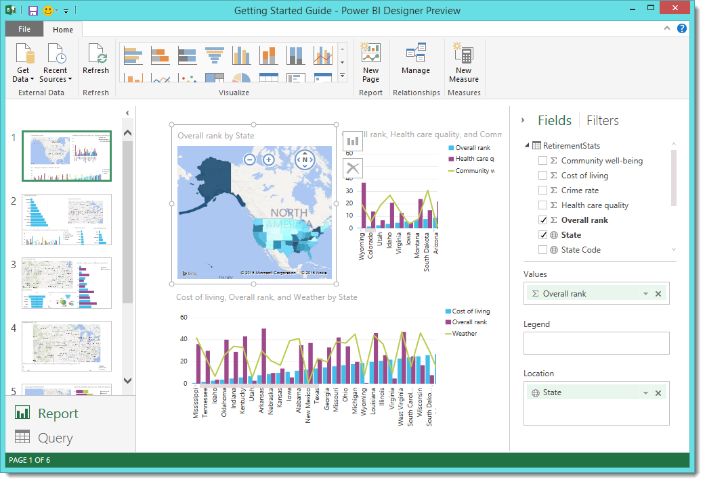

There are six **Pages** in this Report, each visualizing certain elements of our data.

1.  The first page, shown above, shows all states based on *Overall rank*.
2.  The second page focuses on the top ten states based on *Overall rank*.
3.   For the third page, the best 10 states for cost of living (and associated data) are visualized.
4.   Weather is the focus of the fourth page, filtered to the 15 sunniest states.
5.   On the fifth page, Community well-being is charted and visualized for the top 15 states.
6.   Lastly, crime statistics are visualized, showing the best (and well, the last) ten states.

Here’s what the cost of living-focused Report page looks like.

 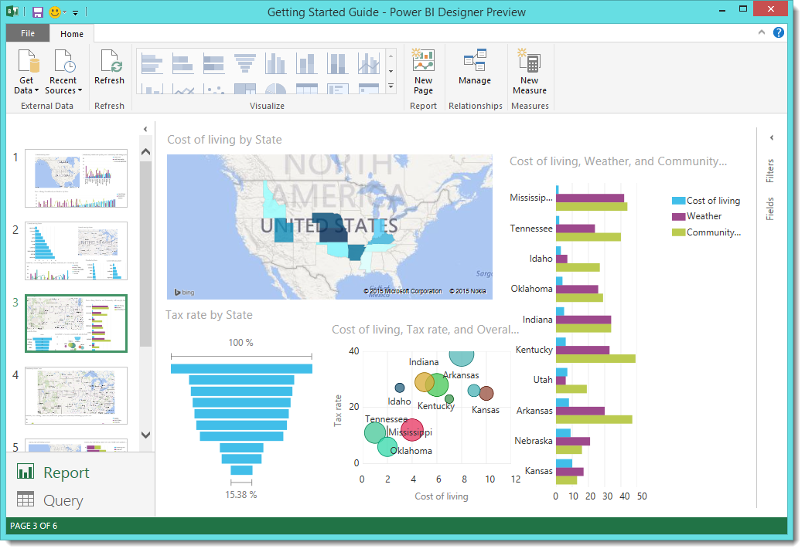

There are all sorts of interesting reports and visualizations you can create.

## Share Your Work

Now that we have a Power BI Designer report that’s reasonably complete, we can share it with others on the **Power BI Service**. The following link brings up the **Power BI Service** in a browser:

[*https://preview.powerbi.com*](https://preview.powerbi.com/)

Select **Get Data** to start the process of loading your Power BI Designer report.

 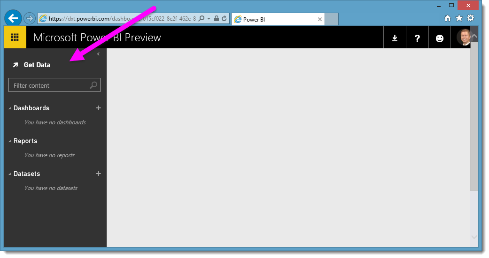

The **Get** **data** page appears, from which you can select **Power BI Designer File** from list along the left, then select **Connect**.

 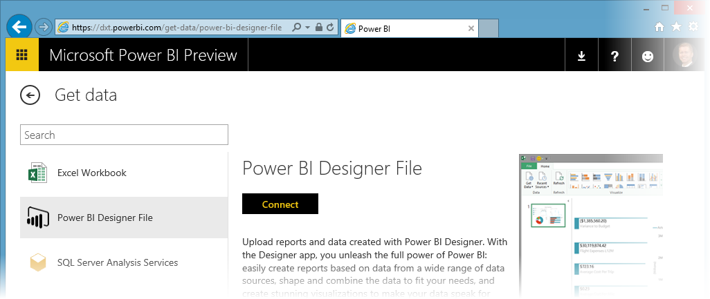

A page appears that lets you navigate to the Power BI Designer file, and load the file to the Power BI Service. Once the service loads the file, select the tile that represents your .pbix file.

The **Power BI Service** displays the first page of the report. Along the bottom of the page, you can select the region between navigation arrows to see small tiles representing the pages in your report. Select any tile to display that page of the report.

 

To save your Power BI Designer report to the **Power BI Service**, select **File \> Save As** from the service. Select the **Power BI** icon (upper left corner) to return to the main page. There are all sorts of interesting visuals you can create in the Power BI Service from your report, which you can pin to a *dashboard*. To learn about dashboards in the **Power BI Service[, see Tips for designing a great dashboard](http://support.powerbi.com/knowledgebase/articles/433616)**.

 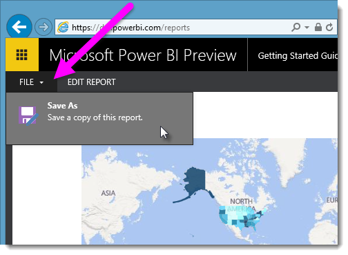

Once saved, select the **Share** icon on the main page of the Power BI Service.

 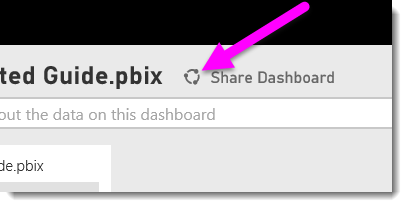

From here, you can send an email to colleagues with whom you’d like to share the dashboard.

 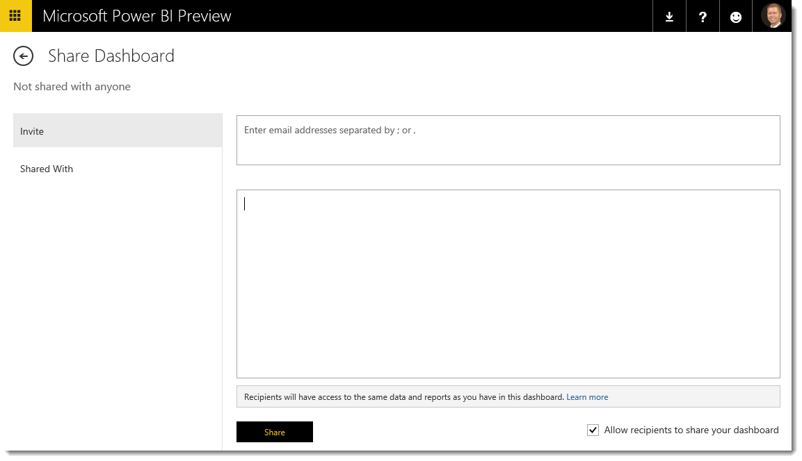

For more information about creating, sharing, and modifying dashboards, see **[Share a dashboard](http://support.powerbi.com/knowledgebase/articles/431008)**.

There are all sorts of compelling data-related mash-ups and visualizations you can do with the Power BI Designer, and with the Power BI Service. Check out the next section for more information.

## More Information

There are all sorts of things you can do with the Power BI Designer. For more information on its capabilities, check out the following resources:

-   [Query Overview with Power BI Designer](https://powerbi.uservoice.com/knowledgebase/articles/471646)
-   [Data Sources in Power BI Designer](https://powerbi.uservoice.com/knowledgebase/articles/471643)
-   [Connect to Data in Power BI Designer](https://powerbi.uservoice.com/knowledgebase/articles/471635)
-   [Shape and Combine Data with Power BI Designer](https://powerbi.uservoice.com/knowledgebase/articles/471644)
-   [Common Query Tasks in the Power BI Designer](https://powerbi.uservoice.com/knowledgebase/articles/471648)   

Want to give us feedback? Great – use the **Send Feedback** menu item in the Power BI Designer. We look forward to hearing from you!

