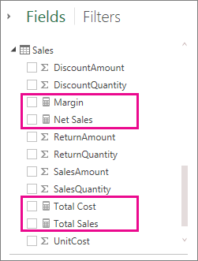
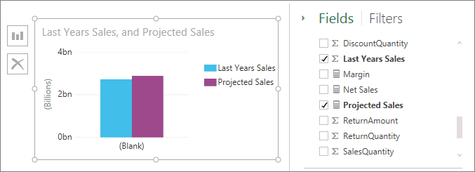

<properties pageTitle="Measures in Power BI Designer" description="Measures in Power BI Designer" services="powerbi" documentationCenter="" authors="v-anpasi" manager="mblythe" editor=""/>
<tags ms.service="powerbi" ms.devlang="NA" ms.topic="article" ms.tgt_pltfrm="NA" ms.workload="powerbi" ms.date="06/16/2015" ms.author="v-anpasi"/>
#Measures in Power BI Designer

[← Power BI Designer](https://support.powerbi.com/knowledgebase/topics/68530-power-bi-designer)

Power BI Designer helps you create insights into your data with just a few clicks. But sometimes that data just doesn’t include everything you need to answer some of your most important questions. Measures can help you get there.

Measures are used in some of the most common data analysis; for example, sums, averages, minimum or maximum values, counts, or more advanced calculations you create yourself using a DAX formula. The calculated results of measures are always changing in response to your interaction with your reports, allowing for fast and dynamic ad-hoc data exploration. Let’s take a closer look.

**Note:** Just like Power BI Designer is Preview edition, so is this article. Information provided here will change often as new features in the designer become available.

##Understanding measures

In Power BI Designer, measures are created and used in Report View. Measures you create yourself appear in the field list with a calculator icon. You can name measures whatever you want, and add them to a new or existing visualization just like any other field.

##Data Analysis Expressions

Measures calculate a result from an expression formula. When you create your own measures, you’ll use the Data Analysis Expressions (DAX) formula language. DAX includes a library of over 200 functions, operators, and constructs, providing immense flexibility in creating measures to calculate results for just about any data analysis need.

DAX formulas are a lot like Excel formulas. DAX even has many of the same functions like DATE, SUM, and LEFT. But, DAX’s functions are meant to work with relational data like we have in Power BI Designer.

##Let’s look at an example

Jan is a sales manager at Contoso. She’s been asked to provide reseller sales projections over the next fiscal year. She decides to base her estimates on last year’s sales amounts, with a six percent annual increase resulting from various promotions that are scheduled over the next six months.

To report the estimates, she imports last year’s sales data by using Query in Power BI Designer. She finds the SalesAmount field in the Reseller Sales table. Because the data she imported only contains sales amounts for last year, she renames the SalesAmount field to Last Years Sales. She then drag Last Years Sales onto the report canvas. It appears in a chart visualization as single value that is the sum of all reseller sales from last year.

She notices that even though she did not specify a calculation herself, one has been provided automatically. The designer created its own measure by summing up all of the values in Last Years Sales.

But, Jan needs a measure to calculate sales projections for the coming year, which will be based on last year’s sales multiplied by 1.06 to account for the expected 6 percent increase in business. For this calculation, she’ll create her own measure. Using the New Measure feature, she creates a new measure, then enters the following DAX formula:

> **Projected Sales = SUM('Sales'[Last Years Sales])\*1.06**

Jan then drags her new Projected Sales measure into the chart.

Very quickly and with minimal effort, Jan now has a measure to calculate projected sales. She can  further analyze her projections by filtering on specific resellers or by adding other fields to her report.

##Learn more

We’ve only provided you with a quick introduction to measures here, but there’s a lot more to help you learn how to create your own. Be sure to see the [Tutorial: Create your own measures in Power BI Designer](http://support.powerbi.com/knowledgebase/articles/556656-tutorial-create-your-own-measures-in-power-bi-des), where you can download a sample file and get step-by-step lessons on how to create more measures.  

To dive a little deeper into DAX, be sure to check out [QuickStart: Learn DAX basics in Power BI Designer](http://support.powerbi.com/knowledgebase/articles/554619-quickstart-learn-dax-basics-in-power-bi-designer). The [Data Analysis Expressions Reference](https://support.office.com/en-us/article/Data-Analysis-Expressions-DAX-Reference-411C6891-614D-438C-BF45-C7E061DD9E08) provides detailed articles on each of the functions, syntax, operators, and naming conventions. DAX has been around for several years in Power Pivot in Excel and SQL Server Analysis Services, so there are a lot of other great resources available, too. Be sure to check out the [DAX Resource Center Wiki](http://social.technet.microsoft.com/wiki/contents/articles/1088.dax-resource-center.aspx), where influential members of the BI community share their knowledge of DAX.
