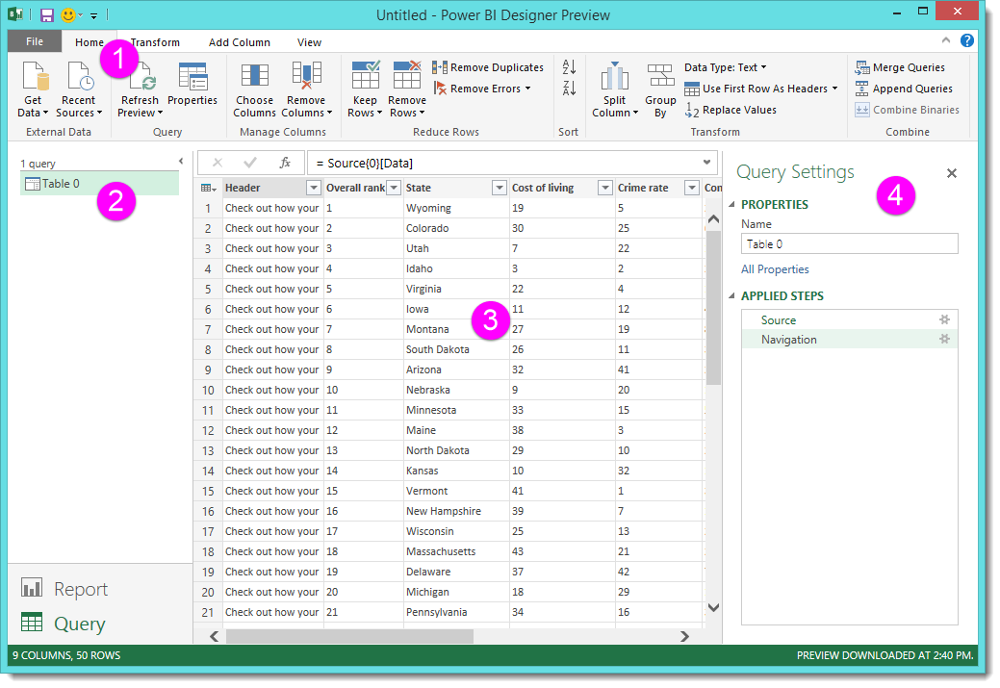
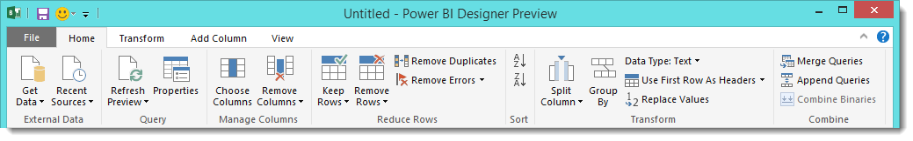
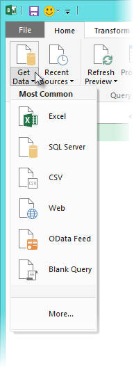
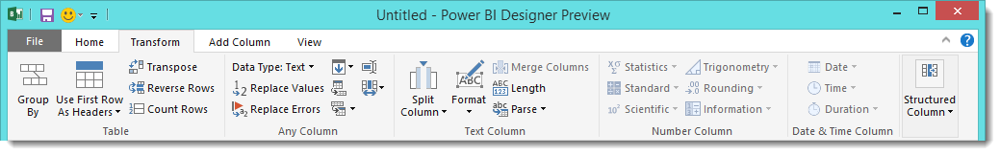
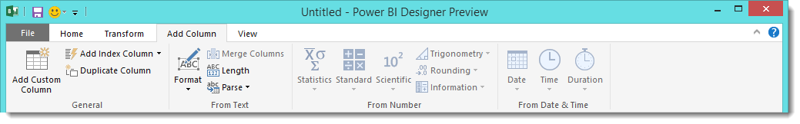
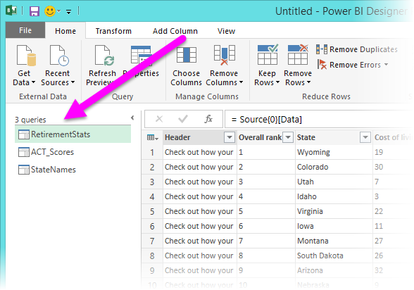
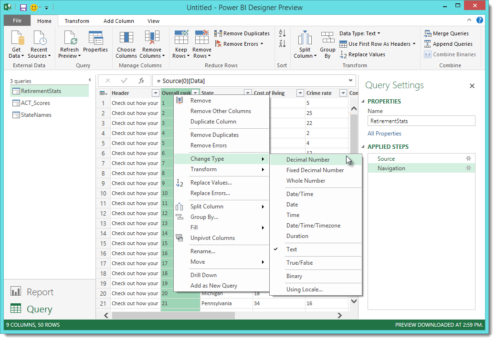
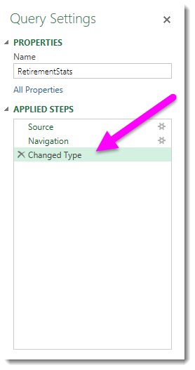
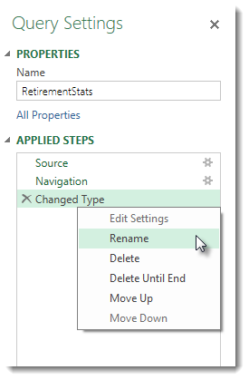
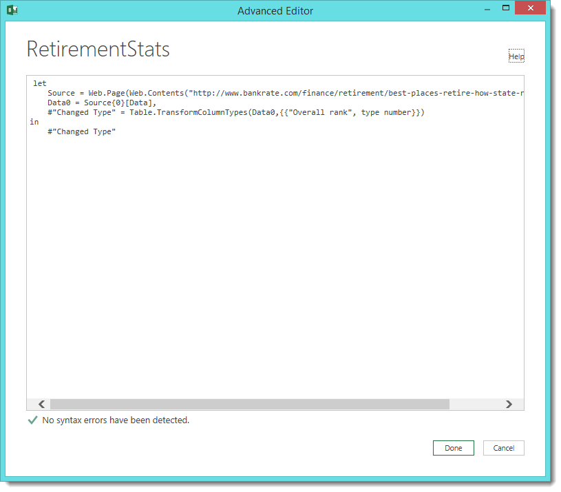

<properties pageTitle="Query Overview in Power BI Designer" description="Query Overview in Power BI Designer" services="powerbi" documentationCenter="" authors="v-anpasi" manager="mblythe" editor=""/> 
<tags ms.service="powerbi" ms.devlang="NA" ms.topic="article" ms.tgt_pltfrm="NA" ms.workload="powerbi" ms.date="06/16/2015" ms.author="v-anpasi"/>
# Query Overview in Power BI Designer

[← Power BI Designer](https://support.powerbi.com/knowledgebase/topics/68530-power-bi-designer)

Welcome to the Power BI Designer. With the Power BI Designer you can connect to the world of data, create compelling and foundational reports, and share your efforts with others – who can then build on your work, and expand their business intelligence efforts.

The Power BI Designer has two views:

-   **Query** view – where you connect to data, shape data, and combine multiple data connections into a data model that meets your needs

-   **Report** view – where you use the queries you created to build compelling visualizations of that data as reports that you can share with others

This document provides an overview of the Query view. At the end of this document, you’ll find links that provide detailed information and guidance about supported data types, connecting to data, shaping data, creating relationships, and how to get started.

But first, let’s see get acquainted with the Power BI Designer Query view.

## The Query View

To get to the Query view, select **Query** from the lower left corner of the Power BI Designer.

With no data connections, the Query view appears as a blank pane, ready for data.

Once a query is loaded, the Query view becomes more interesting. If we connect to the following Web data source, the Query view loads information about the data, which you can then begin to shape.

[*http://www.bankrate.com/finance/retirement/best-places-retire-how-state-ranks.aspx*](http://www.bankrate.com/finance/retirement/best-places-retire-how-state-ranks.aspx)

Here’s how the **Query** window appears once a data connection is established, and data is loaded into the Power BI Designer. The following features are now active:

1.  In the ribbon, many buttons are now active to interact with the data in the query

2.  In the left pane, queries are listed and available for selection, viewing, and shaping

3.  In the center pane, data from the selected query is displayed and available for shaping

4.  The Query Settings window appears, listing the query’s properties and applied steps

We’ll look at each of these four areas – the ribbon, the queries pane, the data view, and the Query Settings pane – in the following sections.

## The Query Ribbon

The ribbon in Query view consists of four tabs – **Home**, **Transform**, **Add Column**, and **View**.

The **Home** tab contains the common query tasks, including the first step in any query, which is Get Data. The following image shows the Home ribbon.

To connect to data and begin the query building process, select the **Get Data** button. A menu appears, providing the most common data sources.

For more information about available data sources, see **Data Sources**. For information about connecting to data, including examples and steps, see **Connect to Data**.

The **Transform** tab provides access to common data transformation tasks, such as adding or removing columns, changing data types, splitting columns, and other data-driven tasks. The following image shows the **Transform** tab.

For more information about transforming data, including examples, see **Combine and Shape Data**.

The **Add Column** tab provides additional tasks associated with adding a column, formatting column data, and adding custom columns. The following image shows the **Add Column** tab.

The **View** tab on the ribbon is used to toggle whether certain panes or windows are displayed. It’s also used to display the Advanced Editor. The following image shows the **View** tab.

It’s useful to know that many of the tasks available from the ribbon are also available by right-clicking a column, or other data, in the center pane.

## The Left Pane

The left pane displays the number of active queries, as well as the name of the query. When you select a query from the left pane, its data is displayed in the center pane, where you can shape and transform the data to meet your needs. The following image shows the left pane with multiple queries.

## The Center (Data) Pane

In the center pane, or Data pane, date from the selected query is displayed. This is where much of the work of the Query view is accomplished.

In the following image, the Web data connection established earlier is displayed, the **Overall score** column is selected, and its header is right-clicked to show the available menu items. Notice that many of these right-click menu items are the same as buttons in the ribbon tabs.

 

When you select a right-click menu item (or a ribbon button), Query applies the step to the data, and saves it as part of the query itself. The steps are recorded in the **Query Settings** pane in sequential order, as described in the next section.

## The Query Settings Pane

The Query Settings pane is where all steps associated with a query are displayed. For example, in the following image, the Applied Steps section of the Query Settings pane reflects the fact that we just changed the type of the **Overall score** column.

As additional shaping steps are applied to the query, they are captured in the **Applied Steps** section.

It’s important to know that the underlying data is *not* changed; rather, Query adjusts and shapes its view of the data, and any interaction with the underlying data occurs based on Query’s shaped and modified view of that data.

In the Query Settings pane, you can rename steps, delete steps, or reorder the steps as you see fit. To do so, right-click the step in the Applied Steps section, and choose from the menu that appears.

## The Advanced Editor

If you want to see the code that Query is creating with each step, or want to create your own shaping code, you can use the Advanced Editor. To launch the advanced editor, select **View** from the ribbon, then select **Advanced Editor**. A window appears, showing the existing Query code.

You can directly edit the code in the **Advanced Editor** window. To close the window, select the **Done** or **Cancel** button.

## Saving Your Work

Once you have your query where you want it, or if you just want to make sure your work is saved, the Power BI Designer can save your work in the form of a .pbix file.

To save your work, select **File \> Save** (or **File \> Save As**), as shown in the following image.

## More Information

There are all sorts of things you can do with the Power BI Designer. For more information on its capabilities, check out the following resources:

-   [Getting Started with Power BI Designer](https://powerbi.uservoice.com/knowledgebase/articles/471664)
-   [Data Sources in Power BI Designer](https://powerbi.uservoice.com/knowledgebase/articles/471643)
-   [Connect to Data in Power BI Designer](https://powerbi.uservoice.com/knowledgebase/articles/471635)
-   [Shape and Combine Data with Power BI Designer](https://powerbi.uservoice.com/knowledgebase/articles/471644)
-   [Common Query Tasks in the Power BI Designer](https://powerbi.uservoice.com/knowledgebase/articles/471648)   

Want to give us feedback? Great – use the **Send Feedback** menu item in the Power BI Designer. We look forward to hearing from you!

