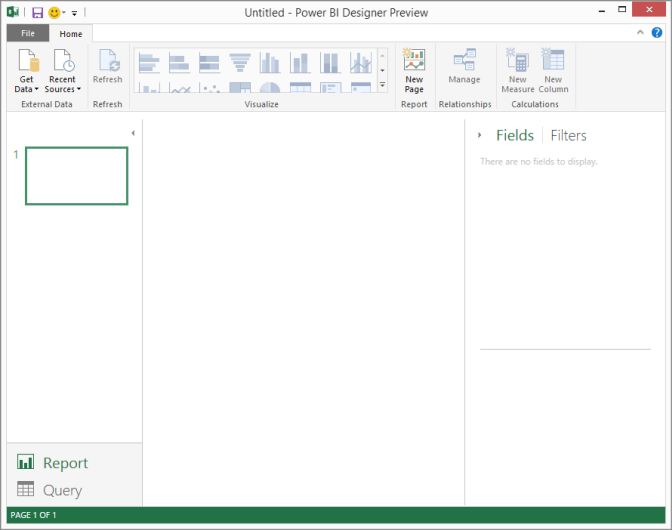
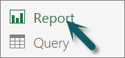
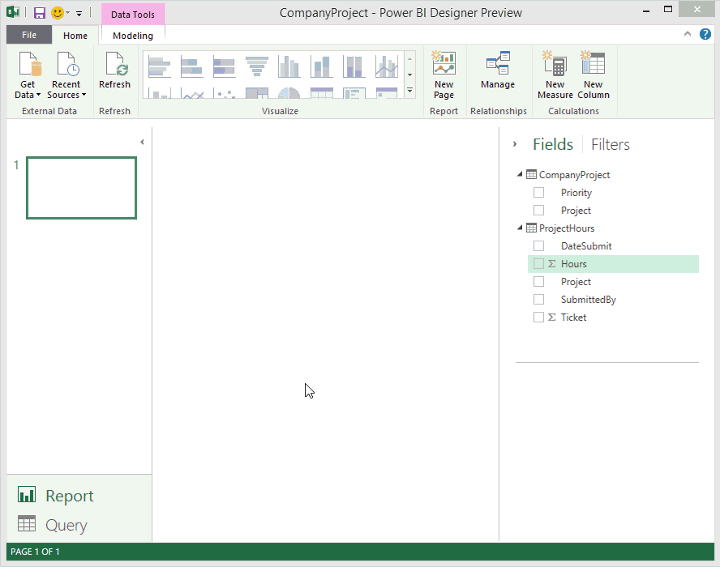
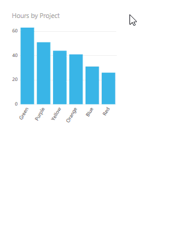
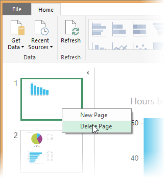

<properties pageTitle="Report View in Power BI Designer" description="Report View in Power BI Designer" services="powerbi" documentationCenter="" authors="v-anpasi" manager="mblythe" editor=""/>
<tags ms.service="powerbi" ms.devlang="NA" ms.topic="article" ms.tgt_pltfrm="NA" ms.workload="powerbi" ms.date="06/16/2015" ms.author="v-anpasi"/>
# Report View in Power BI Designer

[← Power BI Designer](https://support.powerbi.com/knowledgebase/topics/68530-power-bi-designer)

If you’ve been working with Power BI, you know how easy it is to create reports providing dynamic perspectives and insights into your data. Power BI also has more advanced features in the Power BI Designer. With the designer, you can create advanced queries, mashup data from multiple sources, create relationships between tables, and more.

The designer includes Report View, where you can create any number of report pages with visualizations. Report View in the designer provides pretty much the same design experience as a report’s Editing View in Power BI. You can move visualizations around, copy and paste, merge, etc.

The difference is, when using the designer you can also work with your queries and model at the same time, to make sure your data supports the best insights in your reports. You can then save your designer reports to wherever you like, whether it be your local drive or to the cloud.

## Let's take a look!

When you first open the Power BI Designer, you’ll see Report View with a blank canvas.

You can switch between Report View and Query View by clicking on **Report** or **Query.**

> ****

Once you’ve added some data, you can add fields to a new visualization in the canvas.

To change the type of visualization, you can select it from the **Visualize** group in the ribbon or you can right click and select a different it from the **Change visualization type** icon.

> **Tip:** Be sure to experiment with different visualization types. It’s important your visualization convey information in your data clearly.

A report will have at least one blank page to start. Pages appear in the navigator pane just to the left of the canvas. You can add all sorts of visualizations to a page, but it's important not to overdo it. Too many visualizations on a page will make it look busy and difficult to find the right information. You can add new pages to your report, just click **New Page** on the ribbon, or right-click in the navigator pane.

> 

To delete a page, right-click, then **Delete Page. **

> 
>

> **Note:** Reports and visualizations can’t be pinned to a dashboard from the designer. To do that, you’ll need to [upload your Power BI Designer file](http://support.powerbi.com/knowledgebase/articles/461278-upload-power-bi-designer-files) to your Power BI site.
