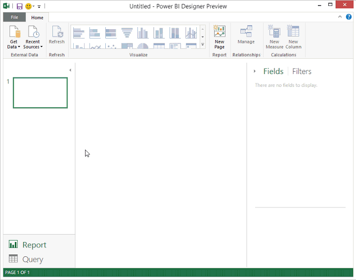

<properties pageTitle="Send us feedback about Power BI Designer Preview" description="Send us feedback about Power BI Designer Preview" services="powerbi" documentationCenter="" authors="v-anpasi" manager="mblythe" editor=""/>
<tags ms.service="powerbi" ms.devlang="NA" ms.topic="article" ms.tgt_pltfrm="NA" ms.workload="powerbi" ms.date="06/19/2015" ms.author="v-anpasi"/>
#Send us feedback about Power BI Designer Preview

[← Power BI Designer](https://support.powerbi.com/knowledgebase/topics/68530-power-bi-designer)

Your opinion matters. We want to hear what you like, and what you don't. When you send us feedback, you can choose to send a screenshot and/or any formulas for tasks you were performing. We can then use this information to help us better understand what you did or didn't like, and any problems you were having.

##You can send us feedback about the Power BI Designer a couple of different ways

You can click the smiley face on the menu bar .

Or, from the File menu, click **Send us Feedback**.

When you send feedback from the Power BI Designer, the information you provide will be specifically about the designer. If you have feedback about the Power BI service or your Power BI page, see [We want your feedback](http://support.powerbi.com/knowledgebase/articles/436738-we-want-your-feedback).

